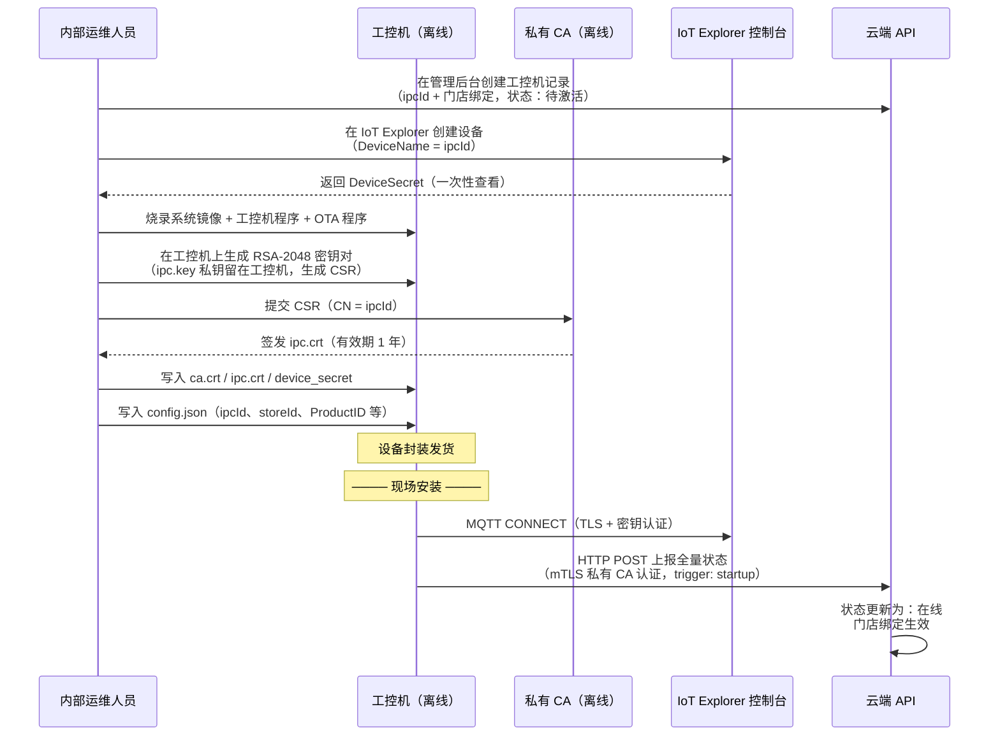
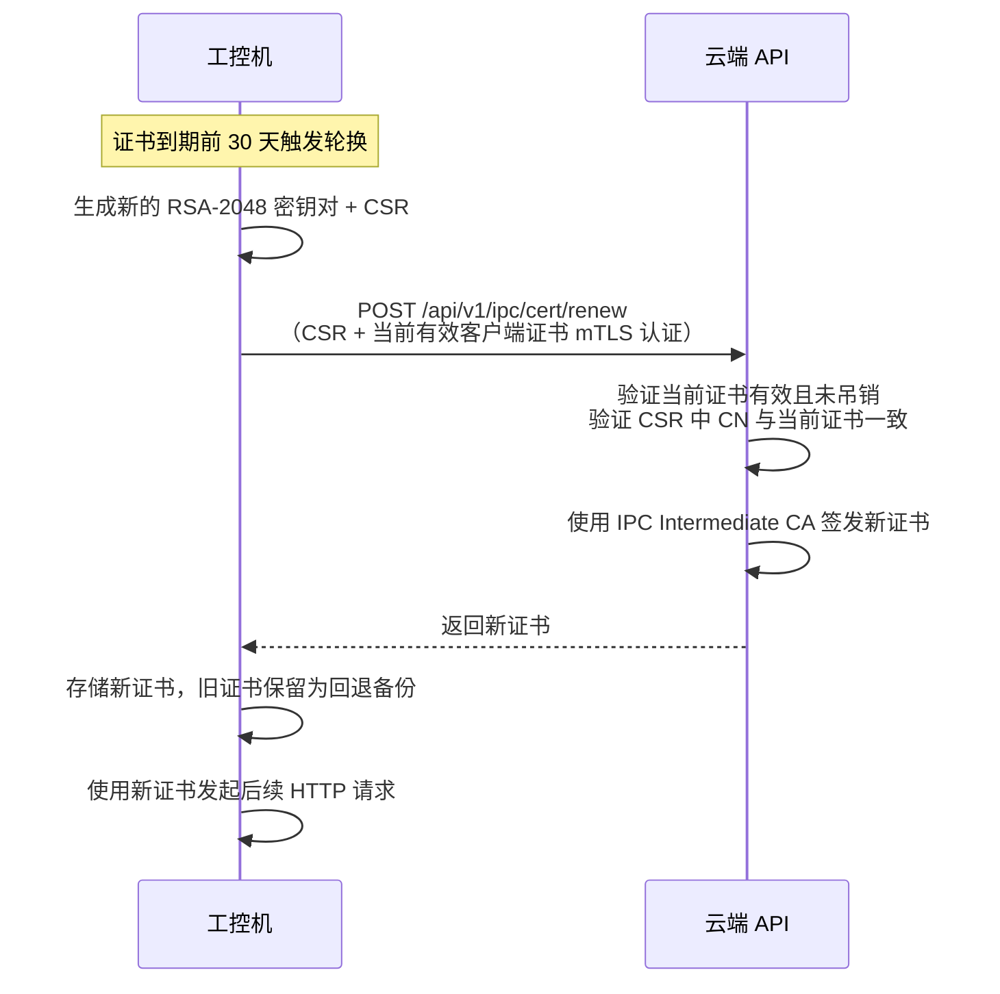

# 接口通信安全

**涉及子系统**：云端 API、小程序、管理后台、工控机
**核心业务**：保障各端与云端 API 之间通信的身份认证、授权、数据完整性与传输加密

---

## 零信任安全原则

本系统所有通信链路均基于以下零信任核心原则设计：

1. **默认拒绝**：任何请求在未完成身份验证与授权前，一律不信任，不区分来源是内网还是外网
2. **持续验证**：每次请求独立校验身份与权限，上一次合法不代表这次合法
3. **最小权限**：每个身份只能访问其当前任务所需的最小资源集合
4. **假设已突破**：设计时假设令牌可能被盗、通道可能被监听，通过多层防御降低爆炸半径
5. **全程审计**：所有关键操作留存不可篡改日志，支持事后追溯

---

## 安全机制总览

| 通信链路 | 传输层 | 身份认证 | 授权模型 | 附加防护 |
|---|---|---|---|---|
| 用户端小程序 → 云端 API | TLS 1.3 + 域名固定 | JWT（微信登录签发，RS256） | 服务端权限查询 | — |
| 店长端小程序 → 云端 API | TLS 1.3 + 域名固定 | JWT（微信登录签发，RS256） | 服务端权限查询 | HMAC-SHA256 全量请求签名 |
| 客服后台 → 云端 API | TLS 1.3 + HSTS | JWT（账号密码 + TOTP 2FA） | 服务端权限查询 | HMAC-SHA256 全量请求签名 |
| 工控机 → 云端 API（HTTP） | mTLS（私有 CA，双向证书验证） | IPC 客户端证书（私有 CA 签发） | 设备身份 + 接口白名单 | `X-Request-ID` 去重 |
| 工控机 ↔ 云端（MQTT） | TLS（IoT Explorer，腾讯云 CA） | IoT Explorer 设备密钥认证 | Topic 级 ACL | `cmdId` 幂等去重、`issuedAt` 时间窗校验 |

---

## 用户体系设计

系统面向三类参与方，每类使用**独立的用户表和独立的 ID 体系**，互不影响：

| 用户体系 | 数据表 | ID 前缀 | 使用端 | 说明 |
|---|---|---|---|---|
| 消费者 | `consumer` | `c_` | 用户端小程序 | 健身房会员 |
| 教练 | `coach` | `h_` | 教练端（规划中） | 课程宣讲者 |
| 管理人员 | `staff` | `s_` | 店长端小程序、客服后台 | 客服、店长、财务、运营、老板等 |

**设计原则**：

- **系统隔离**：同一个自然人可以同时是消费者、教练和管理人员，分别拥有三个独立账号（如 `c_001`、`h_001`、`s_001`），登录入口不同，权限不交叉
- **封禁隔离**：封禁消费者账号不影响其教练身份或管理身份，反之亦然
- **独立演进**：每个体系可以独立扩展字段、规则和业务流程，不互相牵制
- **自然人关联**（可选）：三套体系通过手机号 / 微信 openid 可做松耦合关联，仅用于运营分析，不作为权限依据

### 管理人员角色

管理人员表内部通过 `role` 字段区分角色，角色决定可访问的功能范围：

| 角色 | 说明 | 门店范围 |
|---|---|---|
| `owner` | 老板 | 名下所有门店 |
| `ops` | 运营 | 分配的门店 |
| `finance` | 财务 | 分配的门店 |
| `manager` | 店长 | 分配的门店 |
| `support` | 客服 | 分配的门店 |

> 一个管理人员的门店权限通过 **`staff_store` 关联表**（`staffId` + `storeId`）维护，不写入 JWT。

---

## 客户端 → 云端安全设计

### 一、身份认证

#### 1.1 用户端小程序登录

```
用户端小程序 wx.login()
    │
    ▼ code（5分钟有效）
云端 API /auth/consumer/wx-login
    │ code + appId + appSecret → 微信服务器
    ▼ openid + session_key
在 consumer 表中查找或创建记录
    │
    ▼
签发 JWT（Access Token + Refresh Token）
返回给小程序，存储于 wx.setStorage
```

- 云端**不存储** `session_key`，仅在签名校验时使用后丢弃
- 首次登录检测：若 openid 无对应消费者，创建 `consumer` 记录，引导绑定手机号
- 用户端**仅使用 JWT 鉴权**，无需附加 HMAC 请求签名

#### 1.2 店长端小程序登录

```
店长端小程序 wx.login()
    │
    ▼ code（5分钟有效）
云端 API /auth/staff/wx-login
    │ code + appId + appSecret → 微信服务器
    ▼ openid
在 staff 表中查找（openid 须已绑定管理账号，否则拒绝登录）
    │
    ▼
签发 JWT + 下发 clientSecret（HMAC 签名密钥）
```

- 店长端不自动创建账号——管理人员账号必须由上级在后台预创建并绑定微信
- `clientSecret` 随登录响应下发一次，客户端存入 `wx.setStorageSync`
- `clientSecret` 用于后续**所有请求**的 HMAC 签名（见 1.5 节）

#### 1.3 客服后台登录

1. 提交账号 + 密码（bcrypt 哈希校验）
2. 校验通过后要求输入 TOTP 动态码（Google Authenticator 协议）
3. 两步均通过后签发 JWT，同时下发 `clientSecret`

> 客服后台账号必须开启 2FA，系统强制校验——无 TOTP 的账号无法完成登录。

#### 1.4 登录入口隔离

三套用户体系使用**不同的登录 API 路径**，互不可达：

| 端 | 登录接口 | 查询的表 |
|---|---|---|
| 用户端小程序 | `POST /auth/consumer/wx-login` | `consumer` |
| 店长端小程序 | `POST /auth/staff/wx-login` | `staff` |
| 客服后台 | `POST /auth/staff/password-login` | `staff` |
| 教练端（规划中） | `POST /auth/coach/wx-login` | `coach` |

---

### 二、JWT 规范

#### Token 结构

JWT **只携带身份标识**，不携带角色和门店等权限数据：

```json
{
  "sub": "c_abc123",
  "iss": "consumer",
  "iat": 1712345678,
  "exp": 1712352878
}
```

| 字段 | 说明 |
|---|---|
| `sub` | 用户 ID（含体系前缀：`c_` / `h_` / `s_`） |
| `iss` | 签发来源，标识用户体系：`consumer` / `coach` / `staff` |
| `iat` | 签发时间 |
| `exp` | 过期时间 |

**轻量 JWT 的核心意义**：
- JWT 体积固定（约 200 字节），不随门店数量、角色复杂度膨胀
- 角色和门店权限在服务端查询（Redis 缓存），变更即时生效——无需等 Token 过期
- 同一个 `staffId` 被分配新门店后，下一个请求立即有权限，不需要重新登录

#### 有效期策略

| 用户体系 | Access Token | Refresh Token |
|---|---|---|
| `consumer` | 2 小时 | 30 天 |
| `coach` | 2 小时 | 30 天 |
| `staff` | 1 小时 | 7 天 |

- 算法：**RS256**（私钥签发在云端，公钥可分发校验）
- Refresh Token **单次使用**（Rotation）：使用后立即废弃，同时签发新 Refresh Token
- 检测到 Refresh Token 复用（已废弃的 Token 被提交）→ 判定令牌泄露，立即吊销该账号所有活跃 Token，强制重新登录

#### Token 吊销

以下情况立即吊销该账号所有活跃 Refresh Token（写入 Redis 黑名单，TTL = Token 最长有效期）：

- 主动退出
- 密码/绑定手机号变更
- 上级强制下线
- 检测到 Refresh Token 复用攻击
- 账号被封禁

> 封禁 `consumer` 表中的某用户，只吊销 `iss=consumer` 的 Token；该自然人若同时拥有 `staff` 身份，不受影响。

---

### 三、请求授权（每次请求均校验）

**云端 API 网关对每个入站请求执行以下验证链**：

```
① 提取 Authorization: Bearer <token>
② 验证 JWT 签名（RS256 公钥）
③ 验证 token 未过期（exp）
④ 检查 token 是否在吊销黑名单中（Redis）
⑤ 从 token 提取 sub（用户ID）和 iss（用户体系）
⑥ 验证 iss 与当前 API 路由所属系统匹配（consumer 端 token 不能访问 staff 端接口）
⑦ 从 Redis 加载该用户的权限上下文（role + 门店列表 + 功能权限）
⑧ 验证 role 有权访问当前接口
⑨ 如涉及 storeId，验证该门店在用户的门店列表内
⑩ 通过 → 处理业务逻辑
```

任意步骤失败均返回 `401 Unauthorized` 或 `403 Forbidden`，**不透露具体失败原因**。

#### 权限上下文缓存

每次请求在步骤 ⑦ 中加载的权限上下文来自 Redis（而非 JWT），结构示例：

**消费者**（无门店概念，权限固定）：
```json
{
  "id": "c_abc123",
  "system": "consumer",
  "status": "active"
}
```

**管理人员**（角色 + 门店列表从 Redis 读取）：
```json
{
  "id": "s_xyz789",
  "system": "staff",
  "role": "manager",
  "storeIds": ["store-001", "store-003"],
  "status": "active"
}
```

- 缓存 TTL：5 分钟，变更时主动失效
- 权限变更（角色调整、门店分配变更、封禁）时立即清除对应 key，下次请求重新从 DB 加载
- `owner` 角色的 `storeIds` 可能很大（上万家店），Redis 中使用 Set 结构存储，权限校验用 `SISMEMBER` 查询，O(1) 复杂度

#### 管理人员权限矩阵

| 功能 | `support` | `manager` | `finance` | `ops` | `owner` |
|---|---|---|---|---|---|
| 查看门店设备状态 | ✅ | ✅ | ❌ | ✅ | ✅ |
| 控制设备（开门、开淋浴） | ✅ | ✅ | ❌ | ✅ | ✅ |
| 查看门店消费记录 | ✅ | ✅ | ✅ | ✅ | ✅ |
| 封禁/解封消费者 | ❌ | ✅ | ❌ | ✅ | ✅ |
| 门店配置变更 | ❌ | ✅ | ❌ | ✅ | ✅ |
| 查看/导出财务报表 | ❌ | ❌ | ✅ | ✅ | ✅ |
| 管理人员账号管理 | ❌ | ❌ | ❌ | ❌ | ✅ |
| 门店创建 / 角色分配 | ❌ | ❌ | ❌ | ❌ | ✅ |

> 所有涉及 `storeId` 的操作，服务端从 Redis 读取该 `staffId` 的门店列表进行校验，不依赖客户端传参。

---

### 四、传输安全

#### 协议要求

- 强制 **TLS 1.3**，服务端拒绝 TLS 1.2 及以下版本的握手
- 仅启用以下密码套件：
  - `TLS_AES_256_GCM_SHA384`
  - `TLS_CHACHA20_POLY1305_SHA256`

#### 小程序域名固定

在微信小程序 `app.json` 中配置合法请求域名，并在请求层封装统一检查：

- 所有 `wx.request` 调用统一走封装函数，硬编码允许的 host 列表
- 域名变更需同步更新小程序版本并重新审核

#### 管理后台响应头安全

```
Strict-Transport-Security: max-age=31536000; includeSubDomains; preload
X-Content-Type-Options: nosniff
X-Frame-Options: DENY
Content-Security-Policy: default-src 'self'; connect-src 'self' https://api.fitron-system.com
Referrer-Policy: strict-origin-when-cross-origin
```

---

### 五、HMAC 请求签名（店长端 + 客服后台）

店长端小程序和客服后台的**所有请求**均附加 HMAC 签名（用户端小程序不需要）：

```
X-Timestamp: {Unix秒}
X-Nonce: {16字节随机串，hex编码}
X-Signature: HMAC-SHA256(
  method + ":" + path + ":" + timestamp + ":" + nonce + ":" + SHA256(requestBody),
  clientSecret
)
```

**云端验证规则**：

1. `|serverTime - timestamp| ≤ 60 秒`（防重放时间窗口）
2. `nonce` 在 60 秒窗口内未使用过（Redis SETNX，TTL 120 秒）
3. 重算签名与 `X-Signature` 一致

**`clientSecret` 生命周期**：
- 登录时由云端生成并下发一次
- 服务端以 `staffId` 为 key 存于 Redis
- 用户退出登录或 Token 吊销时同步删除
- 重新登录时生成新的 `clientSecret`

---

### 六、速率限制

| 接口 | 限制规则 | 触发后行为 |
|---|---|---|
| `/auth/consumer/wx-login` | 同 IP 10次/分钟 | 锁定该 IP 15 分钟 |
| `/auth/staff/password-login`（密码） | 同账号 5次失败/10分钟 | 账号锁定 30 分钟，发送告警 |
| `/auth/staff/password-login`（TOTP） | 同账号 3次失败/10分钟 | 会话终止，需重新输入密码 |
| 人脸识别接口 | 同 consumerId 10次/分钟 | `429 Too Many Requests` |
| 开门接口 | 同 consumerId 5次/分钟 | `429 Too Many Requests` |
| 全局 API（单用户） | 500次/分钟 | `429 Too Many Requests`，记录异常日志 |

---

### 七、异常检测与告警

| 场景 | 检测条件 | 响应措施 |
|---|---|---|
| Refresh Token 复用 | 已吊销的 Refresh Token 被提交 | 吊销该账号所有 Token，强制重登 |
| 同账号多地并发活跃 | 同用户 5 分钟内从 3 个不同 IP 活跃 | 触发人工审核告警，可配置强制下线 |
| 异常高频请求 | 单用户触发全局速率限制 | 记录异常事件，临时封禁账号 |
| JWT 校验失败率突增 | 同 IP JWT 校验失败率 > 20%/分钟 | 自动封禁该 IP 1 小时，告警 |
| 非工作时间管理操作 | `staff` 在配置的工作时间外执行高风险操作 | 发送告警通知，操作需二次确认 |
| 跨体系异常关联 | 同一手机号在短时间内触发多个体系的安全事件 | 标记为高风险自然人，通知运营 |

---

### 八、敏感数据处理

| 数据类型 | 传输 | 存储 | 展示 |
|---|---|---|---|
| 手机号 | TLS 加密 | AES-256-GCM + KMS | 脱敏：`138****1234` |
| 人脸特征向量 | TLS + AES-256-GCM 应用层加密 | AES-256-GCM + KMS，与 consumerId 解耦存储 | 不展示，仅用 `faceId` 引用 |
| 身份证号 | TLS 加密 | AES-256-GCM + KMS | 脱敏：`3101**********1234` |
| 支付信息 | TLS 加密 | 不落地，直接转发支付平台 | 仅展示末四位 |

**响应数据最小化**：API 响应中只返回调用方身份对应体系且当前业务必需的字段，多余字段在序列化层过滤。

---

### 九、审计日志

以下操作记录**不可篡改的审计日志**（追加写入，不支持修改/删除）：

| 操作类型 | 记录字段 |
|---|---|
| 登录 / 退出 | `userId`（含体系前缀）, `ip`, `userAgent`, `timestamp`, `result` |
| 开门操作 | `userId`, `storeId`, `deviceId`, `cmdId`, `timestamp` |
| 消费扣款 | `consumerId`, `orderId`, `amount`, `operatorId`, `timestamp` |
| 人脸注册 / 删除 | `consumerId`, `operatorId`, `faceId`, `timestamp` |
| 管理配置变更 | `staffId`, `changeType`, `before`, `after`, `timestamp` |
| Token 吊销 | `userId`, `reason`, `operatorId`, `timestamp` |
| 账号封禁 / 解封 | `targetId`, `operatorId`, `reason`, `timestamp` |

日志写入后只允许追加，审计日志库使用独立存储，与业务数据库隔离。

---

## 工控机零信任安全架构

工控机与云端有两条独立通信链路，安全机制因链路可控程度不同而分别设计：

| 通信链路 | 可控程度 | 安全机制 |
|---|---|---|
| HTTP（工控机直连云端 API） | **完全可控**，服务端由我们部署 | 私有 CA mTLS 双向认证 |
| MQTT（经 IoT Explorer 中转） | **受限**，Broker 由腾讯云托管 | IoT Explorer 设备认证 + TLS |

> IoT Explorer 是托管 MQTT Broker，使用腾讯云自身 CA 体系和设备认证机制，我们无法注入自定义 CA 或对报文做端到端加密（Broker 需解析消息用于路由/规则引擎）。因此 MQTT 通道的传输安全由 IoT Explorer 保障，我们在应用层做指令级防伪。

### 威胁模型

| 威胁 | HTTP 通道防护 | MQTT 通道防护 |
|---|---|---|
| 中间人窃听 / 篡改 | 私有 CA mTLS + TLS 1.3 | IoT Explorer TLS（腾讯云 CA） |
| 仿冒工控机接入 | 私有 CA 客户端证书（CN = ipcId） | IoT Explorer 设备密钥/证书认证 |
| 仿冒云端欺骗工控机 | 证书固定（仅信任 Fitron Root CA） | 工控机验证 IoT Explorer 服务端证书（腾讯云 CA） |
| WiFi 劫持安装恶意证书 | 不使用系统证书存储，ca.crt 出厂内置 | IoT Explorer SDK 内置腾讯云 CA |
| 远程代码执行 | 只处理结构化 JSON，不执行脚本/二进制 | 同左 |
| 物理拆机窃取凭证 | 私钥加密分区存储，可远程吊销 | DeviceSecret 加密分区存储，可远程禁用 |
| 指令重放攻击 | `X-Request-ID` 去重 | `cmdId` 幂等去重 + `issuedAt` 时间窗 |
| IoT Explorer 侧消息泄露 | 不适用（HTTP 不经 IoT Explorer） | MQTT 报文对 Broker 明文，属腾讯云安全责任边界 |

---

### 一、私有 CA 与证书体系（仅用于 HTTP 通道）

系统使用**自建私有 CA**签发工控机客户端证书和云端 API 服务端证书，用于 HTTP 通道的 mTLS 双向认证。

```
Fitron Root CA（离线保管，仅用于签发中间 CA）
├── Fitron IPC Intermediate CA（签发工控机客户端证书）
│   ├── ipc-store001.crt
│   ├── ipc-store002.crt
│   └── ...
└── Fitron Server Intermediate CA（签发云端 API 服务端证书）
    └── api.fitron-system.com.crt
```

| 证书 | 有效期 | 签发方式 | 吊销方式 |
|---|---|---|---|
| Root CA | 10 年 | 离线生成，气隙保管 | 不可吊销（根信任锚） |
| IPC Intermediate CA | 3 年 | Root CA 离线签发 | CRL / OCSP |
| 工控机客户端证书 | 1 年 | IPC Intermediate CA 签发 | CRL / OCSP + 云端黑名单 |
| 服务端证书 | 1 年 | Server Intermediate CA 签发 | 自动续签 |

---

### 二、IoT Explorer 设备认证（MQTT 通道）

MQTT 通道使用腾讯云 IoT Explorer 提供的**密钥认证**方式：

| 凭证 | 来源 | 说明 |
|---|---|---|
| `ProductID` | IoT Explorer 控制台 | 产品标识，全局唯一 |
| `DeviceName` | 与 `ipcId` 一致 | 设备标识 |
| `DeviceSecret` | IoT Explorer 创建设备时生成 | 每台设备独立密钥 |

**MQTT CONNECT 认证**：工控机使用 `ProductID`、`DeviceName`、`DeviceSecret` 通过 HMAC-SHA256 计算 MQTT 连接密码，IoT Explorer 验证通过后建立 TLS 加密连接。

**明确的安全边界**：
- 工控机 → IoT Explorer 这段链路由 TLS 加密保护，外部无法窃听
- IoT Explorer 内部可以读取 MQTT 报文明文（这是托管 Broker 的固有特征）
- 我们的 MQTT 报文中**不包含需要对腾讯云保密的数据**（指令、设备状态、传感器读数均为业务操作数据，非用户隐私）
- 敏感数据（人脸特征向量等）不走 MQTT，走 HTTP 通道（私有 CA mTLS 保护）

---

### 三、出厂预置初始化

工控机在**发货前**于内部受控环境（办公室/仓库）统一完成初始化，写入所有程序与安全凭证。现场部署人员只做物理安装与网络接入，**不接触任何安全材料**。

#### 初始化写入内容

| 写入内容 | 用途 | 说明 |
|---|---|---|
| 操作系统镜像 | — | 精简定制 Linux，关闭不必要服务和端口 |
| 工控机应用程序 | — | 含设备驱动、MQTT 客户端、HTTP 上报模块 |
| OTA 升级程序 | — | 负责后续远程固件/程序更新 |
| `ca.crt` | HTTP mTLS | Fitron Root CA 公钥证书（验证云端 API 服务端证书） |
| `ipc.crt` | HTTP mTLS | 该设备客户端证书（IPC Intermediate CA 签发，CN = ipcId） |
| `ipc.key` | HTTP mTLS | 客户端证书私钥（权限 `600`，仅 fitron 服务账户可读） |
| `device_secret` | MQTT 认证 | IoT Explorer 设备密钥（权限 `600`） |
| `/etc/fitron/config.json` | 两者 | 静态配置（ipcId、storeId、ProductID、MQTT Broker 地址、API 地址等） |

#### 初始化流程



**安全要点**：
- `ipc.key` 在工控机本机生成，**私钥从不离开设备**，CA 仅接收 CSR（公钥请求）
- `DeviceSecret` 在 IoT Explorer 创建设备时生成，仅允许查看一次
- 初始化操作留存完整操作日志（操作人、设备序列号、时间），归入审计记录
- 设备发货后，`ipcId` 状态在云端为"待激活"；首次 HTTP mTLS 连接成功后自动激活

---

### 四、HTTP 通道 mTLS 双向认证

工控机直连云端 API 的 HTTP 通道强制使用私有 CA mTLS：

**工控机 → 云端方向**（工控机验证云端身份）：
- 工控机**不使用操作系统证书存储**
- 仅信任出厂内置的 **Fitron Root CA 公钥**（`ca.crt`）
- TLS 握手时校验服务端证书链是否由 Fitron Root CA 签发
- 即使攻击者在 WiFi 路由器上安装了自己的证书，工控机也不会信任

**云端 → 工控机方向**（云端验证工控机身份）：
- TLS 握手时要求工控机出示客户端证书
- 云端校验证书链是否由 Fitron IPC Intermediate CA 签发
- 从证书 CN 字段提取 `ipcId`，与 HTTP Header 中的 `X-IPC-ID` 比对，不一致则拒绝
- 检查证书是否在 CRL 吊销列表中

**TLS 配置要求**：

| 参数 | 要求 |
|---|---|
| 最低 TLS 版本 | TLS 1.3 |
| 密码套件 | `TLS_AES_256_GCM_SHA384` / `TLS_CHACHA20_POLY1305_SHA256` |
| 客户端证书 | 必须（mTLS） |
| 证书验证 | 完整链验证 + CRL/OCSP |

---

### 五、证书固定（HTTP 通道）

工控机对云端 API 服务端证书执行**公钥固定**：

```python
TRUSTED_CA_PUBKEY_HASH = "sha256/aBcDeFgHiJkLmNoPqRsTuVwXyZ..."  # Fitron Root CA 公钥哈希
BACKUP_CA_PUBKEY_HASH  = "sha256/123456789AbCdEfGhIjKlMnOpQ..."  # 备用 CA 公钥哈希（轮换用）
```

- TLS 握手完成后，计算服务端证书链中 CA 公钥的 SHA-256 哈希
- 与内置的哈希值比对，不匹配 → **立即断开连接**，写入本地安全日志
- 即使攻击者拥有一张公共 CA 签发的 `*.fitron-system.com` 证书，也无法通过验证

---

### 六、HTTP 请求标识

工控机每次 HTTP 请求携带以下 Header，供服务端做身份比对、日志追踪和请求去重：

```
X-IPC-ID: ipc-store001
X-Request-ID: 550e8400-e29b-41d4-a716-446655440000
```

| Header | 说明 |
|---|---|
| `X-IPC-ID` | IPC 标识，服务端校验与 mTLS 客户端证书 CN 一致 |
| `X-Request-ID` | UUID v4，每次请求唯一，用于日志追踪和幂等去重（Redis 缓存，TTL 10 分钟） |

> 身份认证完全由 mTLS 承担。TLS 1.3 的 Session 密钥唯一性保证了传输层防重放。

---

### 七、MQTT Topic ACL

腾讯云 IoT Explorer 支持设备级 Topic 权限控制：

| ipcId | 可 SUBSCRIBE | 可 PUBLISH |
|---|---|---|
| `ipc-store001` | `{ProductID}/ipc-store001/cmd` | `{ProductID}/ipc-store001/cmd/ack`<br/>`{ProductID}/ipc-store001/event`<br/>`{ProductID}/ipc-store001/status` |

- 每台工控机**只能订阅自己的** `cmd` Topic，**只能发布到自己的** `cmd/ack`、`event`、`status` Topic
- 不能读写其他工控机的 Topic（即使知道其他 `ipcId`）
- 云端 API 服务以管理员身份发布到任意 `cmd` Topic，订阅所有 `cmd/ack`、`event`、`status`

---

### 八、指令防伪与完整性（MQTT 应用层）

MQTT 通道的传输安全由 IoT Explorer TLS 保障，应用层通过以下机制保证指令真实性：

1. **时间窗校验**：工控机收到指令后，校验 `issuedAt` 与本地时间差 ≤ 300 秒，超出则丢弃（防重放）
2. **幂等去重**：`cmdId` 记录在本地有序集合中（保留最近 1000 条），重复 `cmdId` 不重复执行
3. **指令白名单**：工控机只处理[指令类型总表](/functional-systems/basics/ipc-cloud-protocol#指令类型总表)中定义的 `type`，其他一律回执 `unsupported`
4. **payload 强校验**：每种指令 `type` 对应严格的 JSON Schema，不符合 Schema 的 payload 拒绝执行

> 工控机**永远不会**解析或执行 payload 中的代码、脚本、Shell 命令或二进制数据。所有操作均为预定义的结构化动作。

---

### 九、证书轮换（HTTP 通道客户端证书）

工控机客户端证书有效期为 1 年，到期前需自动轮换：



轮换失败时：
- 工控机继续使用旧证书直到过期
- 每天重试一次轮换
- 旧证书过期前 7 天仍未轮换成功 → 上报 `cert_expiring_soon` 告警

---

### 十、工控机远程吊销

管理员需要紧急禁用某台工控机时，需同时操作两条通道：

| 步骤 | HTTP 通道 | MQTT 通道 |
|---|---|---|
| ① | 将客户端证书序列号加入 CRL | 在 IoT Explorer 控制台禁用设备 |
| ② | 后续 mTLS 握手失败 | IoT Explorer 强制断开 MQTT 连接 |
| ③ | HTTP 请求被拒绝 | 后续 MQTT CONNECT 被拒绝 |

恢复条件：需重新执行出厂初始化流程（签发新证书 + 在 IoT Explorer 重新启用设备）。

---

### 十一、工控机指令下发前置安全检查链

云端在处理"向工控机下发指令"的请求时，按顺序执行：

```
① 验证调用方身份与权限（JWT + RBAC + storeIds 归属校验）
② 验证目标 ipcId 对应门店在调用方 storeIds 范围内
③ 查询 IoT Explorer 设备在线状态
④ 查询目标 deviceId 的 connectionState（是否 disabled）
⑤ 设备在线且未禁用 → 生成 cmdId，构造指令，发布到 MQTT
⑥ 启动 10 秒回执超时定时器
```

任意步骤失败均拒绝操作，返回对应错误码。

---

### 十二、数据分流原则

根据两条通道的安全特性，对数据进行分流：

| 数据类型 | 走 HTTP（mTLS 私有 CA） | 走 MQTT（IoT Explorer） |
|---|---|---|
| 设备控制指令（开门、开灯等） | | ✅ |
| 指令回执 | | ✅ |
| 设备状态上报 | | ✅ |
| 设备事件上报 | | ✅ |
| 人脸特征向量（加密后） | ✅ | |
| OTA 升级包下载 | ✅ | |
| 证书轮换 | ✅ | |
| 门店配置下发 | ✅ | |

> 原则：**操作类指令走 MQTT**（利用其实时双向通道特性），**敏感数据和大文件走 HTTP**（利用私有 CA mTLS 的完全可控加密通道）。

---

## 待确认事项

- [ ] 工控机私钥存储方式：当前方案为加密分区（权限 600），是否有条件使用 TPM 芯片进一步加固
- [ ] HTTP 通道证书吊销的 CRL 分发机制：定时拉取（每小时）还是 OCSP Stapling
- [ ] 审计日志的存储选型：云数据库追加写、专用日志平台，或两者并用
- [ ] 非工作时间管理操作告警的时间范围配置粒度：全局统一还是门店级独立配置
