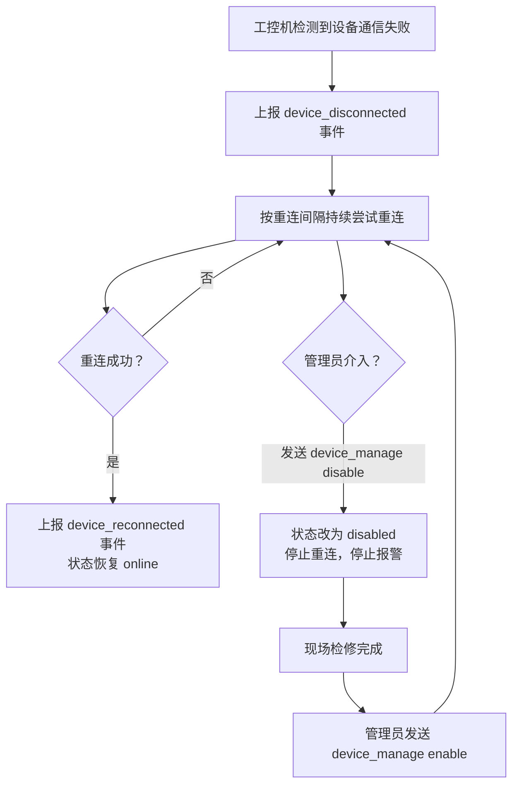
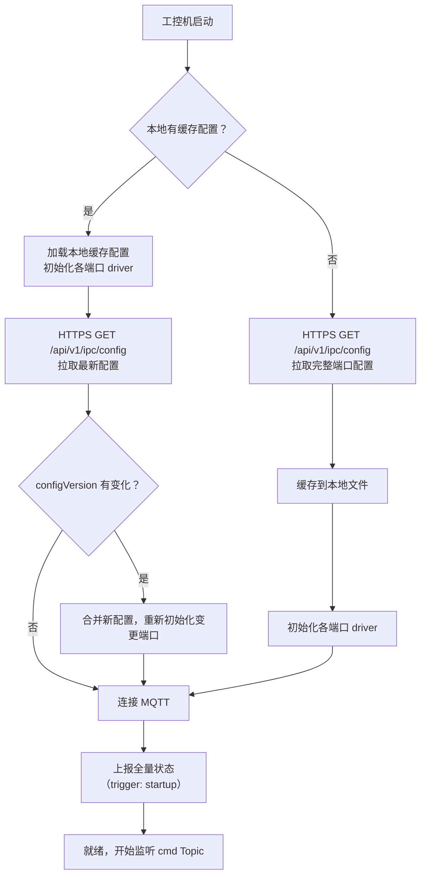
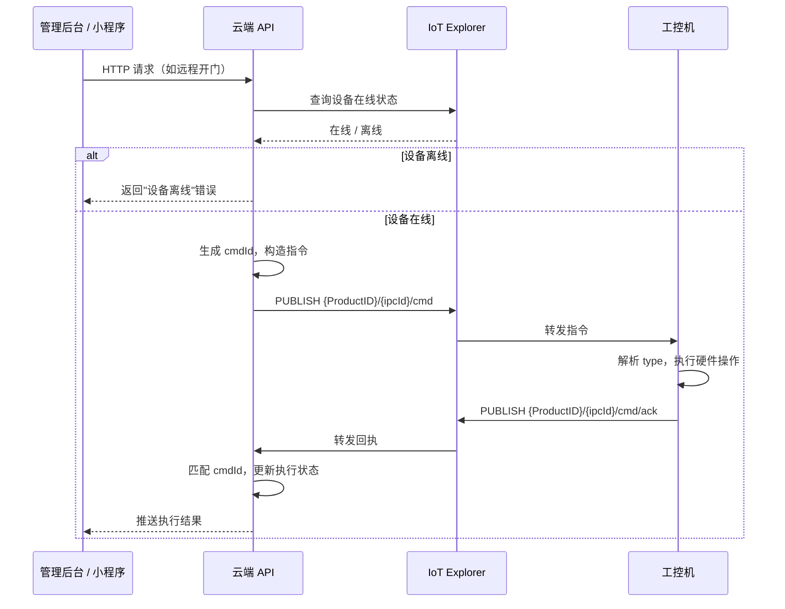
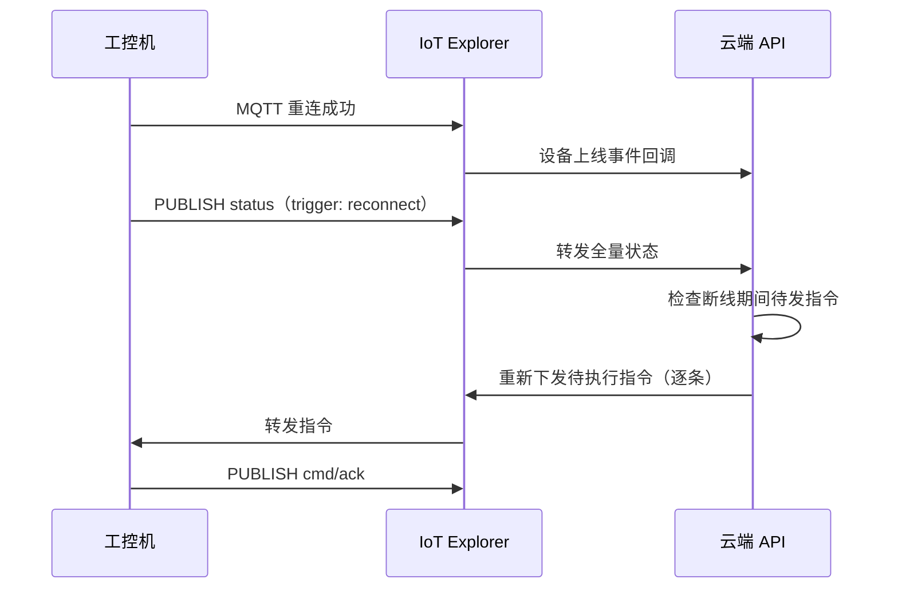

# 工控机与云端通信协议定义

**涉及子系统**：工控机、云端 API
**核心业务**：定义工控机与云端之间 MQTT 指令和 HTTP 上报的完整格式规范

---

## 通信架构

```
工控机 ──── MQTT over TLS ────► 腾讯云 IoT Explorer ◄──── 云端 API 服务
工控机 ──── HTTPS ────────────► 云端 API（HTTP 上报）
```

**MQTT Broker**：腾讯云 IoT Explorer（托管 MQTT Broker，提供设备管理、在线状态监控、消息路由）

---

## MQTT Topic 规范

腾讯云 IoT Explorer 自定义 Topic 格式为 `{ProductID}/{DeviceName}/{后缀}`，工控机的 `DeviceName` 与 `ipcId` 一致。

| Topic 方向 | Topic 格式 | QoS | 说明 |
|---|---|---|---|
| 云端 → 工控机（指令） | `{ProductID}/{ipcId}/cmd` | 1 | 云端下发控制指令 |
| 工控机 → 云端（指令回执） | `{ProductID}/{ipcId}/cmd/ack` | 1 | 工控机确认指令执行结果 |
| 工控机 → 云端（事件） | `{ProductID}/{ipcId}/event` | 1 | 工控机上报状态变更事件 |
| 工控机 → 云端（全量状态） | `{ProductID}/{ipcId}/status` | 1 | 全量设备状态快照 |

> `ProductID` 为腾讯云 IoT Explorer 产品 ID，全局唯一，在控制台创建产品时生成。  
> `ipcId` 为工控机唯一标识，与门店 1:1 对应，格式示例：`ipc-store001`

---

## 设备在线状态与指令下发前检查

### 在线状态来源

工控机的在线 / 离线状态由腾讯云 IoT Explorer 自动维护（基于 MQTT 连接心跳）。云端 API 在下发指令前，**必须**通过 IoT Explorer SDK / API 查询设备当前在线状态：

- **在线**：正常下发指令，启动 10 秒回执超时定时器
- **离线**：不下发指令，直接向调用方返回"设备离线"错误，记录操作失败日志

### MQTT 心跳配置

工控机连接 IoT Explorer 时的 Keep Alive 配置：

| 参数 | 值 |
|---|---|
| Keep Alive | 60 秒 |
| IoT Explorer 判定离线阈值 | 约 90 秒（1.5 × Keep Alive） |

---

## 离线重传策略

工控机断线重连后，**主动**通过 MQTT 发布一条全量状态（`status` Topic），云端收到后：

1. 更新所有设备状态记录
2. 检查断线期间是否有未执行的待发指令（状态为"等待回执"的记录）
3. 对每条待发指令重新调用"在线状态检查 → 下发"流程

> 工控机无需感知"是否有待发指令"，**由云端负责重发**。工控机只需在上线时主动上报全量状态即可。

---

## 设备标识规范（deviceId）

所有受控硬件均通过 `deviceId` 唯一标识。`deviceId` 的命名依据**接口类型**（见[工控机硬件接口分类](/functional-systems/basics/ipc-hardware-comm)），而非设备用途——用途由工控机本地配置的 `label` 和 `role` 字段描述。

**MQTT 指令中只下发 `deviceId` + 操作意图，不携带硬件细节。**

| 接口类型 | deviceId 格式 | 示例 |
|---|---|---|
| 485Hub 继电器 | `relay_{NN}` | `relay_01`、`relay_02`（按物理端口编号） |
| 485Hub Modbus | `modbus_{类型}_{NN}` | `modbus_sensor_01` |
| 专用接口 | `{类型}_{NN}` 或 `{类型}` | `ac_01`、`ac_02`、`ups` |
| 网络接口 | `net_{类型}_{NN}` | `net_face_01`、`net_camera_01` |

> 继电器端口（`relay_XX`）本身没有类型，其 `role`（door_lock / light / shower_valve / shower_light / generic）在工控机本地配置中定义。MQTT 指令中的 `type`（如 `door_control`、`shower_countdown`）必须与目标 `deviceId` 的 `role` 匹配，工控机在执行前校验，不匹配时回执 `error`。

---

## 设备连接状态

### 状态枚举

工控机对每个受控设备持续监控通信状态，状态分三种：

| 状态 | 值 | 说明 |
|---|---|---|
| 在线 | `online` | 可正常通信 |
| 失联 | `offline` | 通信失败，正在按间隔自动重连 |
| 禁用 | `disabled` | 已人工禁用，工控机不再轮询、不再报警，等待现场处理后手动启用 |

### 失联处理流程



- 工控机检测到失联时**只上报一次** `device_disconnected` 事件；云端根据此事件生成**持续性告警**（直到收到 `device_reconnected` 或设备被禁用才解除）
- 重连间隔：首次失联后每 **60 秒**尝试一次；连续失败 10 次后降为每 **5 分钟**一次
- 失联状态下收到该设备的控制指令，工控机直接回执 `error`（附 `connectionState: offline`）

---

## 端口配置管理

工控机不预设任何端口用途——所有端口的 `role`、`driver`、`driverConfig` 均由**云端统一管理、下发**到工控机。

### 配置拉取时机

1. **首次启动 / 无本地配置**：工控机通过 HTTPS 请求 `GET /api/v1/ipc/config` 拉取完整端口配置
2. **正常启动且已有本地缓存**：工控机启动后先加载本地缓存，同时通过 HTTPS 拉取最新配置进行比对；有变更则更新本地缓存并重新初始化对应端口
3. **运行中云端推送变更**：云端通过 `config_update` 指令下发端口配置变更

### 配置结构（云端维护，HTTP 响应 / MQTT 下发通用）

```json
{
  "configVersion": 3,
  "ports": [
    {
      "deviceId": "relay_01",
      "portClass": "relay",
      "label": "A 门电磁锁",
      "role": "door_lock",
      "driver": "relay_485hub",
      "driverConfig": {
        "busPort": "/dev/ttyUSB0",
        "address": 1,
        "channel": 1
      }
    },
    {
      "deviceId": "relay_03",
      "portClass": "relay",
      "label": "健身区灯光",
      "role": "light",
      "driver": "relay_485hub",
      "driverConfig": {
        "busPort": "/dev/ttyUSB0",
        "address": 1,
        "channel": 3
      }
    },
    {
      "deviceId": "ac_01",
      "portClass": "dedicated",
      "label": "健身区空调",
      "role": "ac",
      "driver": "midea_modbus",
      "driverConfig": {
        "busPort": "/dev/ttyUSB1",
        "address": 1,
        "baudRate": 9600
      }
    },
    {
      "deviceId": "modbus_sensor_01",
      "portClass": "modbus",
      "label": "健身区温湿度传感器",
      "role": "env_sensor",
      "driver": "generic_temp_humidity",
      "driverConfig": {
        "busPort": "/dev/ttyUSB0",
        "address": 2,
        "baudRate": 9600
      }
    },
    {
      "deviceId": "net_face_01",
      "portClass": "network",
      "label": "入口刷脸机",
      "role": "face_reader",
      "driver": "hikface_http",
      "driverConfig": {
        "host": "192.168.1.101",
        "port": 80,
        "protocol": "http"
      }
    }
  ]
}
```

| 字段 | 说明 |
|---|---|
| `configVersion` | 配置版本号（单调递增），工控机仅接受 ≥ 当前版本号的配置 |
| `ports[]` | 端口列表，每项定义一个受控设备端口 |
| `portClass` | 端口类型：`relay` / `modbus` / `dedicated` / `network` |
| `role` | 端口用途角色，决定该端口可响应哪些指令类型 |
| `driver` | 驱动标识（代码写死，新品牌需要改代码重新部署） |
| `driverConfig` | 驱动参数（从站地址、总线端口、波特率、IP/端口等），按 driver 不同结构不同 |

### HTTP 配置拉取接口

```
GET /api/v1/ipc/config
Header: X-IPC-ID: {ipcId}
       （+ mTLS 客户端证书 + HMAC 签名，见通信安全文档）
```

响应 200：返回完整配置 JSON（同上述结构）。工控机本地缓存此配置，下次启动时可离线使用。

---

## 空调多品牌驱动适配

空调控制（温度、模式）依赖具体通信协议（RS485 Modbus RTU、红外码等），不同品牌实现不同。**driver 代码写死在工控机固件中**，新品牌需改代码重新部署（通过 OTA），保证稳定性。

云端通过端口配置的 `driver` 字段指定该空调使用哪个品牌 driver，`driverConfig` 传入从站地址等运行时参数。

| `driver` 值 | 说明 |
|---|---|
| `midea_modbus` | 美的空调 RS485 Modbus RTU |
| `gree_modbus` | 格力空调 RS485 Modbus RTU |
| `daikin_modbus` | 大金空调 RS485 Modbus RTU |
| `generic_infrared` | 通用红外码（需配置码库） |

> MQTT 指令中**不携带** `driver` 信息，工控机根据 `deviceId` 查本地配置决定驱动实现。  
> 新增品牌支持时，工控机侧新增 driver 实现并通过 OTA 部署，协议层无需变更。

---

## 指令信封格式（云端 → 工控机）

所有下发指令共享统一信封结构：

```json
{
  "cmdId": "550e8400-e29b-41d4-a716-446655440000",
  "type": "door_control",
  "payload": {},
  "issuedAt": 1712345678
}
```

| 字段 | 类型 | 必填 | 说明 |
|---|---|---|---|
| `cmdId` | string (UUID v4) | 是 | 指令唯一标识，用于回执匹配；工控机对相同 `cmdId` 幂等处理（重复收到不重复执行） |
| `type` | string | 是 | 指令类型枚举，见下方各指令定义 |
| `payload` | object | 是 | 指令参数，结构随 `type` 变化 |
| `issuedAt` | number | 是 | 下发时间戳（Unix 秒） |

---

## 指令回执格式（工控机 → 云端）

工控机收到每条指令后，**必须**在 `cmd/ack` Topic 回复执行结果：

```json
{
  "cmdId": "550e8400-e29b-41d4-a716-446655440000",
  "status": "ok",
  "message": "",
  "executedAt": 1712345679
}
```

| 字段 | 类型 | 说明 |
|---|---|---|
| `cmdId` | string | 对应下发指令的 `cmdId` |
| `status` | string | `ok` 成功 / `error` 执行失败 / `unsupported` 不支持的指令类型 |
| `message` | string | 失败时的错误描述，成功时为空字符串 |
| `executedAt` | number | 执行完成时间戳（Unix 秒） |

> 云端在**确认设备在线后**下发指令，同时启动 **10 秒回执超时定时器**。超时未收到回执，标记该指令为执行失败，记录告警日志。

---

## 指令类型总表

| type | 说明 | 核心 payload 字段 |
|---|---|---|
| `door_control` | AB 门解锁 / 锁定 | `deviceId`, `action` |
| `request_full_status` | 要求工控机重新上报全量状态 | — |
| `relay_control` | 继电器型设备开关（灯光、空调电源等） | `deviceId`, `action` |
| `ac_temperature` | 设置空调目标温度 | `deviceId`, `temperature` |
| `ac_mode` | 设置空调运行模式 | `deviceId`, `mode` |
| `shower_valve` | 淋浴电磁阀直接开关 | `deviceId`, `action` |
| `shower_countdown` | 淋浴电磁阀倒计时开启 | `deviceId`, `durationSeconds` |
| `shower_light` | 强行控制淋浴间灯光 | `deviceId`, `action` |
| `audio_play` | 播放预置语音 | `audioKey` |
| `device_manage` | 禁用 / 启用设备（控制失联设备的告警与重连） | `deviceId`, `action` |
| `config_update` | 下发端口配置变更 | `configVersion`, `ports` |

---

## 各指令详细定义

### 1. `door_control` — AB 门解锁 / 锁定

门禁使用 RS485 继电器驱动电磁锁，因解锁操作有"持续时长"和安全语义，单独定义（不合并到 `relay_control`）。

```json
{
  "cmdId": "...",
  "type": "door_control",
  "payload": {
    "deviceId": "door_a",
    "action": "unlock",
    "duration": 10,
    "operator": "admin@example.com",
    "reason": "用户忘带手机，人工确认身份后放行"
  },
  "issuedAt": 1712345678
}
```

| payload 字段 | 类型 | 必填 | 说明 |
|---|---|---|---|
| `deviceId` | string | 是 | 门设备标识，如 `door_a`、`door_b` |
| `action` | string | 是 | `unlock` 解锁 / `lock` 强制锁定 |
| `duration` | number | 否 | 解锁持续秒数，超时自动锁回，默认 10 秒；`lock` 时忽略 |
| `operator` | string | 否 | 操作人标识，记入操作日志 |
| `reason` | string | 否 | 操作原因，记入操作日志 |

**工控机执行逻辑**：
- `unlock`：继电器触发解锁，`duration` 秒后或门磁检测到门关闭后自动恢复锁定
- `lock`：继电器立即恢复锁定状态，无视当前计时

---

### 2. `request_full_status` — 要求重新上报全量状态

云端要求工控机立即上报一次当前所有设备状态快照。

```json
{
  "cmdId": "...",
  "type": "request_full_status",
  "payload": {},
  "issuedAt": 1712345678
}
```

payload 为空对象，无额外参数。

**工控机执行逻辑**：读取所有设备当前状态，通过 `status` Topic 发布完整状态快照（格式见[全量状态上报格式](#全量状态上报格式)）。

---

### 3. `relay_control` — 继电器型设备开关

通过 RS485 继电器控制的所有开关类设备统一使用此指令，包括：

- **灯光回路**（`deviceId` 如 `light_1`、`light_2`）
- **空调电源**（`deviceId` 如 `ac_1`、`ac_2`）
- 其他单纯开 / 关控制的继电器设备

```json
{
  "cmdId": "...",
  "type": "relay_control",
  "payload": {
    "deviceId": "light_1",
    "action": "on"
  },
  "issuedAt": 1712345678
}
```

| payload 字段 | 类型 | 必填 | 说明 |
|---|---|---|---|
| `deviceId` | string | 是 | 设备标识，如 `light_1`、`ac_1` |
| `action` | string | 是 | `on` 闭合继电器 / `off` 断开继电器 |

> 工控机根据 `deviceId` 查本地配置，确定对应的 RS485 总线地址和继电器通道号，发送对应的 Modbus 写线圈命令。

---

### 4. `ac_temperature` — 设置空调目标温度

```json
{
  "cmdId": "...",
  "type": "ac_temperature",
  "payload": {
    "deviceId": "ac_1",
    "temperature": 26
  },
  "issuedAt": 1712345678
}
```

| payload 字段 | 类型 | 必填 | 说明 |
|---|---|---|---|
| `deviceId` | string | 是 | 空调设备标识 |
| `temperature` | number | 是 | 目标温度，范围 16 ~ 30（°C），整数 |

> 工控机收到后校验范围，超出范围回执 `error`。实际 Modbus 寄存器地址和数据格式由工控机的 driver 实现决定，与协议无关。

---

### 5. `ac_mode` — 设置空调运行模式

```json
{
  "cmdId": "...",
  "type": "ac_mode",
  "payload": {
    "deviceId": "ac_1",
    "mode": "cool"
  },
  "issuedAt": 1712345678
}
```

| payload 字段 | 类型 | 必填 | 说明 |
|---|---|---|---|
| `deviceId` | string | 是 | 空调设备标识 |
| `mode` | string | 是 | 空调模式枚举值 |

**模式枚举**（协议层统一值，工控机 driver 负责映射到各品牌寄存器值）：

| 值 | 说明 |
|---|---|
| `cool` | 制冷 |
| `heat` | 制热 |
| `fan` | 送风 |
| `dry` | 除湿 |
| `auto` | 自动 |

---

### 6. `shower_valve` — 淋浴电磁阀直接开关

直接控制指定淋浴间电磁阀的通断，**不含倒计时逻辑**，用于管理员紧急关阀等场景。

```json
{
  "cmdId": "...",
  "type": "shower_valve",
  "payload": {
    "deviceId": "shower_valve_1",
    "action": "on"
  },
  "issuedAt": 1712345678
}
```

| payload 字段 | 类型 | 必填 | 说明 |
|---|---|---|---|
| `deviceId` | string | 是 | 电磁阀设备标识，如 `shower_valve_1`、`shower_valve_2` |
| `action` | string | 是 | `on` 开阀 / `off` 关阀 |

> 若当前该阀门正在执行 `shower_countdown` 倒计时，收到 `off` 时立即关阀并取消本地倒计时。

---

### 7. `shower_countdown` — 淋浴电磁阀倒计时开启

正常淋浴流程的标准指令：开阀 + 自动倒计时关阀。

```json
{
  "cmdId": "...",
  "type": "shower_countdown",
  "payload": {
    "deviceId": "shower_valve_1",
    "durationSeconds": 300,
    "userId": "user_xxx"
  },
  "issuedAt": 1712345678
}
```

| payload 字段 | 类型 | 必填 | 说明 |
|---|---|---|---|
| `deviceId` | string | 是 | 电磁阀设备标识 |
| `durationSeconds` | number | 是 | 倒计时秒数，工控机强制上限 600 秒，超出截断 |
| `userId` | string | 否 | 使用者用户 ID，记入日志 |

**工控机执行逻辑**：
1. 开启 `deviceId` 对应电磁阀
2. 启动本地倒计时定时器
3. 倒计时期间每 30 秒通过 `event` Topic 上报剩余时间
4. 倒计时归零后自动关阀，上报 `shower_valve_closed` 事件
5. 若收到相同 `deviceId` 的 `shower_valve off` 指令，立即关阀并取消倒计时

---

### 8. `shower_light` — 强行控制淋浴间灯光

独立控制指定淋浴间内部灯光，覆盖工控机本地的自动灯光策略（如"有人才开灯"）。

```json
{
  "cmdId": "...",
  "type": "shower_light",
  "payload": {
    "deviceId": "shower_light_1",
    "action": "on"
  },
  "issuedAt": 1712345678
}
```

| payload 字段 | 类型 | 必填 | 说明 |
|---|---|---|---|
| `deviceId` | string | 是 | 淋浴间灯光设备标识，如 `shower_light_1` |
| `action` | string | 是 | `on` 开灯 / `off` 关灯 |

---

### 9. `audio_play` — 播放预置语音

工控机在本地存储有预置语音文件库，云端通过 `audioKey` 指定播放哪条语音，无需 TTS 合成。

```json
{
  "cmdId": "...",
  "type": "audio_play",
  "payload": {
    "audioKey": "closing_30min",
    "volume": 80,
    "priority": "normal"
  },
  "issuedAt": 1712345678
}
```

| payload 字段 | 类型 | 必填 | 说明 |
|---|---|---|---|
| `audioKey` | string | 是 | 预置语音文件 key，对应工控机本地音频文件 |
| `volume` | number | 否 | 音量 0 ~ 100，默认 80 |
| `priority` | string | 否 | `urgent` 立即打断当前播放 / `normal` 排队，默认 `normal` |

**预置语音 key 清单**（初始版本，按需扩充）：

| audioKey | 语音内容 |
|---|---|
| `welcome` | 欢迎光临 |
| `closing_30min` | 健身房将于 30 分钟后关闭，请准备离店 |
| `closing_10min` | 健身房将于 10 分钟后关闭，请尽快离店 |
| `door_timeout` | 门已长时间未关闭，请注意关门 |
| `shower_ending_soon` | 淋浴时间即将结束 |
| `alarm` | 注意，系统检测到异常，请工作人员处理 |

---

### 10. `device_manage` — 禁用 / 启用设备

用于管理失联设备的告警与重连行为。现场检修前通过此指令禁用设备，避免持续告警；检修完成后再启用，工控机恢复监控与重连。

```json
{
  "cmdId": "...",
  "type": "device_manage",
  "payload": {
    "deviceId": "relay_04",
    "action": "disable"
  },
  "issuedAt": 1712345678
}
```

| payload 字段 | 类型 | 必填 | 说明 |
|---|---|---|---|
| `deviceId` | string | 是 | 目标设备标识 |
| `action` | string | 是 | `disable` 禁用（停止重连和报警）/ `enable` 启用（恢复监控和重连） |

**工控机执行逻辑**：
- `disable`：将设备标记为 `disabled`，停止轮询和重连尝试，后续全量状态上报中该设备 `connectionState` 为 `disabled`
- `enable`：将设备改为 `offline`，立即执行一次通信检测，若成功则改为 `online` 并上报 `device_reconnected` 事件

---

### 11. `config_update` — 下发端口配置变更

云端修改设备端口配置后，通过此指令将变更推送到工控机。工控机收到后更新本地缓存并重新初始化受影响的端口。

```json
{
  "cmdId": "...",
  "type": "config_update",
  "payload": {
    "configVersion": 4,
    "ports": [
      {
        "deviceId": "relay_05",
        "portClass": "relay",
        "label": "淋浴间3灯光",
        "role": "shower_light",
        "driver": "relay_485hub",
        "driverConfig": {
          "busPort": "/dev/ttyUSB0",
          "address": 1,
          "channel": 5
        }
      }
    ]
  },
  "issuedAt": 1712345678
}
```

| payload 字段 | 类型 | 必填 | 说明 |
|---|---|---|---|
| `configVersion` | number | 是 | 新配置版本号，必须 > 工控机当前版本号，否则拒绝并回执 `error` |
| `ports` | array | 是 | 变更的端口列表（增量），工控机按 `deviceId` 匹配并覆盖本地配置 |

**工控机执行逻辑**：
1. 校验 `configVersion` > 当前本地版本号
2. 逐项按 `deviceId` 合并到本地配置，已存在的覆盖，不存在的新增
3. 更新本地缓存文件
4. 对变更的端口执行：停止旧 driver → 使用新配置初始化新 driver → 检测连接状态
5. 回执 `ok` 后，主动上报一次全量状态

> 如需**删除**某个端口，将该 `deviceId` 的 `role` 设为 `removed`，工控机停止该端口的驱动并从后续状态上报中移除。

---

## 工控机启动流程



---

## 全量状态上报格式

工控机通过 `status` Topic 上报，结构以 `deviceId` 为 key，动态适应门店设备数量：

```json
{
  "ipcId": "ipc-store001",
  "storeId": "store-001",
  "reportedAt": 1712345680,
  "trigger": "request",
  "devices": {
    "relay_01": { "role": "door_lock",     "connectionState": "online",   "locked": true,  "opened": false },
    "relay_02": { "role": "door_lock",     "connectionState": "online",   "locked": true,  "opened": false },
    "relay_03": { "role": "light",         "connectionState": "online",   "state": "on"  },
    "relay_04": { "role": "light",         "connectionState": "online",   "state": "off" },
    "relay_05": { "role": "light",         "connectionState": "offline",  "state": null  },
    "relay_06": { "role": "shower_valve",  "connectionState": "online",   "state": "off", "countdownRemaining": 0   },
    "relay_07": { "role": "shower_valve",  "connectionState": "online",   "state": "on",  "countdownRemaining": 180 },
    "relay_08": { "role": "shower_light",  "connectionState": "disabled", "state": null  },
    "relay_09": { "role": "shower_light",  "connectionState": "online",   "state": "on"  },
    "ac_01":    { "role": "ac",            "connectionState": "online",   "power": "on",  "mode": "cool", "temperature": 26 },
    "ac_02":    { "role": "ac",            "connectionState": "online",   "power": "off", "mode": "cool", "temperature": 26 },
    "modbus_sensor_01": { "role": "env_sensor", "connectionState": "online" }
  },
  "sensors": {
    "modbus_sensor_01": { "temperature": 28.5, "humidity": 55 }
  },
  "ups": {
    "connectionState": "online",
    "batteryLevel": 85,
    "mainsPower": true,
    "outputVoltage": 220
  }
}
```

| 顶层字段 | 说明 |
|---|---|
| `trigger` | 上报触发原因：`startup` 启动自检 / `request` 响应 `request_full_status` 指令 / `reconnect` MQTT 断线重连 |
| `devices` | 以 `deviceId` 为 key，包含所有受控设备的当前状态 |
| `sensors` | 只读传感器读数（与 `devices` 中对应设备的 `connectionState` 联动） |
| `ups` | UPS 状态 |

**设备状态字段说明**：

| 字段 | 说明 |
|---|---|
| `role` | 该端口的用途角色（来自工控机本地配置） |
| `connectionState` | `online` / `offline` / `disabled`，见[设备连接状态](#设备连接状态) |
| 其余字段 | `connectionState` 为 `offline` 或 `disabled` 时，状态字段填 `null`（无法获取真实值） |

---

## 事件格式（工控机 → 云端）

工控机通过 `event` Topic 上报状态变更事件：

```json
{
  "eventId": "uuid",
  "ipcId": "ipc-store001",
  "storeId": "store-001",
  "type": "device_disconnected",
  "payload": {
    "deviceId": "relay_05",
    "role": "light"
  },
  "occurredAt": 1712345678
}
```

| 字段 | 类型 | 必填 | 说明 |
|---|---|---|---|
| `eventId` | string (UUID) | 是 | 事件唯一标识 |
| `ipcId` | string | 是 | 工控机标识 |
| `storeId` | string | 是 | 门店标识 |
| `type` | string | 是 | 事件类型 |
| `payload` | object | 是 | 事件详情，含关联设备时必包含 `deviceId` |
| `occurredAt` | number | 是 | 事件发生时间戳（Unix 秒） |

**设备连接状态相关事件**：

| type | 触发时机 | payload 关键字段 |
|---|---|---|
| `device_disconnected` | 工控机首次检测到某设备通信失败 | `deviceId`, `role` |
| `device_reconnected` | 失联设备通信恢复正常 | `deviceId`, `role` |

---

## HTTP 上报接口

| 接口 | 说明 |
|---|---|
| `POST /api/v1/ipc/event` | 事件上报（刷脸、门磁、告警等） |
| `POST /api/v1/ipc/ota/result` | OTA 更新结果回报 |

> 心跳不再通过 HTTP 上报，工控机在线状态由腾讯云 IoT Explorer 基于 MQTT Keep Alive 自动维护。

---

## 指令下发完整时序



## 断线重连时序



---

## 待确认事项

- [x] ~~工控机端口配置的管理方式~~ → 云端统一管理，通过 HTTP 拉取 + `config_update` MQTT 推送
- [ ] 各门店继电器端口总数（`relay_01` ~ `relay_NN` 的 NN 值），以及每个端口的 `role` 和标签分配
- [ ] 各门店淋浴间数量（决定 shower_valve / shower_light 的端口数量）
- [ ] 空调品牌型号确认后，验证 `ac_mode` 枚举值与对应 driver 的寄存器映射
- [ ] `audio_play` 预置语音文件清单最终版本（`audioKey` 与文件名规范）
- [ ] UPS 品牌与通信协议确认（影响 `ups` 状态上报字段）
