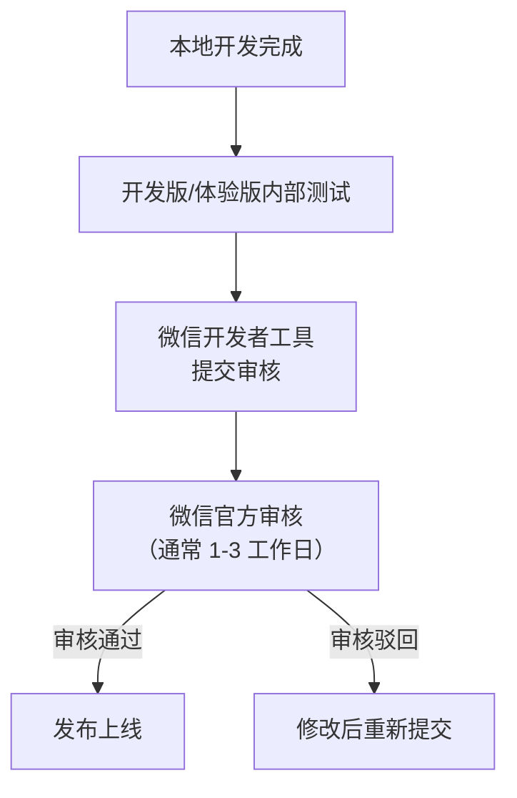

# 小程序发布

**涉及子系统**：小程序（客户端 + 店长端）
**核心业务**：微信小程序审核提交与版本发布管理流程

---

## 小程序体系

飞创 Fitron 包含两个独立小程序：

| 小程序 | AppID | 用途 |
|---|---|---|
| 客户端小程序 | 待申请 | 用户注册、购买产品、人脸录入、进场、淋浴、个人中心 |
| 店长端小程序 | 待申请 | 门店统计、远程开门、用户管理 |

---

## 发布流程

---

## 版本管理规范

- 发布前在测试环境完整回归
- 每次发布记录版本号、变更内容、发布人
- 重大功能变更提前通知用户（公告/弹窗）
- 保留上一个审核通过版本，紧急回滚可秒级切换

---

## 审核注意事项

- 人脸识别功能需在隐私说明中明确声明用途
- 支付功能需配置对应小程序类目
- 测试账号需提前配置在审核材料中（如需要）

---

## 待确认事项

- [ ] 小程序 AppID 申请主体（企业资质）
- [ ] 是否需要独立的预发布环境小程序
