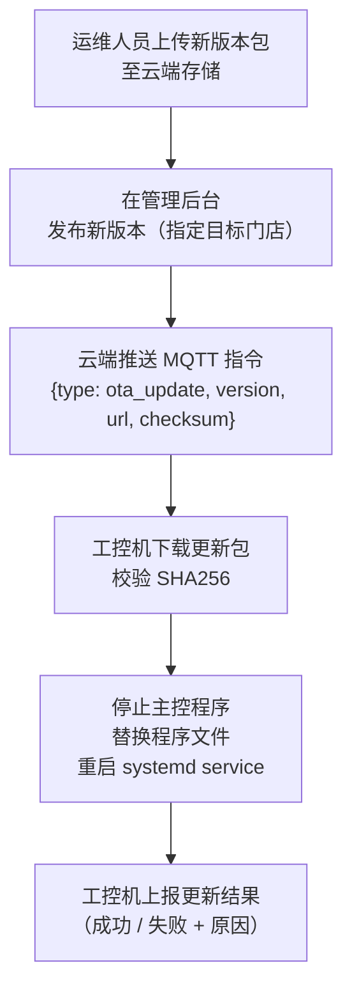

# OTA 更新

**涉及子系统**：工控机、云端 API
**核心业务**：工控机主控程序远程升级，版本管理与回滚

---

## 更新流程

---

## 版本管理规则

- 版本号格式：`MAJOR.MINOR.PATCH`（如 `1.2.3`）
- 每个版本包含：程序二进制 + 配置模板 + 变更说明
- 云端保留最近 **10 个**版本包，支持一键回滚到任意历史版本
- 更新前自动备份当前版本程序文件

---

## 安全要求

- 下载链接带时效签名（有效期 1 小时）
- 安装前校验 SHA256 完整性
- 更新包通过 HTTPS 传输

---

## 待确认事项

- [ ] 是否支持分批灰度推送（先推 1 家门店验证，再全量）
- [ ] 更新失败后自动回滚策略
- [ ] 是否需要更新前后截图/日志自动上传
