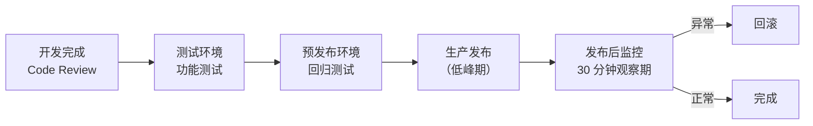

# 安全发布与测试流程

**涉及子系统**：全端
**核心业务**：确保每次版本发布有完整的测试验证与回滚保障，避免线上故障影响门店运营

---

## 环境划分

| 环境 | 用途 | 访问范围 |
|---|---|---|
| 开发环境（dev） | 日常开发调试 | 仅开发人员 |
| 测试环境（test） | 功能测试、集成测试 | 内部团队 |
| 预发布环境（staging） | 上线前最终验证，数据与生产隔离 | 内部团队 |
| 生产环境（prod） | 线上运行 | 全量用户 |

---

## 发布流程

---

## 回滚策略

| 子系统 | 回滚方式 | 时间估计 |
|---|---|---|
| 云端 API | 镜像版本回退（Docker） | < 2 分钟 |
| 管理后台 | CDN 静态文件版本切换 | < 1 分钟 |
| 小程序 | 微信后台版本回退 | < 5 分钟 |
| 工控机 | OTA 回滚至上一版本 | < 10 分钟 |

---

## 待确认事项

- [ ] 是否接入 CI/CD 流水线（GitHub Actions / Jenkins）
- [ ] 数据库 Schema 变更的回滚方案（需单独评估）
