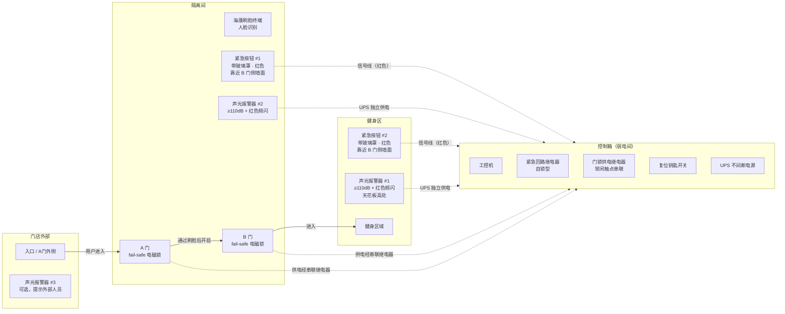
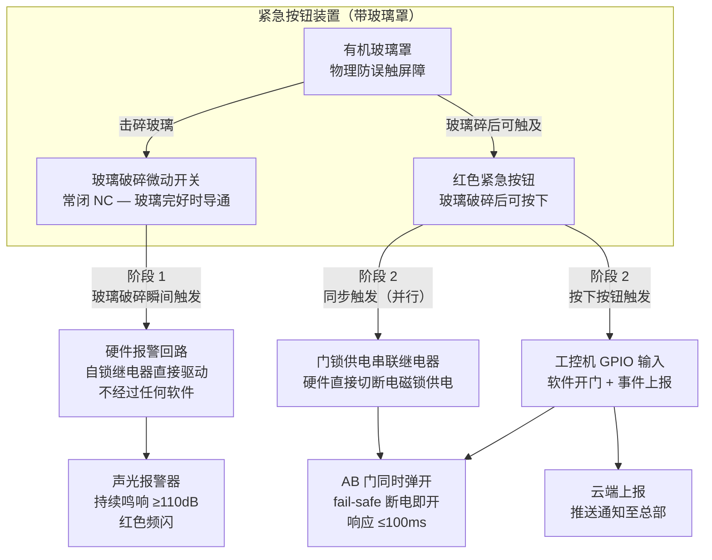
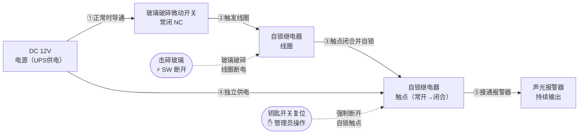
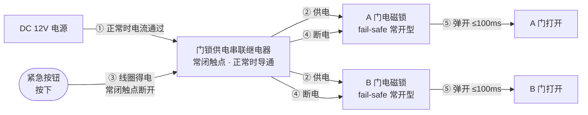
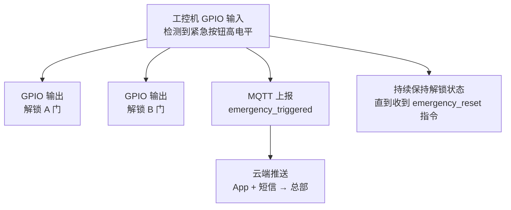
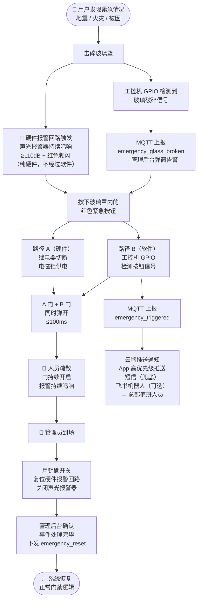
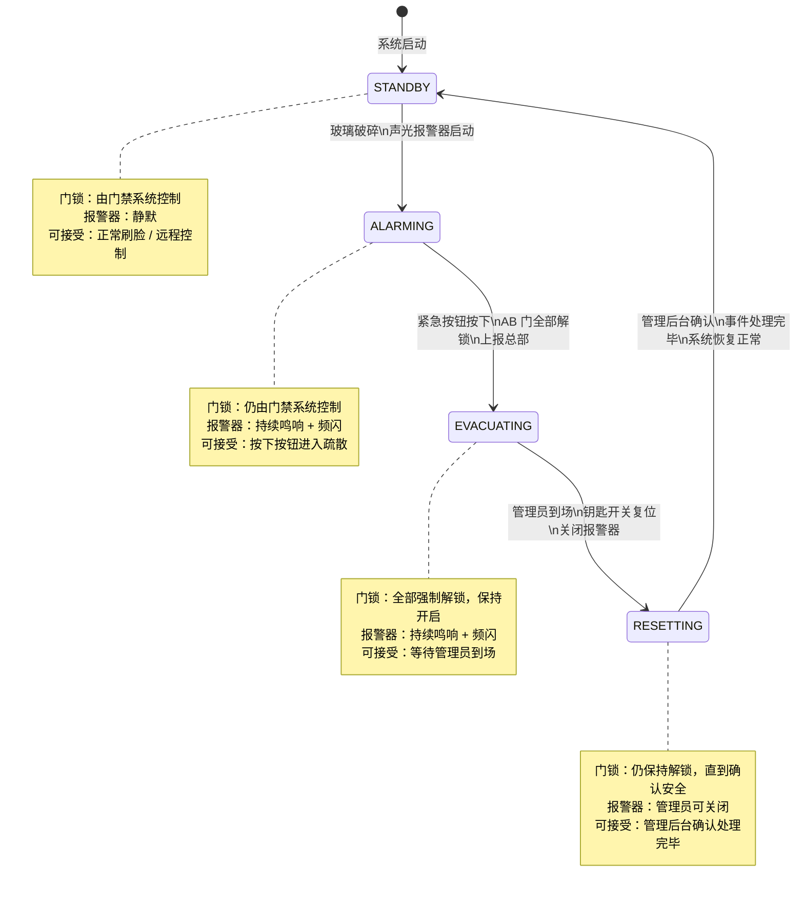
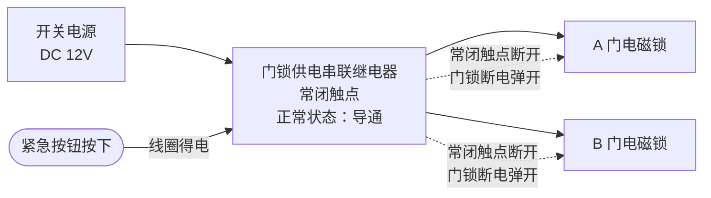

# 紧急安全系统

**涉及子系统**：工控机（核心执行）、云端 API（事件上报/推送）、管理后台（告警展示/状态监控）  
**核心业务**：在地震、火灾等重大突发事件中，确保所有人员能立即离开健身房，不因门禁系统阻碍疏散

---

## 设计原则

> **安全第一，软件是辅助，硬件是底线。**

紧急安全系统必须遵循以下原则：

1. **硬件独立性**：核心疏散动作（开锁 + 报警）不得依赖工控机软件，必须有纯硬件电路兜底。
2. **失效安全（Fail-Safe）**：任何单点故障（断电、工控机宕机、网络中断）均应使系统趋向"安全状态"（门打开）。
3. **防误触设计**：紧急按钮必须有物理防护，防止日常误触；但紧急状态下操作必须直观、零培训可完成。
4. **不可静默失败**：报警触发后，必须有持续的声光输出，直到有权限人员主动复位。

---

## 硬件布局

### 门店物理布局



### 紧急按钮位置

| 编号 | 位置 | 面向人群 | 用途 |
|---|---|---|---|
| 紧急按钮 #1 | **隔离间内部**（靠近 B 门一侧墙面） | 已进入隔离间、无法通过刷脸出去的用户 | 地震/火灾时在隔离间内被困无法出去 |
| 紧急按钮 #2 | **健身区内部**（靠近 B 门的健身区墙面） | 健身区内的用户 | 健身区内发生紧急情况，无法正常走门禁出去 |

### 声光报警器位置

| 编号 | 位置 | 要求 |
|---|---|---|
| 报警器 #1 | 健身区内显眼位置（天花板或高处墙面） | 声压 ≥ 110dB，红色 LED 频闪 |
| 报警器 #2 | 隔离间内 | 同上，确保隔离间内人员能感知 |
| 报警器 #3 | 门店外部入口（可选） | 提示外部人员勿进入 |

---

## 硬件组成

| 物料名称 | 规格/要求 | 数量 | 说明 |
|---|---|---|---|
| 带玻璃罩紧急按钮 | 红色，带可击碎有机玻璃保护罩，内置玻璃破碎微动开关，IP54，24V DC | 2 | 隔离间内 + 健身区 B 门旁 |
| 声光报警器 | DC 12V/24V，≥110dB，红色频闪，独立常闭/常开输入接口 | 2~3 | 健身区 + 隔离间（+ 门店外） |
| 紧急回路继电器模块 | 双路，DC 12V，带自锁功能（触发后保持，需手动/远程复位） | 1 | 安装在控制箱内，纯硬件报警回路核心 |
| 复位钥匙开关 | 带锁芯，仅管理员持有钥匙，旋转复位 | 1 | 安装在控制箱内或专用位置，用于解除报警 |

---

## 电路设计

### 两阶段触发机制

紧急按钮分两个物理阶段触发，对应两套独立电路：



### 阶段 1：玻璃破碎 → 硬件报警（无需软件介入）

玻璃罩内置**常闭型微动开关**，玻璃完好时电路导通；击碎玻璃后，玻璃碎片释放弹片，微动开关断开，触发自锁继电器，直接接通声光报警器电源。



**关键特性**：
- 自锁继电器一旦触发，即使玻璃重新放回（开关恢复）也**不会自动复位**
- 只有通过**复位钥匙开关**才能解除报警，防止任意人员关闭报警

工控机同时通过 GPIO 检测破碎传感器状态，用于事件上报（软件层面的信息通道，不作为报警触发依据）。

### 阶段 2：按钮按下 → 所有门全开

按钮信号通过两条并行路径执行开门动作，**任意一条路径成功即可开门**：

#### 路径 A：硬件直接切断门锁电源（优先，不依赖软件）



> 电磁锁已采购 **fail-safe 常开型**（见 BOM 清单第 4、5 项），断电即自动弹开，无需任何软件指令。

#### 路径 B：工控机软件开门（辅助，用于日志记录）



---

## 完整触发流程



---

## 云端事件上报

工控机通过 MQTT 上报以下紧急事件：

| 事件类型 | 触发时机 | 上报内容 | 云端动作 |
|---|---|---|---|
| `emergency_glass_broken` | 玻璃破碎传感器触发 | 按钮编号、时间戳、门店 ID | 推送告警通知 |
| `emergency_triggered` | 紧急按钮按下 | 按钮编号、时间戳、门店 ID | 推送紧急通知至总部（短信 + App 推送） |
| `emergency_doors_opened` | 所有门解锁完成 | 门列表、时间戳 | 记录日志 |
| `emergency_reset` | 管理员复位操作 | 操作人账号、时间戳 | 关闭告警、恢复正常门禁逻辑 |

### MQTT Payload 示例

```json
{
  "event": "emergency_triggered",
  "store_id": "store_001",
  "button_id": "emergency_btn_chamber",
  "location": "隔离间内",
  "timestamp": "2025-03-13T10:23:45+08:00",
  "doors_unlocked": ["A", "B"]
}
```

---

## 总部通知机制

| 通知渠道 | 触发事件 | 接收方 | 内容 |
|---|---|---|---|
| App 推送（高优先级） | `emergency_triggered` | 总部运营值班人员 | 门店名称、触发位置、时间 |
| 短信 | `emergency_triggered` | 总部紧急联系人（最多 3 人） | 同上，确保无 App 也能收到 |
| 管理后台弹窗 | `emergency_glass_broken` / `emergency_triggered` | 当前登录的所有管理后台用户 | 高亮告警弹窗，要求确认 |
| 飞书机器人（可选） | `emergency_triggered` | 运营群 | 自动发送告警消息 |

> **短信为兜底通知渠道**，必须实现，确保 App 通知失效（推送服务故障）时仍能通知到人。

---

## 系统状态机

紧急安全系统有四个状态：



| 状态 | 描述 | 门锁状态 | 报警器 | 可接受的操作 |
|---|---|---|---|---|
| `STANDBY` | 正常运行 | 由门禁系统控制 | 静默 | 正常刷脸、远程控制 |
| `ALARMING` | 玻璃已破碎，等待按钮 | 由门禁系统控制（尚未开门） | 持续鸣响 + 频闪 | 按下按钮进入疏散 |
| `EVACUATING` | 紧急按钮已按下 | **全部强制解锁，保持开启** | 持续鸣响 + 频闪 | 管理员到场处理 |
| `RESETTING` | 管理员到场，正在复位 | **仍保持解锁**，直到确认安全 | 可由管理员关闭 | 管理后台确认完毕后恢复 STANDBY |

---

## 防误触与防滥用设计

| 风险 | 设计应对 |
|---|---|
| 普通用户好奇心误触按钮 | 玻璃罩需主动击碎才能按到按钮；玻璃破碎即触发报警，有明显代价 |
| 恶意触发（骚扰报警） | 玻璃破碎传感器记录时间戳上报云端；管理后台可查历史记录；门店监控录像可回溯 |
| 报警器被人为遮盖 | 声光报警器安装在高处（≥2.5m），普通人无法轻易遮盖 |
| 复位钥匙丢失 | 复位钥匙建议备份 2 把，一把现场、一把总部；管理后台也提供远程复位指令 |
| 工控机宕机时按钮无效 | 路径A（硬件直接切断门锁供电）不经过工控机，确保兜底 |
| 断电时系统失效 | 电磁锁为 fail-safe 常开型，断电即自动弹开；UPS 为工控机和报警器供电 |

---

## 与其他系统的联动

| 联动系统 | 触发动作 | 说明 |
|---|---|---|
| 门禁系统 | 紧急状态下强制解锁并锁定门禁控制逻辑（禁止其他指令关门） | 防止系统在紧急状态下自动关门 |
| 硬件控制系统 | 触发所有灯光全亮（含健身区、隔离间、走道） | 确保疏散路径明亮可见 |
| 数据分析系统 | 紧急事件记录入日志，纳入安全报表 | 可用于事后复盘 |
| 淋浴系统 | 触发后关闭所有淋浴热水（防止无人监管时漏水） | 可选联动 |

---

## BOM 补充清单

以下硬件需在现有 BOM 基础上新增：

| 序号 | 物料名称 | 规格/要求 | 数量 | 状态 | 备注 |
|---|---|---|---|---|---|
| E-1 | 带玻璃罩紧急按钮 | 红色，内置玻璃破碎微动开关（常闭型），IP54，24V DC，面板嵌入式安装 | 2 | 🔄 | 隔离间 + 健身区 B 门旁各 1 |
| E-2 | 声光报警器 | DC 12V，≥110dB，红色 LED 频闪，常闭/常开输入 | 2~3 | 🔄 | 健身区 + 隔离间（+ 门店外可选）|
| E-3 | 自锁继电器模块 | DC 12V 线圈，带自锁功能（需断电或外部信号复位），DIN 导轨安装 | 1 | 🔄 | 安装在控制箱内 |
| E-4 | 门锁供电串联继电器 | DC 12V，常闭触点，用于紧急状态切断 AB 门电磁锁供电 | 1 | 🔄 | 安装在控制箱内，串联在门锁供电回路 |
| E-5 | 复位钥匙开关 | 带锁芯，双位（ON/OFF），面板安装 | 1（备用 1） | 🔄 | 主锁安装在控制箱面板；备用钥匙交总部保管 |

---

## 安装与接线要点

1. **紧急按钮接线**：玻璃破碎微动开关（常闭）串联在自锁继电器线圈回路中；按钮（常开）接入工控机 GPIO 输入 + 门锁供电串联继电器控制线圈。

2. **门锁供电路径**：



3. **报警器独立供电**：声光报警器通过 UPS 供电，不与工控机同一路，确保工控机宕机时报警器仍能正常运行。

4. **所有紧急回路走线**：使用红色线缆，与普通控制信号线区分，便于维护排查。

---

## 定期维护检查

| 检查项 | 频率 | 方法 |
|---|---|---|
| 玻璃罩完好性检查 | 每月 | 目视检查，确认玻璃未裂纹或松动 |
| 报警器功能测试 | 每季度 | 在非营业时间用备用玻璃片替换测试，确认声光正常 |
| 复位钥匙可用性 | 每季度 | 确认钥匙可正常旋转复位 |
| 工控机 GPIO 信号验证 | 每季度 | 通过管理后台触发测试模式，验证信号上报是否正常 |
| 门锁断电开门测试 | 每半年 | 短暂断开门锁供电，确认 AB 门均能弹开 |

---

## 待确认事项

- [ ] 紧急按钮具体型号：确认玻璃破碎微动开关规格（常闭 NC 接点电压/电流）
- [ ] 声光报警器数量：门店外是否需要第 3 个报警器
- [ ] 复位方式：管理后台远程复位是否作为主要复位手段（减少对到场人员的依赖）
- [ ] 总部短信通知服务商：确认短信 API 供应商（阿里云 / 腾讯云等）
- [ ] 紧急状态下灯光全亮联动：是否需要覆盖灯光手动关闭的状态
- [ ] 自锁继电器与 UPS 供电范围：确认 UPS 容量是否覆盖报警器持续运行（见 BOM E-2）
