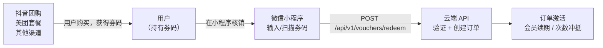
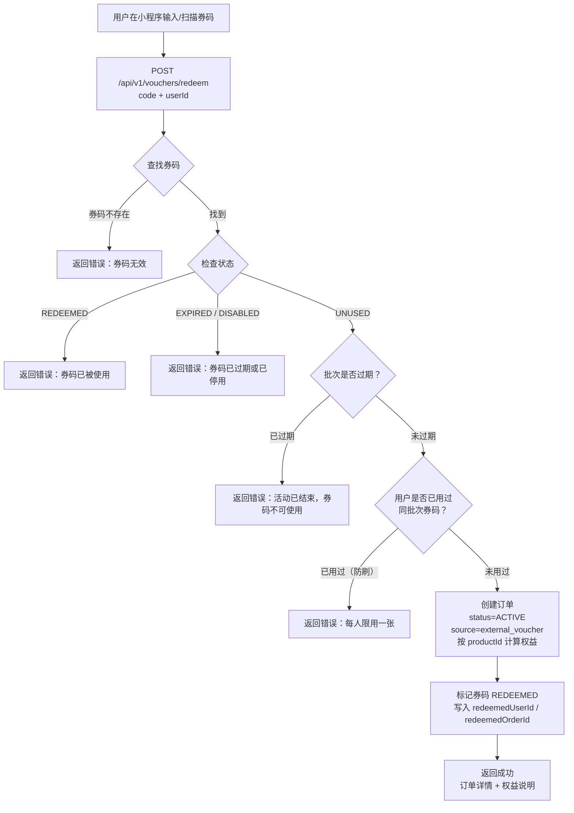

# 外部平台券码核销系统

**涉及子系统**：云端 API（核心）、小程序（核销入口）、管理后台（批次管理）  
**核心业务**：用户在抖音、美团等外部平台购买券码，在小程序内核销，系统自动创建订单并为用户开通或续期会员权益

---

## 系统概述

用户通过抖音团购、美团套餐等外部渠道购买健身房产品后，会获得一个**券码**。他们进入小程序，输入或扫描该券码，系统验证后自动创建一笔等效订单，用户无需在小程序内再次支付。



---

## 券码管理模式

### 推荐方案：内部码池模式

我们自行生成一批唯一券码，上传至抖音/美团活动页面作为核销凭证。用户消费后从平台获得券码，我们在自有系统内验证和核销，**无需实时调用外部平台 API**。

**优点**：
- 不依赖外部平台接口稳定性
- 实现简单，无需平台开发者资质
- 适合初期小规模运营

**适用场景**：抖音团购、美团套餐、线下发码、合作渠道等所有需要兑换码的场景。

> 若未来需要对接美团/抖音官方核销 API（防止一码多用、与平台数据打通），可在此基础上扩展，数据模型兼容。

---

## 数据模型

### 券码批次（VoucherBatch）

```
VoucherBatch {
  id              String       # 批次 ID
  name            String       # 批次名称（如"抖音3月团购-月卡"）
  platform        Enum         # DOUYIN / MEITUAN / CUSTOM（自定义渠道）
  productId       String       # 对应本系统的产品 ID（决定开通什么权益）
  totalCount      Int          # 批次总码量
  usedCount       Int          # 已核销数量（系统自动统计）
  codePrefix      String?      # 券码前缀（用于区分批次，如"DY2503"）
  expiresAt       DateTime?    # 批次过期时间（过期后券码不可核销）
  createdBy       String       # 创建人（管理员账号）
  createdAt       DateTime
}
```

### 券码（VoucherCode）

```
VoucherCode {
  id              String       # 内部 ID
  batchId         String       # 所属批次
  code            String       # 唯一券码（用户持有的字符串，如"DY2503-A7X9KL"）
  status          Enum         # UNUSED / REDEEMED / EXPIRED / DISABLED
  redeemedUserId  String?      # 核销用户 ID
  redeemedOrderId String?      # 核销生成的订单 ID
  redeemedAt      DateTime?    # 核销时间
  createdAt       DateTime
}
```

---

## 核销流程



---

## 订单创建规则

核销成功后，云端 API 创建一笔新订单，其行为与正常购买完全相同：

| 产品类型 | 权益处理规则 |
|---|---|
| 月卡/季卡/年卡 | 若用户当前无有效卡，从今日起计算有效期；若有有效卡，有效期**顺延**（叠加） |
| 次卡 | 向用户当前有效次卡**追加次数**；若无有效次卡，新建一张 |
| 体验卡 | 按体验卡规则处理（含退款窗口） |

> **叠加规则是核心设计决策**：用户在美团买了一张月卡券码，在已有月卡未到期时核销，应该顺延而非覆盖，否则用户会损失权益。

**订单 `source` 字段**（新增）：

```
Order.source  Enum  # WECHAT_PAY（微信支付购买）/ EXTERNAL_VOUCHER（外部券码）
Order.voucherCodeId  String?  # 关联的券码 ID（source=EXTERNAL_VOUCHER 时填写）
```

---

## 券码生成规则

券码由后端批量生成，格式建议：

```
{平台前缀}{批次月份}-{6位随机大写字母+数字}

示例：
  DY2503-A7X9KL   （抖音 2025年3月批次）
  MT2503-B3F2PQ   （美团 2025年3月批次）
  CS2503-X9M4WR   （自定义渠道）
```

生成后导出为 CSV，上传至对应平台活动后台。

---

## 防刷设计

| 防刷措施 | 说明 |
|---|---|
| 码唯一性 | 每个码只能核销一次（数据库唯一索引） |
| 每人每批次限一张 | 同一用户对同一批次只能核销一张券 |
| 批次有效期 | 超出活动时间后码失效 |
| 核销接口频率限制 | 同一 userId 短时间内多次失败请求触发限流 |
| 操作日志 | 所有核销尝试（成功/失败）均记录日志，供审计 |

---

## 小程序交互设计

### 核销入口

建议放置于：**个人中心 → 「兑换券码」** 或购买页底部「有优惠券码？点此兑换」

### 交互流程

```
进入兑换页面
    │
    ├── 手动输入框（用户输入券码字符串）
    └── 扫码按钮（调起相机扫二维码，二维码内容即券码）
          │
          ▼
       点击「立即兑换」
          │
          ▼
       调用 POST /api/v1/vouchers/redeem
          │
    ┌─────┴─────┐
    │  成功      │──► 展示「兑换成功」页：
    └───────────┘      产品名称 / 有效期 / 剩余次数
          │ 失败
          ▼
       展示具体失败原因（已使用/已过期/码无效）
```

---

## 管理后台功能

### 券码批次管理

- **批次列表**：平台、产品、总量、已用量、过期时间
- **新建批次**：选择平台、关联产品、设置数量和有效期、生成券码
- **导出券码**：将批次内所有码导出为 CSV，用于上传平台
- **停用批次**：提前终止活动（已核销订单不受影响）

### 核销记录

- 按批次/用户/时间段查看核销记录
- 识别异常核销（同 IP 大量失败尝试等）

---

## API 接口规划

```
# 用户端（小程序调用）
POST /api/v1/vouchers/redeem
  Body: { code: "DY2503-A7X9KL" }
  Auth: 用户 JWT

# 管理端
POST /api/v1/admin/voucher-batches           # 创建批次
GET  /api/v1/admin/voucher-batches           # 批次列表
GET  /api/v1/admin/voucher-batches/:id/codes # 导出码列表（CSV）
PUT  /api/v1/admin/voucher-batches/:id/disable # 停用批次
GET  /api/v1/admin/voucher-batches/:id/stats # 批次核销统计
```

---

## 待确认事项

- [ ] 月卡有效期叠加方式确认：顺延（在原到期日基础上加 N 天）vs 从核销日重新计算
- [ ] 次卡追加次数时是否新建独立订单还是在原订单上追加（建议新建独立订单，权益清晰）
- [ ] 是否需要接入美团/抖音官方核销 API（第一期建议内部码池，后续可扩展）
- [ ] 同一用户每批次限用数量（建议 1 张，可配置）
- [ ] 二维码格式设计（是否在二维码中直接嵌入券码字符串，还是用 URL 跳转）
