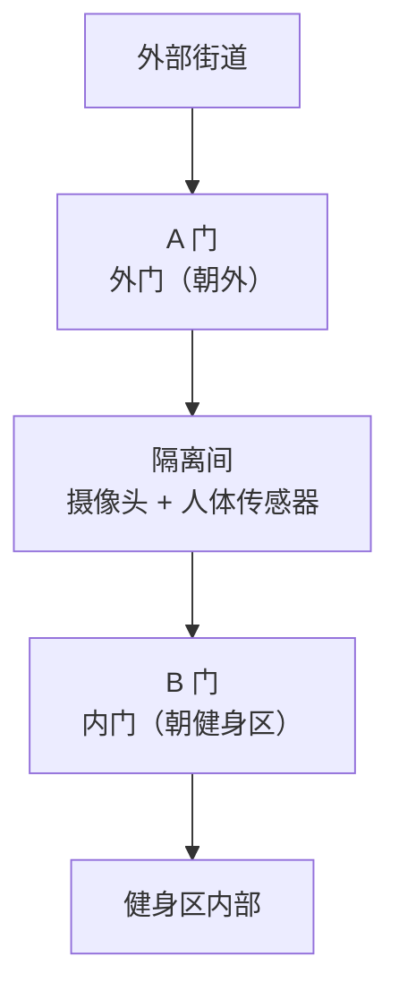
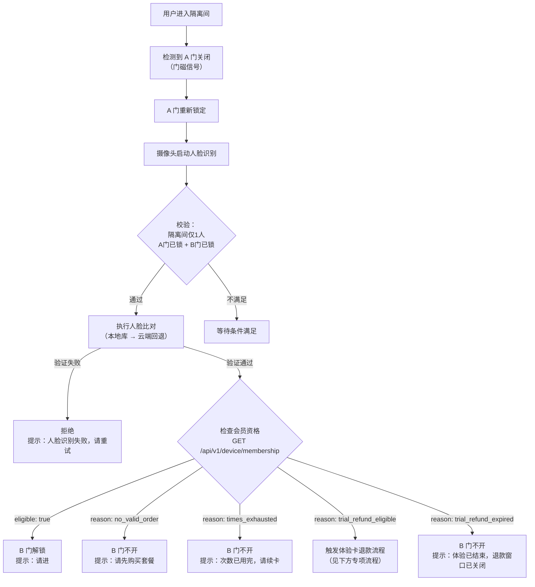
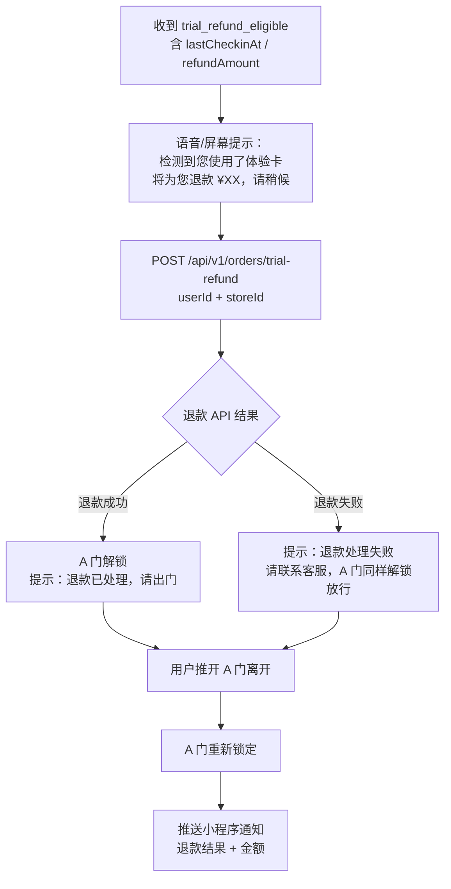
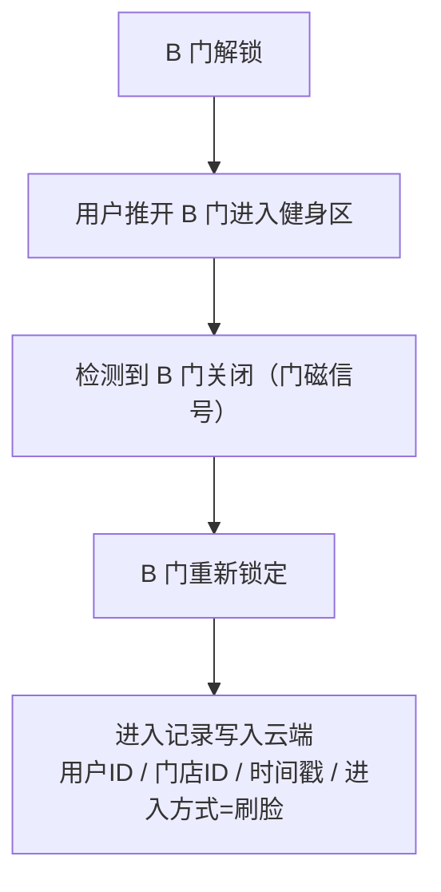
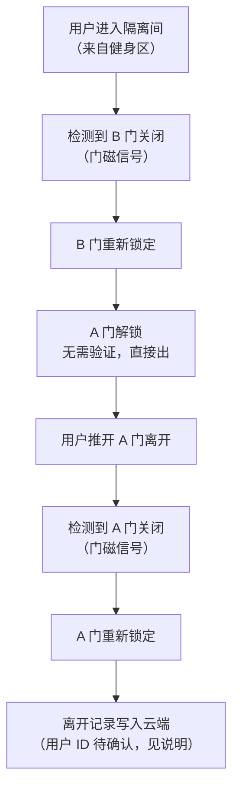
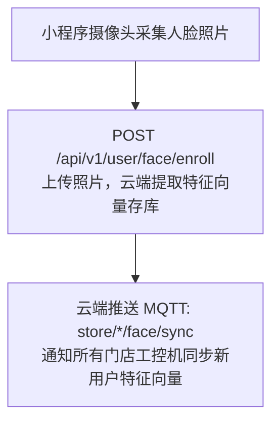
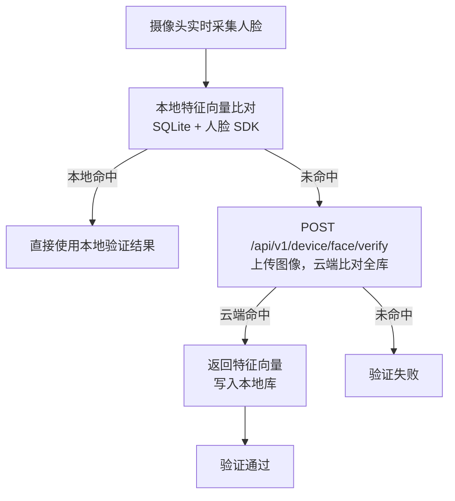

# 刷脸系统（AB 门）

**涉及子系统**：工控机（核心）、云端 API（人脸验证/同步）、小程序（人脸录入）  
**核心业务**：通过 AB 门隔离间 + 人脸识别，实现用户无人值守安全进出健身房

---

## 系统概述

入口采用 **AB 门隔离间**结构：两道门（A 门朝外、B 门朝内）围成一个独立隔离区域。任意时刻只允许一道门处于开放状态，确保进出人员唯一可控，同时完成身份验证后方可通过 B 门进入健身区。

---

## 进入流程

### 前提条件检查（A 门可打开）

| 条件 | 要求 |
|---|---|
| 隔离间内有人 | 无人（`chamber_occupied = false`） |
| B 门状态 | 锁定（`doorB_locked = true`） |

满足以上两个条件时，**A 门解锁**，用户可从外部拉开 A 门进入隔离间。

### 进入隔离间后（等待刷脸）

---

## 体验卡退款触发流程

当刷脸结果为 `trial_refund_eligible` 时，工控机触发以下专项流程：

> **注意**：无论退款 API 是否成功，均应解锁 A 门放行用户，避免将用户困在隔离间。退款失败时记录待处理异常，由后台人工补退。

### B 门开启后

---

## 离开流程

### 前提条件检查（B 门可打开）

| 条件 | 要求 |
|---|---|
| A 门状态 | 锁定（`doorA_locked = true`） |
| B 门状态 | 锁定（`doorB_locked = true`） |
| 隔离间内有人 | 无人（`chamber_occupied = false`） |

满足以上条件时，**B 门解锁**，健身区内用户可从内侧推开 B 门进入隔离间。

> 注意：离开时**无需刷脸**，隔离间无人且两门均锁定即可开 B 门。

### 进入隔离间后（出门）

### 离开记录说明

离开时无刷脸环节，用户身份无法通过人脸确认。可选方案：

| 方案 | 优点 | 缺点 |
|---|---|---|
| 记录"匿名出门"事件 | 实现简单 | 无法精确统计在场人数 |
| 出门时也进行刷脸 | 精确统计在场 | 增加出门摩擦，UX 下降 |
| 基于最近进入的用户推算 | 折中 | 多人同时在场时可能错误 |

> **暂定方案**：记录匿名出门事件，在场人数通过进入记录推算（每次进入时对应最近一次未出门的同用户记录配对）。待业务需要时再优化。

---

## 边界情况处理

| 场景 | 处理方式 |
|---|---|
| 隔离间内有人但长时间未刷脸（超时） | 超过 N 秒后语音提示，可选择解锁 A 门让其离开（管理员确认） |
| 断电/UPS 切换瞬间 | 电磁锁断电默认状态需在硬件设计时确认（常闭锁 vs 常开锁） |
| 工控机与云端断网 | 本地库有记录的用户可正常刷脸进入；本地库无记录的用户无法进入（暂不支持离线注册） |
| 多人强行同时进入隔离间 | 人体传感器检测到 > 1 人时拒绝刷脸，语音提示"隔离间内只允许一人" |
| 摄像头故障 | 触发告警，工控机上报云端；管理员可通过管理后台远程手动开门 |

---

## 人脸数据流

### 首次录入（小程序端）

### 刷脸验证（工控机端）

---

## 状态机完整定义

### 状态变量

| 变量 | 初始值 | 说明 |
|---|---|---|
| `doorA_locked` | `true` | A 门锁定状态 |
| `doorB_locked` | `true` | B 门锁定状态 |
| `doorA_closed` | `true` | A 门关闭状态（门磁） |
| `doorB_closed` | `true` | B 门关闭状态（门磁） |
| `chamber_occupied` | `false` | 隔离间有人（人体传感器） |
| `pending_user` | `null` | 当前隔离间内待验证的用户（刷脸成功后赋值） |

### 事件触发器

| 事件 | 触发条件 | 执行动作 |
|---|---|---|
| `EVT_ENTER_REQUEST` | 外部用户按入门按钮 | 检查条件 → 解锁 A 门 |
| `EVT_DOOR_A_OPEN` | 门磁：A 门打开 | 开始计时等待关闭 |
| `EVT_DOOR_A_CLOSE` | 门磁：A 门关闭 | 锁定 A 门，触发刷脸 |
| `EVT_FACE_SUCCESS` | 刷脸验证通过 + 资格有效（`eligible: true`） | 解锁 B 门 |
| `EVT_FACE_NO_MEMBER` | 刷脸通过 + 无有效资格 | B 门不开，语音提示 |
| `EVT_FACE_TRIAL_REFUND` | 刷脸通过 + `trial_refund_eligible` | 触发自动退款 → 解锁 A 门 |
| `EVT_FACE_TRIAL_EXPIRED` | 刷脸通过 + `trial_refund_expired` | B 门不开，提示退款窗口已关闭 |
| `EVT_DOOR_B_OPEN` | 门磁：B 门打开 | 开始计时等待关闭 |
| `EVT_DOOR_B_CLOSE` | 门磁：B 门关闭 | 锁定 B 门，上报进入记录 |
| `EVT_EXIT_REQUEST` | 内部用户触发出门（按钮或自动检测） | 检查条件 → 解锁 B 门 |
| `EVT_CHAMBER_EMPTY` | 人体传感器：隔离间无人 | 更新 `chamber_occupied=false` |
| `EVT_CHAMBER_OCCUPIED` | 人体传感器：隔离间有人 | 更新 `chamber_occupied=true` |

---

## 涉及子系统的开发工作

| 子系统 | 工作内容 |
|---|---|
| 工控机 | 状态机实现、GPIO 控制、人脸 SDK 集成、本地人脸库管理、MQTT 上报 |
| 云端 API | 人脸远程验证接口、特征向量存储、进出记录写入、MQTT 推送 |
| 小程序 | 人脸采集界面、上传人脸接口调用 |
| 管理后台 | 远程手动开门（紧急情况）、进出记录查看 |
