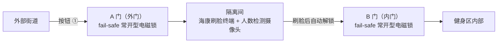
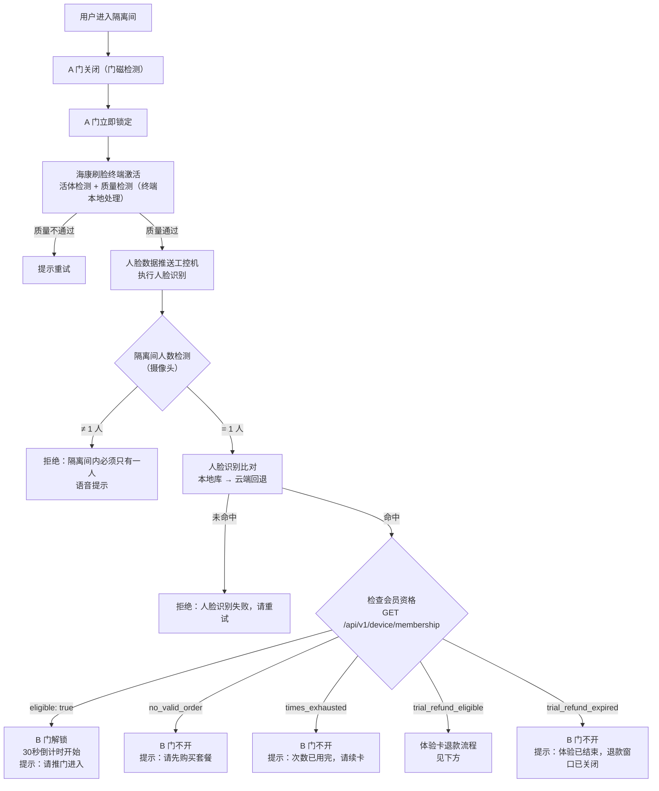
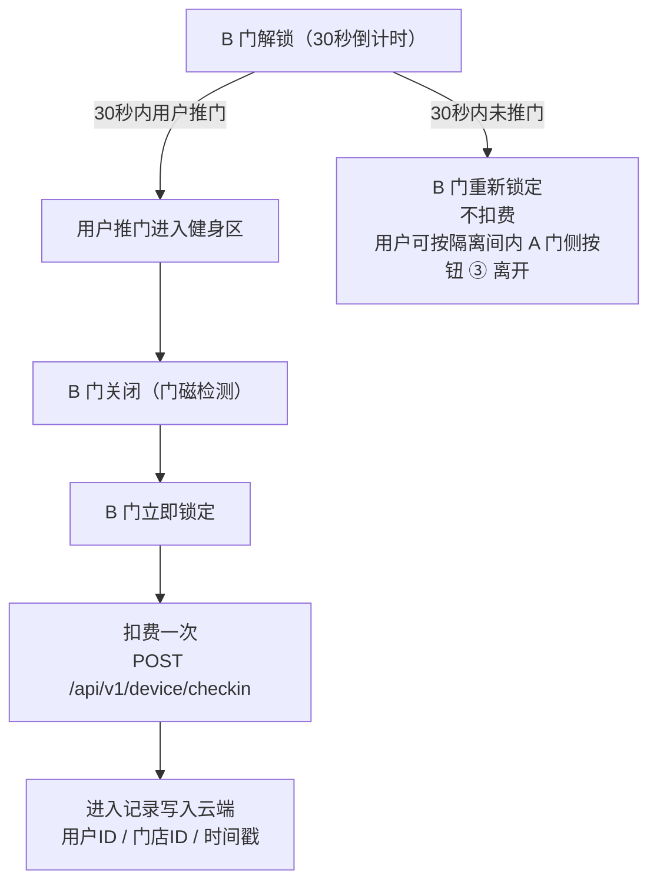
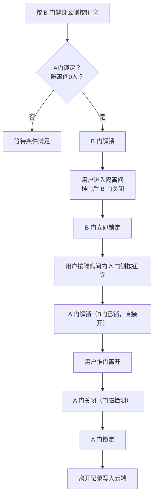
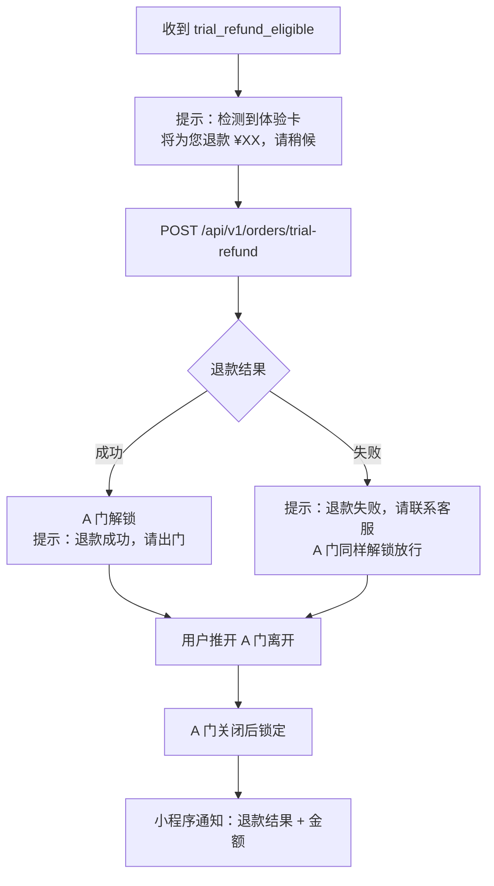
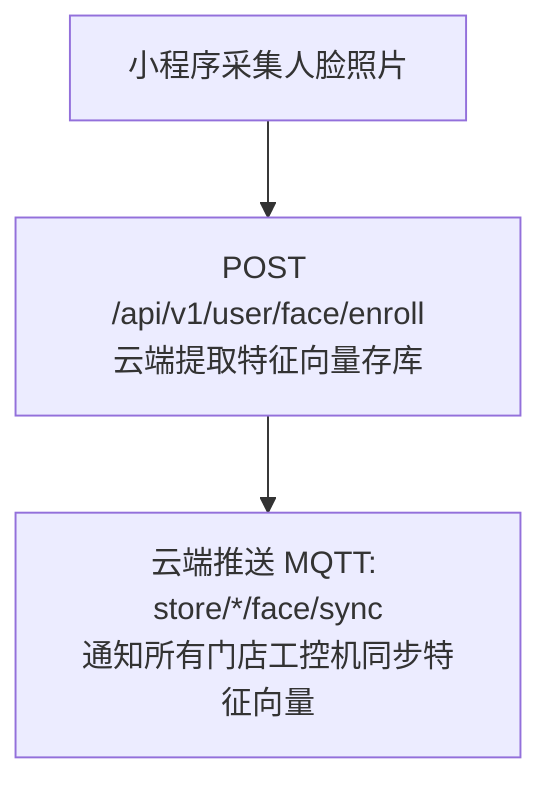
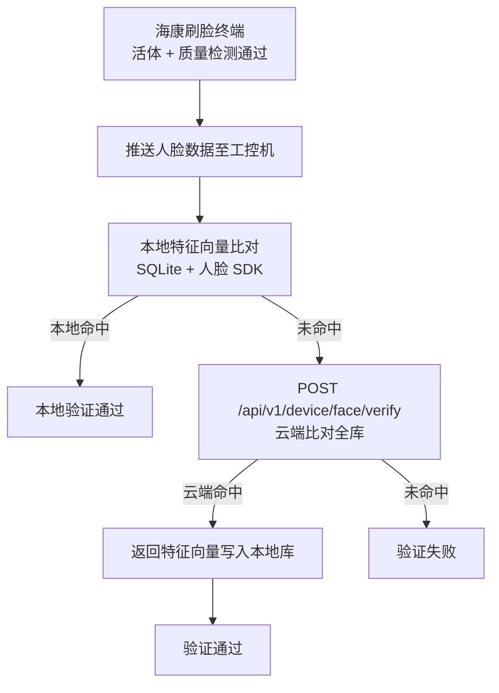

# 刷脸系统（AB 门）

**涉及子系统**：工控机（核心）、云端 API（人脸验证/同步）、小程序（人脸录入）  
**核心业务**：通过 AB 门隔离间 + 人脸识别，实现用户无人值守安全进出健身房

---

## 系统概述

入口采用 **AB 门隔离间**结构：两道门（A 门朝外、B 门朝内）围成一个独立隔离区域。

**硬件说明：**

| 设备 | 安装位置 | 作用 |
|---|---|---|
| A 门外侧进门按钮 ① | A 门外侧 | 触发进门流程（无需刷脸） |
| 海康刷脸终端 | 隔离间内（A 门内侧） | 活体检测 + 质量检测，通过后推送工控机识别 |
| 人数检测摄像头 | 隔离间内 | AI 视频分析，精确统计隔离间内人数（0人/1人） |
| B 门健身区侧出门按钮 ② | B 门健身区侧 | 触发出门流程 |
| 隔离间内 A 门侧开门按钮 ③ | 隔离间内（A 门内侧） | 出门最后一步，从隔离间离开 |
| 电磁锁（A/B 门） | 门框 | **fail-safe 常开型**：断电/紧急情况自动开门，通电后受控 |

---

## 进门流程

### 第一步：A 门开启（无需刷脸）

用户按下 **A 门外侧进门按钮 ①**，工控机检查：

| 条件 | 要求 |
|---|---|
| B 门状态 | 锁定 |
| 隔离间人数 | 0 人（摄像头检测） |

两个条件均满足 → A 门电磁锁解锁，用户**推门**进入隔离间。

### 第二步：隔离间内刷脸

### 第三步：B 门通过与扣费

> **关键规则**：B 门解锁后用户需主动推门，**30 秒内未推门则重新锁定且不扣费**。用户推门进入、B 门关闭后立即锁定，同时扣费。

---

## 出门流程

### 第一步：从健身区进入隔离间

用户按下 **B 门健身区侧出门按钮 ②**，工控机检查：

| 条件 | 要求 |
|---|---|
| A 门状态 | 锁定 |
| 隔离间人数 | 0 人（摄像头检测） |

条件满足 → B 门解锁，用户推门进入隔离间 → B 门关闭后立即锁定。

### 第二步：从隔离间离开

用户按下 **隔离间内 A 门侧开门按钮 ③**，工控机检查：

| 条件 | 要求 |
|---|---|
| B 门状态 | 锁定（满足，因第一步已锁定） |

条件满足 → A 门解锁，用户推门离开健身房。

> **出门全程无需刷脸**，也不受会员有效期/体验卡状态限制。

---

## 体验卡退款流程

当刷脸结果为 `trial_refund_eligible`（体验卡在 10 分钟退款窗口内）时：

> **原则**：退款无论成功失败均放行用户，不得将用户困在隔离间。失败时记录异常待人工补退。

### 体验卡超时规则

| 情况 | 用户在隔离间刷脸结果 |
|---|---|
| 10 分钟内返回隔离间刷脸 | `trial_refund_eligible` → 退款 + 结束体验 |
| 超出 10 分钟，按天计费卡 | `eligible: true` → 正常扣费，可继续使用 |
| 超出 10 分钟，按次计费卡 | `times_exhausted` → B 门不开，提示次数已用完 |
| 超出 10 分钟且退款窗口关闭 | `trial_refund_expired` → B 门不开，退款窗口已关闭 |

---

## 边界情况处理

| 场景 | 处理方式 |
|---|---|
| 断电 / UPS 切换 | fail-safe 电磁锁断电自动开门，用户可自由离开（地震等紧急情况同） |
| 工控机与云端断网 | 本地库有记录的用户正常进入；本地库无记录的用户无法进入（暂不支持离线注册） |
| 多人同时进入隔离间 | 人数检测摄像头检测到 > 1 人 → 拒绝刷脸，语音提示"隔离间内只允许一人" |
| 刷脸后 30 秒未推门 | B 门重新锁定，不扣费；用户可按隔离间内按钮 ③ 离开 |
| 人数检测摄像头故障 | 触发告警，上报云端；管理员可通过管理后台远程手动开门 |
| 隔离间内滞留超时 | 超过配置时间后语音提示，可选择解锁 A 门放行（需管理员确认） |

---

## 状态机定义

### 状态变量

| 变量 | 初始值 | 说明 |
|---|---|---|
| `doorA_locked` | `true` | A 门锁定状态 |
| `doorB_locked` | `true` | B 门锁定状态 |
| `doorA_closed` | `true` | A 门关闭状态（门磁） |
| `doorB_closed` | `true` | B 门关闭状态（门磁） |
| `chamber_count` | `0` | 隔离间内人数（摄像头检测，0 或 1） |
| `pending_user` | `null` | 当前隔离间内待验证的用户（刷脸成功后赋值） |
| `b_unlock_timer` | `null` | B 门解锁后的 30 秒倒计时 |

### 事件触发器

| 事件 | 触发条件 | 执行动作 |
|---|---|---|
| `EVT_BTN_A_OUTER` | 按下 A 门外侧按钮 ① | 检查 B 门锁定 + 隔离间 0 人 → 解锁 A 门 |
| `EVT_DOOR_A_CLOSE` | 门磁：A 门关闭 | 立即锁定 A 门，触发刷脸等待 |
| `EVT_FACE_QUALITY_PASS` | 海康终端质量检测通过 | 推送人脸数据到工控机识别 |
| `EVT_FACE_SUCCESS` | 人脸识别通过 + `eligible: true` | 检查隔离间恰好 1 人 → 解锁 B 门，启动 30 秒计时 |
| `EVT_FACE_TRIAL_REFUND` | `trial_refund_eligible` | 触发退款流程 → 解锁 A 门 |
| `EVT_DOOR_B_CLOSE_ENTER` | 门磁：B 门关闭（进门方向） | 立即锁定 B 门，取消计时，扣费，写入进入记录 |
| `EVT_B_UNLOCK_TIMEOUT` | 30 秒计时到期且 B 门未开 | B 门重新锁定，不扣费 |
| `EVT_BTN_B_INNER` | 按下 B 门健身区侧按钮 ② | 检查 A 门锁定 + 隔离间 0 人 → 解锁 B 门 |
| `EVT_DOOR_B_CLOSE_EXIT` | 门磁：B 门关闭（出门方向） | 立即锁定 B 门 |
| `EVT_BTN_A_INNER` | 按下隔离间内 A 门侧按钮 ③ | 检查 B 门锁定 → 解锁 A 门 |
| `EVT_DOOR_A_CLOSE_EXIT` | 门磁：A 门关闭（出门方向） | 锁定 A 门，写入离开记录 |
| `EVT_CHAMBER_COUNT` | 摄像头：人数变化 | 更新 `chamber_count` |

---

## 人脸数据流

### 首次录入（小程序端）

### 刷脸验证（工控机端）

---

## 涉及子系统的开发工作

| 子系统 | 工作内容 |
|---|---|
| 工控机 | 状态机实现、GPIO 控制门锁、与海康刷脸终端通信、接收人脸数据并识别、本地人脸库管理、MQTT 上报 |
| 云端 API | 人脸远程验证接口、特征向量存储、进出记录写入、会员资格查询、体验卡退款接口、MQTT 推送 |
| 小程序 | 人脸采集界面、上传人脸接口调用 |
| 管理后台 | 远程手动开门（紧急情况）、进出记录查看 |
