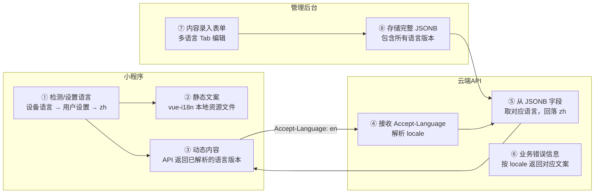

# 多语言系统（i18n）

**涉及子系统**：云端 API（核心）、小程序（用户侧展示）、管理后台（内容录入）  
**核心业务**：支持外籍用户使用小程序，后台录入内容时同时维护多语言版本，API 按请求语言返回对应内容

---

## 背景与目标

健身房面向外籍用户开放，需要在以下层面实现多语言支持：

1. **小程序 UI 文案**：页面标题、按钮、提示语等静态文本
2. **动态内容**：从后台录入的产品名称、描述、门店介绍、优惠券说明、活动 Banner 等
3. **API 错误信息**：返回给用户的业务错误提示
4. **管理后台内容录入**：运营人员在后台编辑内容时，同时填写各语言版本

**第一期支持语言：**


| 语言   | 代码   | 说明          |
| ---- | ---- | ----------- |
| 简体中文 | `zh` | 默认语言，必填     |
| 英文   | `en` | 外籍用户主要语言，必填 |


> 第二期可扩展日文（`ja`）、韩文（`ko`）等，数据库结构无需变更。

---

## 整体架构




---

## 一、数据库多语言方案

### 设计原则

采用 **PostgreSQL JSONB 字段** 存储多语言内容，而非独立的多语言表。

**选择理由：**

- 系统规模适中，语言维度不多，JSONB 足够简洁
- 查询时无需 JOIN 语言表，性能更好
- 字段结构清晰：`{"zh": "月卡", "en": "Monthly Pass"}`
- PostgreSQL JSONB 支持索引、路径查询，扩展成本低

### 需要多语言的字段（可译字段）


| 表名               | 字段            | 中文示例              | 英文示例                                       |
| ---------------- | ------------- | ----------------- | ------------------------------------------ |
| `products`       | `name`        | `月卡`              | `Monthly Pass`                             |
| `products`       | `description` | `每月无限次进入，按自然月计算`  | `Unlimited monthly access, calendar month` |
| `stores`         | `name`        | `EachCan 朝阳店`     | `EachCan Chaoyang`                         |
| `stores`         | `address`     | `北京市朝阳区 XX 路 1 号` | `No.1 XX Rd, Chaoyang, Beijing`            |
| `stores`         | `description` | `设施齐全，24小时营业`     | `Full facilities, 24/7 open`               |
| `coupons`        | `name`        | `新用户专享优惠券`        | `New User Coupon`                          |
| `coupons`        | `description` | `首次购买月卡享 8 折`     | `20% off your first Monthly Pass`          |
| `banners` *(如有)* | `title`       | `五一大促`            | `May Day Sale`                             |
| `banners` *(如有)* | `content`     | `限时优惠，即刻购买`       | `Limited time offer, buy now`              |


> `users`、`orders`、`checkins`、`device_logs` 等运营型数据无需多语言，始终存储原始数据。

### 字段定义规范（以 Flyway SQL 为例）

```sql
-- products 表可译字段
ALTER TABLE products
  ADD COLUMN name        JSONB NOT NULL DEFAULT '{"zh": "", "en": ""}',
  ADD COLUMN description JSONB          DEFAULT '{"zh": "", "en": ""}';

-- stores 表可译字段
ALTER TABLE stores
  ADD COLUMN name        JSONB NOT NULL DEFAULT '{"zh": "", "en": ""}',
  ADD COLUMN address     JSONB          DEFAULT '{"zh": "", "en": ""}',
  ADD COLUMN description JSONB          DEFAULT '{"zh": "", "en": ""}';

-- coupons 表可译字段
ALTER TABLE coupons
  ADD COLUMN name        JSONB NOT NULL DEFAULT '{"zh": "", "en": ""}',
  ADD COLUMN description JSONB          DEFAULT '{"zh": "", "en": ""}';
```

### 后端工具类（Kotlin）

```kotlin
// 从 JSONB 字段中取指定语言，回落到 zh
fun JsonNode?.resolve(locale: String): String {
    if (this == null) return ""
    return get(locale)?.asText()?.takeIf { it.isNotBlank() }
        ?: get("zh")?.asText()
        ?: ""
}
```

---

## 二、云端 API 多语言方案

### 语言协商

小程序在每次 HTTP 请求头中携带 `Accept-Language`：

```
Accept-Language: en
Accept-Language: zh
```

后端统一解析此 Header，若未携带则默认 `zh`。

### 响应结构

**用户端接口**（小程序调用）：API 直接返回**解析后的字符串**，而非完整 JSONB 对象。

```json
// GET /api/v1/products  Accept-Language: en
{
  "id": "prod_001",
  "name": "Monthly Pass",
  "description": "Unlimited monthly access, calendar month",
  "price": 299.00,
  "type": "monthly"
}
```

**管理端接口**（后台调用）：返回**完整 JSONB**，前端展示多语言编辑 Tab。

```json
// GET /api/v1/admin/products/prod_001
{
  "id": "prod_001",
  "name": { "zh": "月卡", "en": "Monthly Pass" },
  "description": { "zh": "每月无限次进入", "en": "Unlimited monthly access" },
  "price": 299.00
}
```

### 业务错误信息多语言

云端 API 返回的业务错误码对应的提示文案按 locale 返回：

```json
// 用户无有效订单，Accept-Language: en
{
  "code": "NO_VALID_ORDER",
  "message": "No valid membership found. Please purchase a plan."
}

// 同一错误，Accept-Language: zh
{
  "code": "NO_VALID_ORDER",
  "message": "未找到有效会员资格，请购买套餐。"
}
```

后端维护错误码 → 多语言文案的映射表（可用枚举或配置文件）。

### 新增 API 接口说明


| 接口                                | 变更                      | 说明           |
| --------------------------------- | ----------------------- | ------------ |
| `GET /api/v1/products`            | 新增 `Accept-Language` 支持 | 返回解析后的语言版本   |
| `GET /api/v1/products/{id}`       | 同上                      | —            |
| `GET /api/v1/stores`              | 新增 `Accept-Language` 支持 | 门店名称、描述按语言返回 |
| `GET /api/v1/admin/products`      | 返回完整 JSONB 对象           | 后台编辑需要全量数据   |
| `POST /api/v1/admin/products`     | 接收 `name: {zh, en}` 格式  | 后台提交多语言内容    |
| `PUT /api/v1/admin/products/{id}` | 同上                      | —            |
| `GET /api/v1/admin/stores/{id}`   | 返回完整 JSONB 对象           | —            |
| `PUT /api/v1/admin/stores/{id}`   | 接收多语言字段                 | —            |


---

## 三、小程序多语言方案

### 技术选型


| 能力        | 方案                                       |
| --------- | ---------------------------------------- |
| 静态文案 i18n | `vue-i18n`（uni-app Vue 3 原生支持）           |
| 语言文件格式    | JSON，按 locale 分文件                        |
| 动态内容      | API 请求携带 `Accept-Language`，使用服务端返回的已解析内容 |
| 语言偏好存储    | `uni.getStorageSync('locale')`           |
| 默认语言逻辑    | 设备语言 → 用户设置 → 回落 `zh`                    |


### 工程目录结构

```
src/
├── locales/
│   ├── zh.json        # 简体中文文案
│   └── en.json        # 英文文案
├── composables/
│   └── useLocale.ts   # 语言切换、初始化、写入 HTTP header
└── ...
```

### 语言文件示例

```json
// src/locales/zh.json
{
  "common": {
    "confirm": "确认",
    "cancel": "取消",
    "loading": "加载中…",
    "retry": "重试"
  },
  "home": {
    "nearbyStores": "附近门店",
    "openStatus": "营业中",
    "closedStatus": "已关闭"
  },
  "product": {
    "buy": "立即购买",
    "validDays": "有效期 {days} 天",
    "timesLeft": "剩余 {times} 次"
  },
  "face": {
    "enrollTitle": "人脸录入",
    "retakeBtn": "重新录入",
    "success": "录入成功"
  },
  "error": {
    "network": "网络连接失败，请重试",
    "unknown": "操作失败，请稍后重试"
  }
}
```

```json
// src/locales/en.json
{
  "common": {
    "confirm": "Confirm",
    "cancel": "Cancel",
    "loading": "Loading…",
    "retry": "Retry"
  },
  "home": {
    "nearbyStores": "Nearby Gyms",
    "openStatus": "Open",
    "closedStatus": "Closed"
  },
  "product": {
    "buy": "Buy Now",
    "validDays": "Valid for {days} days",
    "timesLeft": "{times} entries remaining"
  },
  "face": {
    "enrollTitle": "Face Enrollment",
    "retakeBtn": "Re-enroll",
    "success": "Enrollment successful"
  },
  "error": {
    "network": "Network error, please retry",
    "unknown": "Operation failed, please try again"
  }
}
```

### 语言初始化逻辑

```
app 启动
  ↓
读取 storage('locale')
  ↓ 无记录
读取 uni.getSystemInfoSync().language
  ↓ 非 zh/en
回落至 zh
  ↓
设置 vue-i18n locale
写入 storage('locale')
在 HTTP 拦截器中注入 Accept-Language header
```

### 语言切换入口

- **首次引导**：首次打开小程序时，若设备语言为非中文，自动切换为 `en`，并在引导页提示语言设置
- **个人中心**：「语言设置」选项，可手动切换中文 / English

### 需要多语言文案的页面（逐一覆盖）


| 页面        | 静态文案           | 动态内容（来自 API）          |
| --------- | -------------- | --------------------- |
| 首页 / 门店列表 | 搜索框、按钮         | 门店名称、地址、状态            |
| 登录注册      | 按钮、说明文字、协议链接文本 | —                     |
| 人脸录入      | 提示语、步骤说明、按钮    | API 错误文案              |
| 产品列表      | 按钮、筛选项         | 产品名称、描述、有效期说明         |
| 订单详情      | 状态标签、操作按钮      | —                     |
| 优惠券       | 提示文字           | 优惠券名称、使用说明            |
| 淋浴控制      | 按钮、倒计时说明       | —                     |
| 动作库       | 分类名称           | 动作名称、说明 *(动作库数据需多语言)* |
| 个人中心      | 所有菜单项、标签       | —                     |
| 错误提示      | 通用错误文案         | 业务错误文案（来自 API）        |


---

## 四、管理后台多语言内容录入方案

### 原则

管理后台界面**无需多语言**（内部使用，中文即可），但**内容编辑表单需支持多语言内容录入**。

### 表单设计：语言 Tab 模式

对含可译字段的编辑表单，使用**语言切换 Tab** 展示各语言的输入区域：

```
┌────────────────────────────────────────────────┐
│  产品名称                                        │
│  ┌──────────┬──────────┐                        │
│  │  简体中文 │  English  │                        │
│  └──────────┴──────────┘                        │
│  ┌────────────────────────────────────────────┐  │
│  │ 月卡                                        │  │
│  └────────────────────────────────────────────┘  │
│                                                  │
│  产品描述                                        │
│  ┌──────────┬──────────┐                        │
│  │  简体中文 │  English  │                        │
│  └──────────┴──────────┘                        │
│  ┌────────────────────────────────────────────┐  │
│  │ 每月无限次进入，按自然月计算                    │  │
│  └────────────────────────────────────────────┘  │
└────────────────────────────────────────────────┘
```

- **中文为必填**，英文为必填（第一期两语言均须录入）
- 表单提交时前端组装为 `{"zh": "...", "en": "..."}` 格式发给后端
- 表单校验：每种语言版本的必填字段均须填写

### 涉及多语言录入的管理后台页面


| 页面                   | 含可译字段        |
| -------------------- | ------------ |
| 产品管理 — 新增/编辑产品       | 产品名称、产品描述    |
| 门店管理 — 编辑门店信息        | 门店名称、地址、门店简介 |
| 优惠券管理 — 新增/编辑优惠券     | 优惠券名称、使用说明   |
| Banner / 活动管理 *(如有)* | 标题、正文内容      |


### 前端实现建议（Nuxt 3 + Nuxt UI）

封装可复用的 `LocalizedInput` 组件，接收字段名，自动渲染多语言 Tab：

```vue
<LocalizedInput
  label="产品名称"
  v-model="form.name"
  :locales="['zh', 'en']"
  :required="true"
/>
```

内部维护 `{ zh: string, en: string }` 双向绑定，配合 Zod 校验每个 locale 不为空。

---

## 五、影响范围汇总

### 数据库变更


| 表          | 变更内容                                    |
| ---------- | --------------------------------------- |
| `products` | `name`、`description` 改为 JSONB           |
| `stores`   | `name`、`address`、`description` 改为 JSONB |
| `coupons`  | `name`、`description` 改为 JSONB           |


> 如有 `banners` / `activities` 表，同样需要对展示性文案字段做 JSONB 处理。

### 后端变更


| 模块               | 变更内容                                                 |
| ---------------- | ---------------------------------------------------- |
| `common`         | 新增 `LocaleResolver`：从请求头解析 `Accept-Language`，默认 `zh` |
| `common`         | 新增 `JsonbI18nUtil`：JSONB 字段按 locale 解析工具             |
| `product`        | 查询结果按 locale 解析可译字段后返回                               |
| `store`          | 同上                                                   |
| `coupon`         | 同上                                                   |
| `product`（admin） | 接收和返回完整 JSONB 结构                                     |
| `store`（admin）   | 同上                                                   |
| `coupon`（admin）  | 同上                                                   |
| 错误信息             | 全局异常处理器按 locale 返回对应语言的用户可见文案                        |


### 小程序变更


| 模块                         | 变更内容                            |
| -------------------------- | ------------------------------- |
| `src/locales/`             | 新建 `zh.json`、`en.json` 文案资源文件   |
| `composables/useLocale.ts` | 语言初始化、切换、持久化逻辑                  |
| HTTP 拦截器                   | 每次请求注入 `Accept-Language` header |
| 所有页面                       | 静态文案替换为 `t('...')` 调用           |
| 个人中心                       | 新增「语言设置」入口                      |


### 管理后台变更


| 模块                              | 变更内容                        |
| ------------------------------- | --------------------------- |
| `components/LocalizedInput.vue` | 新建多语言输入组件                   |
| 产品管理表单                          | 使用 `LocalizedInput` 替换普通文本框 |
| 门店管理表单                          | 同上                          |
| 优惠券管理表单                         | 同上                          |


---

## 六、语言回落策略

在任何层面，若某语言版本未填写，统一按以下顺序回落：

```
请求语言 → zh（简体中文）→ 任意有值的语言 → 空字符串
```

---

## 待确认事项

- 动作库（健身动作教程）的多语言方案：内容量较大，是否由运营手动翻译或接入 AI 翻译辅助
- 第一期英文内容是否需要专业翻译审校，还是运营自行填写即可
- 门店地址是否需要英文翻译（可选，部分门店地址英文意义不大）
- 是否需要支持小程序内切换语言后立即刷新所有已缓存的动态内容
- 外部券码（抖音/美团）的核销提示语是否也需要多语言

