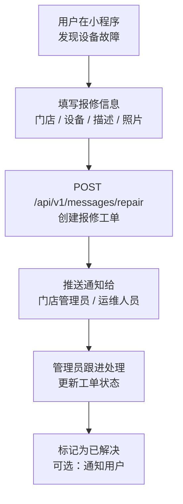

# 设备报修

**涉及子系统**：云端 API、管理后台、小程序
**核心业务**：用户提交设备故障报修，管理端跟进处理

---

## 报修流程



---

## 报修工单数据模型

```
RepairTicket {
  id          String
  storeId     String      # 所属门店
  userId      String      # 报修用户
  device      String      # 设备描述（如：淋浴3号、大门刷脸机）
  description String      # 故障描述
  images      String[]    # 照片 URL 列表
  status      Enum        # PENDING / PROCESSING / RESOLVED / CLOSED
  assignee    String?     # 处理人
  resolvedAt  DateTime?
  createdAt   DateTime
}
```

---

## 待确认事项

- [ ] 是否需要与外部工单系统对接（如企业微信、飞书）
- [ ] 报修提交后是否需要给用户发微信服务通知
