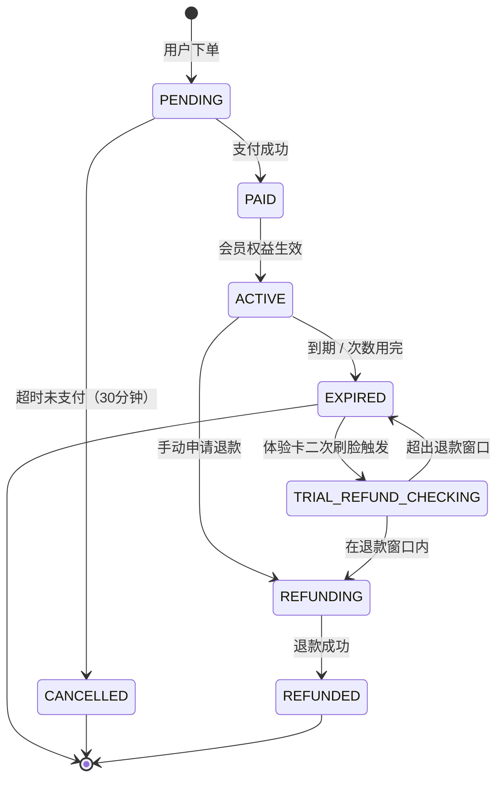
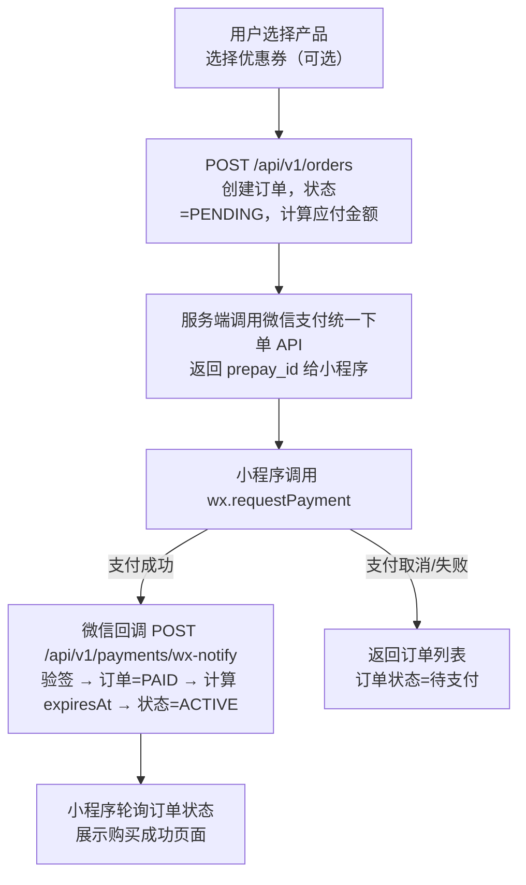
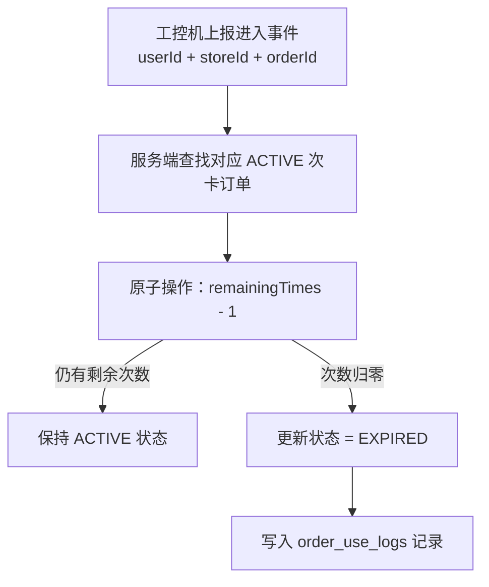

# 订单系统

**涉及子系统**：云端 API（核心）、管理后台（查询/退款）、小程序（购买入口）  
**核心业务**：处理用户购买产品套餐的完整生命周期，包括创建、支付、生效、核销、退款

---

## 订单状态流转



---

## 订单数据模型

```
Order {
  id              String       # 订单唯一标识（展示用：年月日+随机码）
  userId          String       # 用户 ID
  storeId         String?      # 购买时所在门店（null = 线上购买）
  productId       String       # 产品 ID
  productSnapshot Json         # 购买时产品快照（防止产品修改后影响订单）
  couponId        String?      # 使用的优惠券 ID
  originalAmount  Decimal      # 原价
  discountAmount  Decimal      # 优惠金额
  payAmount       Decimal      # 实付金额
  status          Enum         # PENDING/PAID/ACTIVE/EXPIRED/CANCELLED/REFUNDING/REFUNDED
  paymentMethod   String?      # 支付方式（wechat）
  wxTransactionId String?      # 微信支付流水号
  paidAt          DateTime?    # 支付时间
  expiresAt       DateTime?    # 有效期截止时间（付款后计算）
  remainingTimes  Int?         # 次卡剩余次数
  refundedAt      DateTime?    # 退款时间
  refundReason    String?      # 退款原因
  createdAt       DateTime
  updatedAt       DateTime
}
```

---

## 购买流程

### 小程序端流程



### 支付回调安全处理

- 回调接口需验证微信签名，防止伪造
- 使用幂等锁防止重复回调处理（基于微信 `transaction_id`）
- 异步处理：回调立即返回 200，业务逻辑异步执行

---

## 核销流程（次卡扣减）

次卡每次用户成功进入时由云端 API 执行：



---

## 退款规则

| 订单类型 | 退款条件 | 退款金额计算 | 发起方式 |
|---|---|---|---|
| 月卡（未使用） | 未进入过健身房 | 全额退款 | 手动申请 |
| 月卡（已使用） | 在有效期内 | 按剩余天数比例退款 | 手动申请 |
| 次卡（未使用） | 0 次已用 | 全额退款 | 手动申请 |
| 次卡（已使用） | 有剩余次数 | 按剩余次数比例退款 | 手动申请 |
| **体验卡** | **已进入一次 + 距进入时间 ≤ 退款窗口** | **全额退款** | **二次刷脸自动触发** |

> 体验卡退款是系统**自动触发**的，由工控机检测到刷脸结果为 `trial_refund_eligible` 后直接调用退款 API，无需用户手动操作。

---

## 体验卡自动退款 API

工控机调用，无需用户手动申请：

```
POST /api/v1/orders/trial-refund

Request:
{
  "userId": "user_xxx",
  "storeId": "store_001"
}

Response（成功）:
{
  "success": true,
  "refundAmount": 9.90,
  "wxRefundId": "xxx",
  "message": "退款已发起，预计 1-3 个工作日到账"
}

Response（失败）:
{
  "success": false,
  "error": "REFUND_WINDOW_EXPIRED",  // 或其他错误码
  "message": "退款窗口已关闭"
}
```

**服务端校验逻辑**：
1. 查找该用户最近一笔状态为 `EXPIRED`（次数归零）的体验卡订单
2. 查找对应 `checkin_logs` 中该订单触发的最后一次进入时间 `lastCheckinAt`
3. 校验 `now - lastCheckinAt ≤ product.trialRefundWindowMinutes`
4. 通过则调用微信退款 API，更新订单状态为 `REFUNDED`

---

## 管理后台订单功能

- **订单列表**：多维度筛选（时间范围、门店、用户、产品类型、状态）
- **订单详情**：完整信息、支付记录、使用记录
- **手动退款**：填写退款原因，调用微信退款 API，记录操作人
- **数据导出**：支持导出为 Excel/CSV（财务对账用）

---

## 待确认事项

- [ ] 订单是否支持多产品合并购买（一次下单多张卡）
- [ ] 待支付订单超时时间（建议 30 分钟）
- [x] 体验卡退款机制：二次刷脸自动触发，窗口内全额退款（已确认）
- [ ] 体验卡退款窗口时长具体值（建议 30 分钟，待运营确认）
- [ ] 非体验卡退款是否需要审批流程（管理员直接退 vs 需上级审批）
- [x] 体验卡退款接入微信退款 API 自动退款（已确认）
