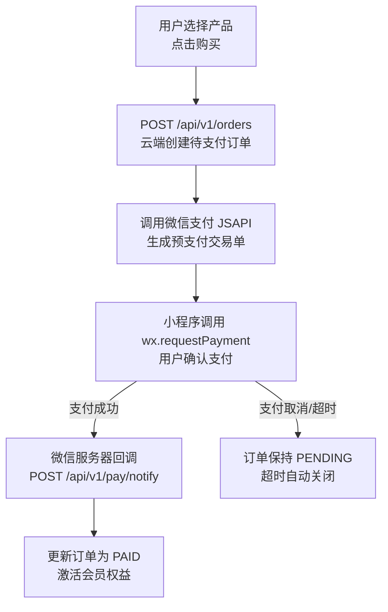

# 支付系统

**涉及子系统**：云端 API（核心）、小程序（收银台）
**核心业务**：微信支付集成、退款处理、账单对账

---

## 微信支付

飞创 Fitron 通过微信支付小程序支付接口完成用户购买订单的资金结算。

### 支付流程

### 支付配置项

| 配置项 | 说明 |
|---|---|
| 商户号（mchId） | 微信支付商户唯一标识 |
| APIv3 密钥 | 用于回调通知验签与敏感信息解密 |
| 证书序列号 | 请求微信接口所需的证书标识 |
| 回调地址 | 需公网可达，建议配置独立子域名 |

---

## 退款

退款由云端 API 发起，调用微信支付退款接口。退款结果通过退款回调通知更新订单状态。

| 退款场景 | 触发方式 | 说明 |
|---|---|---|
| 体验卡退款 | 系统自动 | 检测到退款窗口内重新刷脸触发 |
| 管理员手动退款 | 管理后台操作 | 适用于用户投诉、误购等场景 |
| 订单超时未支付 | 无需退款 | 直接关闭订单，未扣款 |

---

## 资格申请

### 微信支付商户号申请

1. 登录[微信支付商户平台](https://pay.weixin.qq.com)，完成主体资质认证
2. 申请小程序支付权限（需小程序已发布并完成类目配置）
3. 获取商户号（mchId）、配置 APIv3 密钥与证书

### 小程序支付类目要求

| 要求项 | 说明 |
|---|---|
| 小程序类目 | 需包含「运动/健康」或「体育健身」相关类目 |
| 营业执照 | 需提供有效的营业执照（个体工商户或企业均可） |
| 对公账户 | 建议使用对公账户接收结算款项 |

---

## 待确认事项

- [ ] 是否需要对接多商户（每家加盟店独立商户号 vs 统一结算）
- [ ] 退款到账时效的用户提示文案
- [ ] 是否支持线下扫码支付（目前仅规划小程序支付）
- [ ] 账单对账自动化脚本（与微信支付账单文件比对）
