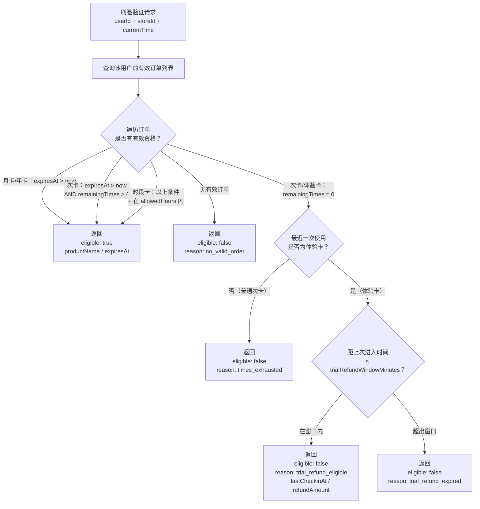

# 产品/计费系统

**涉及子系统**：云端 API（核心）、管理后台（配置）、小程序（展示购买）  
**核心业务**：定义健身房的产品套餐类型、定价规则、有效期与使用权限逻辑

---

## 系统概述

产品/计费系统定义了用户可以购买的所有套餐类型，以及每种套餐对应的使用权益（可进入的时间段、次数限制、有效期等）。它是订单系统的上游，是门禁验证权限的依据。

---

## 产品类型

| 产品类型 | 说明 | 计费方式 |
|---|---|---|
| 月卡 | 在有效期内无限次进入 | 按自然月或按购买日起 N 天 |
| 季卡 / 年卡 | 同月卡，有效期更长 | 同月卡 |
| 次卡 | 固定次数，有效期内使用 | 按次扣减 |
| **体验卡** | 首次用户限购，1 次进入机会，支持条件退款 | 1 次，含退款窗口 |
| 时段卡（可选） | 仅限特定时间段进入（如白天场、夜间场） | 按月/次 + 时段限制 |

### 体验卡退款机制

体验卡是唯一支持「进入后反悔退款」的产品类型。规则如下：

- 用户使用体验卡进入健身房（消耗唯一 1 次机会）
- 用户通过正常出门流程离开健身房
- 用户**在退款窗口时间内**重新进入隔离间并进行刷脸
- 系统检测到：身份确认 + 次数已耗尽 + 上次使用为体验卡 + 距进入时间 ≤ 退款窗口
- 系统自动发起退款，并开 A 门放行用户离开隔离间

> **退款窗口时长**：在产品配置中设定（`trialRefundWindowMinutes`，建议 30 分钟），超出窗口则不可退款。

---

## 产品数据模型

```
Product {
  id                        String       # 产品唯一标识
  storeId                   String?      # 所属门店（null = 通用产品）
  name                      String       # 产品名称
  type                      Enum         # monthly / times / experience / seasonal
  price                     Decimal      # 售价（元）
  originalPrice             Decimal?     # 划线价（展示用）
  durationDays              Int?         # 有效期天数（月卡/次卡过期时间）
  timesTotal                Int?         # 次卡总次数（null = 不限次）
  allowedHours              String?      # 允许进入时段（如 "06:00-22:00"）
  isOnSale                  Boolean      # 是否上架
  sortOrder                 Int          # 小程序展示排序
  trialRefundWindowMinutes  Int?         # 体验卡退款窗口（分钟），null=不支持此退款机制
  createdAt                 DateTime
  updatedAt                 DateTime
}
```

---

## 会员资格验证逻辑

当用户刷脸时，工控机通过云端 API 验证该用户是否具有进入权限，API 同时返回体验卡退款判断结果。



---

## 次卡次数扣减规则

- 每次**成功进入健身区**（B 门打开）时扣减 1 次
- 刷脸验证通过但 B 门未开（如用户中途离开隔离间）不扣次
- 扣减操作在云端原子执行（防止并发重复扣减）
- 扣减记录写入 `order_use_logs` 表，可追溯

---

## 产品管理（管理后台）

- **产品列表**：展示所有产品，支持上下架切换
- **新增/编辑产品**：填写名称、类型、价格、有效期、次数、时段限制
- **多门店产品**：可创建仅针对特定门店的专属套餐
- **价格历史**：记录价格修改记录（已购订单不受影响）

---

## 小程序展示规则

- 展示当前门店上架的所有产品（`isOnSale = true`）
- 优先展示通用产品，再展示门店专属产品
- 按 `sortOrder` 排序
- 体验卡：仅对从未购买过任何产品的用户展示（需云端判断）

---

## 待确认事项

- [ ] 是否支持「团体课」类产品（预约制，与无人值守模式有所不同）
- [ ] 时段卡是否进入第一期范围
- [ ] 是否支持多门店通用卡（在任意门店均可使用）
- [ ] 次卡过期未用完的处理规则（清零 vs 退款 vs 延期）
- [ ] 是否支持家庭卡（一张卡多人使用）
