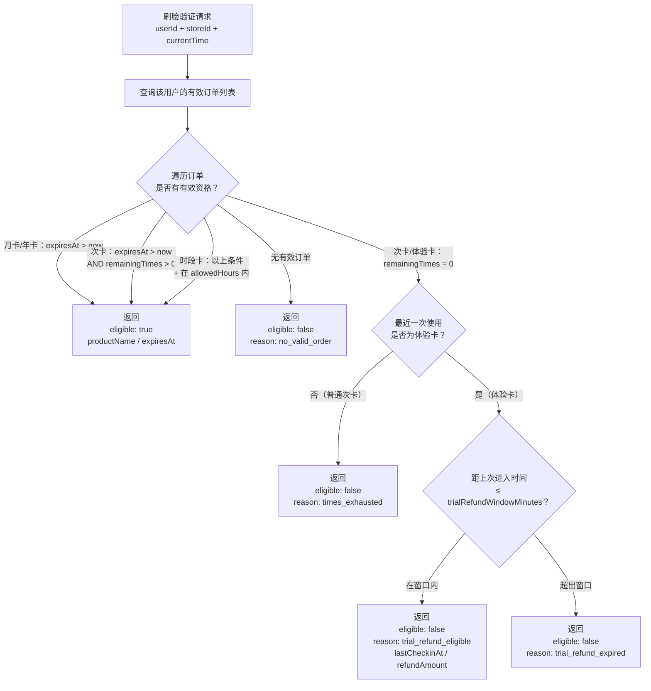

# 产品/计费系统

**涉及子系统**：云端 API（核心）、管理后台（配置）、小程序（展示购买）  
**核心业务**：定义健身房的产品套餐类型、定价规则、有效期与使用权限逻辑

---

## 系统概述

产品/计费系统定义了用户可以购买的所有套餐类型，以及每种套餐对应的使用权益（可进入的时间段、次数限制、有效期等）。它是订单系统的上游，是门禁验证权限的依据。

---

## 产品类型

| 产品类型 | 枚举值 | 说明 | 计费方式 |
|---|---|---|---|
| **体验卡** | `experience` | 首次用户限购，1 次进入机会，支持条件退款 | 1 次，含退款窗口 |
| **单店时长卡** | `single_store_duration` | 指定单家门店可用，按购买日起有效天数计算 | 有效期内无限次进入（限本店） |
| **跨店时长卡** | `multi_store_duration` | 全部门店或指定多家门店通用，有效期内任意门店均可进入 | 有效期内无限次进入 |
| **洗浴时长权益卡** | `shower_duration` | 附带淋浴使用权益，可单独购买或作为附加权益叠加 | 每次进场可使用淋浴 N 分钟 |

> 以上四种为基础产品类型，实际产品名称（如月卡、季卡、年卡）通过配置有效天数来实现，不作为独立类型枚举。

### 各产品类型使用规则

| 产品类型 | 进入权限 | 淋浴权益 | 门店限制 |
|---|---|---|---|
| 体验卡 | 1 次（含退款窗口） | 无 | 购买时指定门店 |
| 单店时长卡 | 有效期内无限次 | 无（可叠加洗浴卡） | 仅限购买时指定的单家门店 |
| 跨店时长卡 | 有效期内无限次 | 无（可叠加洗浴卡） | 产品配置的门店范围（可全部） |
| 洗浴时长权益卡 | 需配合入场权益使用 | 每次 N 分钟 | 跟随绑定的时长卡门店范围 |

### 体验卡退款机制

体验卡是唯一支持「进入后反悔退款」的产品类型。规则如下：

- 用户使用体验卡进入健身房（消耗唯一 1 次机会）
- 用户通过正常出门流程离开健身房
- 用户**在退款窗口时间内**重新进入隔离间并进行刷脸
- 系统检测到：身份确认 + 次数已耗尽 + 上次使用为体验卡 + 距进入时间 ≤ 退款窗口
- 系统自动发起退款，并开 A 门放行用户离开隔离间

> **退款窗口时长**：在产品配置中设定（`trialRefundWindowMinutes`，建议 30 分钟），超出窗口则不可退款。

---

## 产品数据模型

```
Product {
  id                        String       # 产品唯一标识
  name                      JsonObject   # 产品名称（多语言：{zh,en}）
  description               JsonObject?  # 产品描述（多语言：{zh,en}）
  type                      Enum         # experience / single_store_duration / multi_store_duration / shower_duration
  price                     Decimal      # 售价（元）
  originalPrice             Decimal?     # 划线价（展示用）
  durationDays              Int?         # 有效期天数（null = 永久/次卡以次数为准）
  allowedHours              String?      # 允许进入时段（如 "06:00-22:00"，null = 不限）
  showerMinutesPerEntry     Int?         # 洗浴时长权益卡：每次入场可用淋浴分钟数
  isOnSale                  Boolean      # 是否上架
  sortOrder                 Int          # 小程序展示排序
  trialRefundWindowMinutes  Int?         # 体验卡退款窗口（分钟），仅 experience 类型有效
  createdAt                 DateTime
  updatedAt                 DateTime
}

# 产品适用门店与定价（多对多，支持门店独立定价）
ProductStoreConfig {
  id          String
  productId   String
  storeId     String
  price       Decimal?   # 门店专属定价（null = 使用产品默认价格）
  isOnSale    Boolean    # 该门店是否上架此产品
}
```

### 多语言字段说明（新增）

- `name`、`description` 由单语言 `String` 改为多语言对象（JSONB）
- 用户端 API 根据 `Accept-Language` 返回解析后的文本
- 管理端 API 返回完整语言对象用于编辑
- 第一阶段要求 `zh`、`en` 必填

---

## 会员资格验证逻辑

当用户刷脸时，工控机通过云端 API 验证该用户是否具有进入权限，API 同时返回体验卡退款判断结果。



---

## 次卡次数扣减规则

- 每次**成功进入健身区**（B 门打开）时扣减 1 次
- 刷脸验证通过但 B 门未开（如用户中途离开隔离间）不扣次
- 扣减操作在云端原子执行（防止并发重复扣减）
- 扣减记录写入 `order_use_logs` 表，可追溯

---

## 多门店产品

产品本身不绑定门店，通过 `ProductStoreConfig` 配置每个产品在哪些门店上架及各门店独立定价：

- **单店时长卡**：仅配置一家门店的 `ProductStoreConfig`
- **跨店时长卡**：配置多家或全部门店的 `ProductStoreConfig`
- **洗浴时长权益卡**：可与时长卡搭配，配置在相同门店范围

## 产品管理（管理后台）

- **产品列表**：展示所有产品，支持上下架切换、按类型筛选
- **新增/编辑产品**：填写名称、类型、价格、有效期、时段限制、洗浴时长
- **适用门店配置**：为产品分配适用门店，并可单独设置门店定价
- **价格历史**：记录价格修改记录（已购订单不受影响）

---

## 小程序展示规则

- 展示当前门店上架的所有产品（`isOnSale = true`）
- 优先展示通用产品，再展示门店专属产品
- 按 `sortOrder` 排序
- 体验卡：仅对从未购买过任何产品的用户展示（需云端判断）

---

## 待确认事项

- [ ] 跨店时长卡的"适用全部门店"是否包括未来新增门店（建议：新门店自动加入）
- [ ] 洗浴时长权益卡是否可以独立售卖，还是仅作为附加权益搭配购买
- [ ] 单店时长卡转让或赠送场景如何处理
- [ ] 是否支持时段限制（如仅白天场/夜间场）
- [ ] 是否支持「团体课」类产品（预约制，与无人值守模式有所不同）
- [ ] 是否支持家庭卡（一张卡多人使用）
