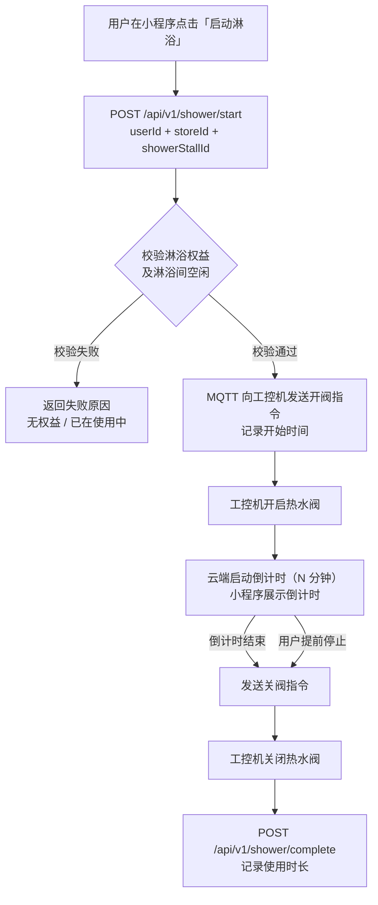

# 淋浴系统

**涉及子系统**：小程序（控制入口）、云端 API（指令中转/权益校验）、工控机（硬件执行）  
**核心业务**：用户通过小程序启动淋浴，系统控制热水阀门的开关与计时

---

## 系统概述

健身房提供淋浴功能，用户运动结束后可在小程序上点击启动淋浴，系统向工控机下发指令开启热水阀，并在指定时长后自动关闭。

> **注意**：淋浴控制硬件方案目前尚未确定，本文档相关硬件部分留占位，待方案确定后补充。

---

## 淋浴权益规则（待定）

淋浴作为健身房的附加服务，其使用权益规则尚未最终确定，以下为候选方案：

| 方案 | 说明 | 优点 | 缺点 |
|---|---|---|---|
| 会员免费不限次 | 有有效会员即可使用 | 简单，用户体验好 | 成本不可控 |
| 每次进入赠送 1 次 | 每次刷脸进入获得 1 次淋浴机会 | 与进入行为绑定 | 实现稍复杂 |
| 按次购买 | 单独购买淋浴次数 | 成本可控 | 增加购买摩擦 |
| 包含在套餐内 | 指定套餐（如月卡）包含 N 次/月淋浴 | 差异化竞争 | 套餐设计复杂 |

> **暂定**：待运营策略确定后填写此处。

---

## 淋浴控制流程（软件层）



---

## 硬件方案（待定）

以下为候选硬件方案，需在硬件设计阶段确认：

| 方案 | 说明 | 复杂度 |
|---|---|---|
| 工控机 GPIO + 电磁热水阀 | 工控机直接控制继电器驱动电磁阀 | 低 |
| RS485 智能控制器 | 独立的淋浴控制器通过 RS485 与工控机通信 | 中 |
| WiFi/MQTT 智能设备 | 采购支持 MQTT 的智能热水控制模块 | 中 |

> **硬件方案确定后，需补充**：
> - 具体控制器型号及接线图
> - 工控机驱动代码接口定义
> - 安全保护机制（如最长开启时间限制，防止阀门故障时水漫金山）

---

## MQTT 指令格式（草案）

```json
// 云端 → 工控机：开启淋浴
{
  "action": "shower_start",
  "stallId": "shower_1",
  "durationSeconds": 300,
  "userId": "user_xxx"
}

// 云端 → 工控机：关闭淋浴
{
  "action": "shower_stop",
  "stallId": "shower_1"
}

// 工控机 → 云端：状态上报
{
  "event": "shower_status",
  "stallId": "shower_1",
  "status": "running",  // running / idle / error
  "remainingSeconds": 180
}
```

---

## 小程序交互设计

- 首页或个人中心显示「淋浴」入口（仅在门店内或有权益时展示）
- 启动后展示倒计时界面
- 支持提前结束按钮
- 无权益时展示说明和购买引导

---

## 待确认事项

- [ ] **淋浴权益方案**（会员免费 / 按次 / 套餐内含）
- [ ] **硬件方案**（GPIO 电磁阀 / RS485 / 智能设备）
- [ ] 每次淋浴时长上限（建议 5-10 分钟）
- [ ] 是否支持多个淋浴间同时使用的并发控制
- [ ] 淋浴间占用状态展示（小程序是否需要显示哪个淋浴间空闲）
- [ ] 未进入健身房的用户是否可以使用淋浴（权益校验策略）
