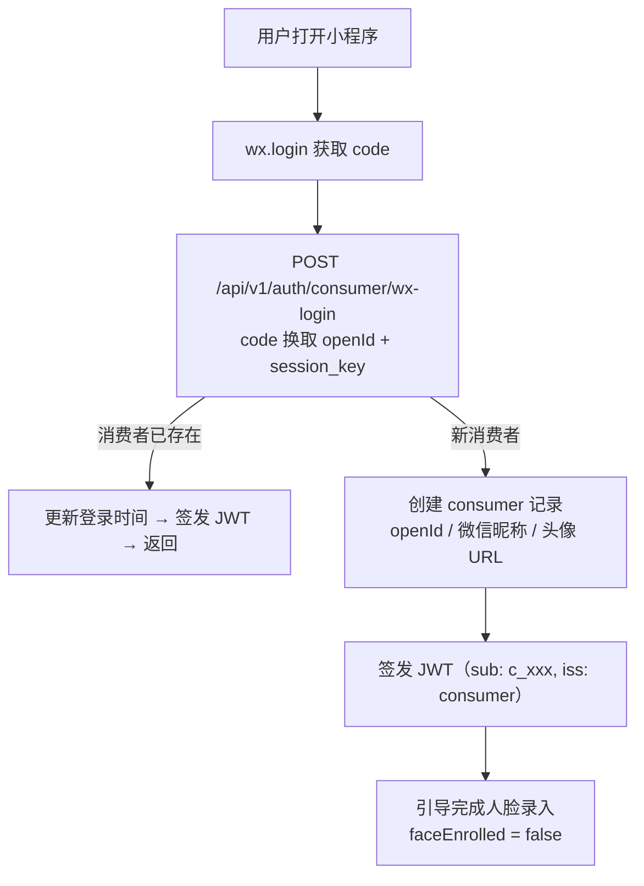

# 用户体系

**涉及子系统**：云端 API（核心）、管理后台（管理）、小程序（注册/个人中心）、教练端（规划中）
**核心业务**：多方用户注册、身份认证、人脸数据绑定、会员状态管理

---

## 三套独立用户体系

系统面向三类参与方，每类使用**独立的数据表和独立的 ID 体系**，互不影响：

| 用户体系 | 数据表 | ID 前缀 | 使用端 | 说明 |
|---|---|---|---|---|
| 消费者 | `consumer` | `c_` | 用户端小程序 | 健身房会员 |
| 教练 | `coach` | `h_` | 教练端（规划中） | 课程宣讲者 |
| 管理人员 | `staff` | `s_` | 店长端小程序、客服后台 | 客服、店长、财务、运营、老板等 |

**设计原则**：

- **系统隔离**：同一个自然人可以同时是消费者、教练和管理人员，分别拥有三个独立账号（如 `c_001`、`h_001`、`s_001`），登录入口不同，权限不交叉
- **封禁隔离**：封禁消费者账号不影响其教练身份或管理身份，反之亦然
- **独立演进**：每个体系可以独立扩展字段、规则和业务流程，不互相牵制
- **自然人关联**（可选）：三套体系通过手机号 / 微信 openid 可做松耦合关联，仅用于运营分析，不作为权限依据

### 管理人员角色

管理人员表内部通过 `role` 字段区分角色，角色决定可访问的功能范围：

| 角色 | 说明 | 门店范围 |
|---|---|---|
| `owner` | 老板 | 名下所有门店 |
| `ops` | 运营 | 分配的门店 |
| `finance` | 财务 | 分配的门店 |
| `manager` | 店长 | 分配的门店 |
| `support` | 客服 | 分配的门店 |

管理人员的门店权限通过 **`staff_store` 关联表**（`staffId` + `storeId`）维护，不写入 JWT。

> 完整的身份认证与授权设计见 [接口通信安全](/functional-systems/basics/api-security)。

---

## 消费者注册流程



---

## 消费者数据模型

```
Consumer {
  id              String       # 消费者唯一标识（c_ 前缀）
  wxOpenId        String       # 微信 openId（唯一）
  wxUnionId       String?      # 微信 unionId（多平台互通用）
  nickname        String?      # 微信昵称
  avatarUrl       String?      # 头像 URL
  phone           String?      # 手机号（用户授权后获取）
  faceEnrolled    Boolean      # 是否已完成人脸录入
  faceEnrolledAt  DateTime?    # 人脸录入时间
  status          Enum         # ACTIVE / BANNED / DELETED
  createdAt       DateTime
  lastLoginAt     DateTime
}
```

### 管理人员数据模型

```
Staff {
  id              String       # 管理人员唯一标识（s_ 前缀）
  wxOpenId        String?      # 微信 openId（店长端登录用，可为空表示仅使用后台密码登录）
  name            String       # 姓名
  phone           String       # 手机号
  email           String?      # 邮箱
  passwordHash    String?      # bcrypt 哈希（客服后台登录用）
  totpSecret      String?      # TOTP 密钥（2FA 用）
  role            Enum         # owner / ops / finance / manager / support
  status          Enum         # ACTIVE / SUSPENDED / DELETED
  createdAt       DateTime
  lastLoginAt     DateTime
}
```

### 管理人员门店关联

```
StaffStore {
  staffId         String       # 管理人员 ID
  storeId         String       # 门店 ID
  createdAt       DateTime
}
```

### 教练数据模型（规划中）

```
Coach {
  id              String       # 教练唯一标识（h_ 前缀）
  wxOpenId        String       # 微信 openId
  name            String       # 姓名
  phone           String       # 手机号
  avatarUrl       String?      # 头像 URL
  status          Enum         # ACTIVE / SUSPENDED / DELETED
  createdAt       DateTime
  lastLoginAt     DateTime
}
```

---

## 会员状态查询

消费者的会员状态不单独存储字段，而是**实时从订单系统查询**：

```
GET /api/v1/consumer/membership?storeId=xxx
        │
        ▼
查询该消费者在指定门店的 ACTIVE 订单
        │
        ▼
返回：
{
  "eligible": true/false,
  "memberships": [
    {
      "productName": "月卡",
      "expiresAt": "2026-04-11",
      "remainingTimes": null   // 不限次
    },
    {
      "productName": "次卡10次",
      "expiresAt": "2026-06-11",
      "remainingTimes": 7
    }
  ]
}
```

---

## 人脸绑定管理

| 操作 | 入口 | 说明 |
|---|---|---|
| 录入人脸 | 用户端小程序 → 个人中心 → 人脸管理 | 首次录入，引导流程 |
| 重新录入 | 用户端小程序 → 个人中心 → 人脸管理 | 覆盖旧数据 |
| 删除人脸 | 客服后台 → 消费者详情 | 仅管理人员可操作（如用户投诉隐私） |
| 查看状态 | 客服后台 → 消费者详情 | 显示已录入/未录入及录入时间 |

录入/重录后，工控机通过 MQTT 实时同步新的特征向量到本地库。

---

## 消费者封禁逻辑

- 管理人员在客服后台可将消费者设为 `BANNED` 状态
- 封禁仅影响 `consumer` 表，不影响该自然人的 `staff` 或 `coach` 身份
- 被封禁的消费者刷脸时，云端 API 返回 `eligible: false, reason: "账号已封禁"`
- 工控机拒绝开门并播报提示

---

## 客服后台消费者管理功能

- **消费者列表**：搜索（手机号/昵称）、筛选（会员状态/有无人脸）
- **消费者详情**：
  - 基本信息（昵称、注册时间、手机号）
  - 会员状态（当前有效套餐）
  - 人脸信息（录入状态、录入时间）
  - 订单历史
  - 进出记录
  - 操作：手动封禁/解封、删除人脸数据
- **数据导出**：消费者列表 Excel 导出

---

## 隐私合规说明

- 人脸特征向量属于**生物特征数据**，需在用户授权后方可采集
- 小程序端在人脸录入前需展示《隐私政策》并获取用户同意
- 用户可随时申请删除人脸数据（通过客服或客服后台操作）
- 人脸图片原图建议不做永久存储（特征向量提取后删除原图）

---

## 待确认事项

- [ ] 手机号是否为必填（建议可选，降低注册门槛）
- [ ] 是否支持同一消费者在多门店独立建立人脸记录（目前设计为全局唯一）
- [ ] 用户注销账号的流程（数据保留多久后彻底删除）
- [ ] 微信 unionId 是否需要对接（跨小程序/公众号场景）
