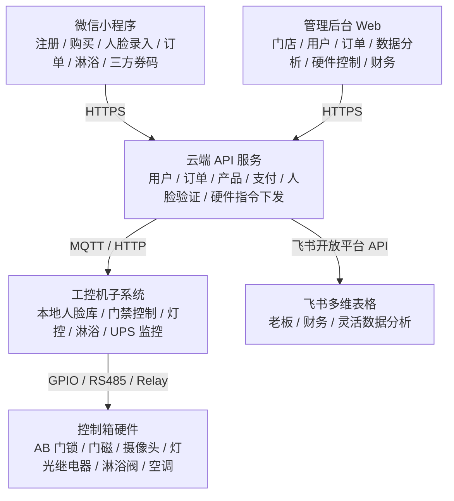

## 项目概述

**飞创 Fitron** 旨在打造一套**无人值守连锁健身房**综合服务系统，通过自研硬件与软件的深度整合，实现用户从进店到离店全流程的自动化管理。

### 核心特点

- **自研 AB 门刷脸系统**：入口隔离间 + 本地人脸库 + 云端验证回退，安全可靠
- **连锁多店管理**：统一后台，支持多门店独立配置与数据汇总
- **硬件全自研**：工控机、控制箱、门禁、灯控均自主设计安装
- **AI 辅助开发**：三端分工明确，基于 AI 工具高效推进

---

## 团队分工

| 技术方向 | 负责内容 | 主要子系统 |
|---|---|---|
| **硬件端（负责人）** | 硬件设计、选型、组装、工控机程序 | 工控机子系统 |
| **后端程序员** | 云端服务、API、数据库、消息队列、飞书数据同步 | 云端 API 服务 + 飞书多维表格（同步任务） |
| **前端程序员** | 管理后台、微信小程序 | 管理后台 Web + 微信小程序 |

> 三端均基于 AI 辅助编程，工期估算已结合 AI 加速因子。

---

## 系统架构总览

---

## 快速导航

- [子系统概览](/subsystems/) — 了解各子系统的边界与职责
- [功能系统概览](/functional-systems/) — 了解各功能系统的业务逻辑
- [硬件 BOM](/hardware/bom) — 硬件选型与物料清单
- [接线规则](/hardware/wiring-rules) — 控制箱内部接线规范
- [工作内容梳理](/planning/work-breakdown) — 各功能点三端任务拆解
- [工期预期](/planning/timeline) — 交付里程碑与时间线
