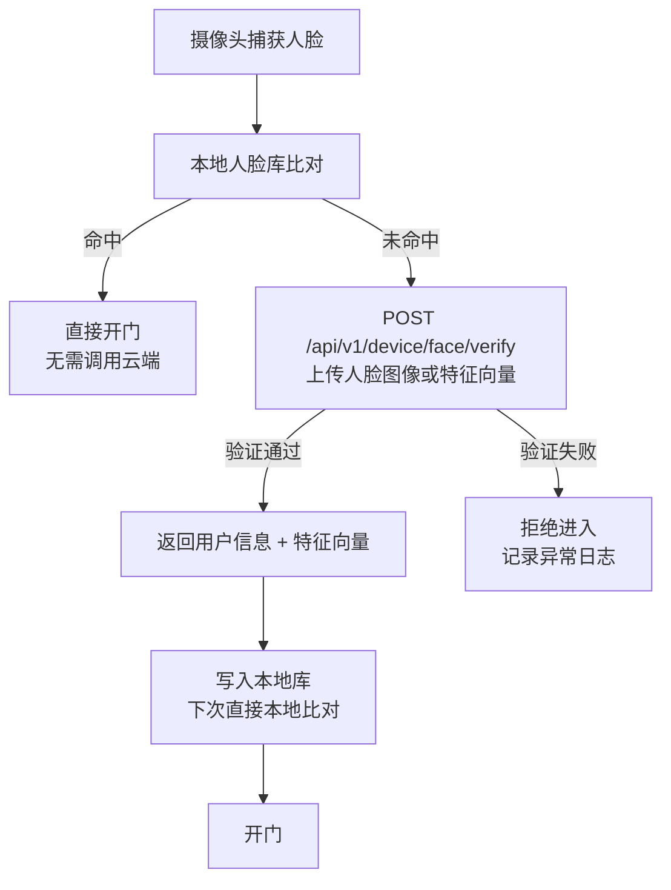

# 云端 API 服务

**负责人**：后端程序员  
**运行环境**：云服务器（Linux，Docker 部署）  
**核心职责**：统一业务逻辑处理、数据持久化、人脸远程验证、MQTT Broker 托管

---

## 职责边界

云端 API 服务是整个系统的**核心枢纽**，所有业务数据的权威来源均在此处。

**云端 API 负责：**
- 用户注册、登录、鉴权（微信 openId + JWT）
- 产品、订单、优惠券的完整生命周期管理
- 人脸特征向量的存储与远程验证（工控机本地库无记录时的回退）
- 向工控机下发控制指令（通过 MQTT）
- 多门店数据隔离与聚合
- 管理后台的所有数据接口
- 数据分析聚合计算

**云端 API 不负责：**
- 实时硬件 I/O（由工控机负责）
- 页面渲染（由前端子系统负责）

---

## 核心模块

```
cloud-api/
├── auth/            # 鉴权：微信 openId 换 JWT，管理员账号体系
├── user/            # 用户管理：注册、信息、会员状态
├── face/            # 人脸服务：特征向量存储、远程验证接口
├── store/           # 门店管理：多店配置、设备绑定
├── product/         # 产品/套餐：定价、有效期规则
├── order/           # 订单：购买、核销、退款
├── coupon/          # 优惠券：发放、核验
├── hardware/        # 硬件控制：远程开门、灯控指令下发
├── analytics/       # 数据分析：报表聚合、飞书多维表格推送
└── mqtt-broker/     # MQTT Broker 托管（或使用 EMQX 独立部署）
```

---

## API 设计规范

### 鉴权方式

| 调用方 | 鉴权方式 | 说明 |
|---|---|---|
| 微信小程序 | `wx.login` 换取 `code` → 后端换 `openId` → 签发 JWT | 用户身份 |
| 管理后台 Web | 账号密码登录 → 签发 JWT（角色：admin/finance/store_manager） | 管理员身份 |
| 工控机 | API Key（每台设备独立 Key，绑定门店） | 设备身份 |

### REST 接口规范

```
基础路径: /api/v1/

用户端接口:
  POST   /api/v1/auth/wx-login          # 微信登录
  GET    /api/v1/user/profile           # 用户信息
  POST   /api/v1/user/face/enroll       # 人脸录入（上传特征向量）
  GET    /api/v1/products               # 产品列表
  POST   /api/v1/orders                 # 创建订单
  GET    /api/v1/orders/{id}            # 订单详情
  POST   /api/v1/coupons/verify         # 核销优惠券

管理端接口:
  GET    /api/v1/admin/stores           # 门店列表
  GET    /api/v1/admin/users            # 用户列表
  GET    /api/v1/admin/orders           # 订单列表
  POST   /api/v1/admin/hardware/door    # 远程开门
  POST   /api/v1/admin/hardware/light   # 远程灯光控制
  GET    /api/v1/admin/analytics/...    # 数据报表

设备端接口（工控机调用）:
  POST   /api/v1/device/face/verify     # 人脸远程验证
  POST   /api/v1/device/events          # 上报事件（进出记录等）
  GET    /api/v1/device/config          # 拉取设备配置
```

---

## 人脸远程验证流程



---

## 数据库设计（核心表）

| 表名 | 说明 |
|---|---|
| `users` | 用户基本信息、微信 openId、状态 |
| `user_faces` | 人脸特征向量（压缩存储）、绑定用户 |
| `stores` | 门店信息、MQTT 设备 Key |
| `products` | 产品套餐（类型、价格、有效期、次数） |
| `orders` | 订单（用户、产品、门店、支付状态、有效期） |
| `checkins` | 进出记录（用户、门店、时间、进/出） |
| `coupons` | 优惠券定义 |
| `user_coupons` | 用户优惠券（发放、使用记录） |
| `device_logs` | 设备事件日志（门状态、告警等） |

---

## 技术选型建议

| 组件 | 建议方案 | 备注 |
|---|---|---|
| 开发语言 | Python (FastAPI) 或 Node.js (NestJS) | AI 生成代码质量较高 |
| 数据库 | PostgreSQL | 生产级稳定性 |
| 缓存 | Redis | 会话、限流、人脸验证结果缓存 |
| MQTT Broker | EMQX（Docker 部署） | 支持大量设备连接 |
| 对象存储 | 阿里云 OSS / 腾讯 COS | 存储人脸图片原图（可选） |
| 部署方式 | Docker Compose / K8s | 按规模选择 |
| 支付集成 | 微信支付 API | 小程序内购买 |

---

## 待确认事项

- [ ] 技术栈最终选型（Python FastAPI vs Node.js NestJS）
- [ ] 人脸特征向量存储方式（数据库字段 vs 向量数据库）
- [ ] 多门店数据隔离策略（单库多租户 vs 多库）
- [ ] 飞书多维表格数据推送的触发时机与频率
- [ ] 微信支付接入方式（直接 API vs 第三方聚合支付）
