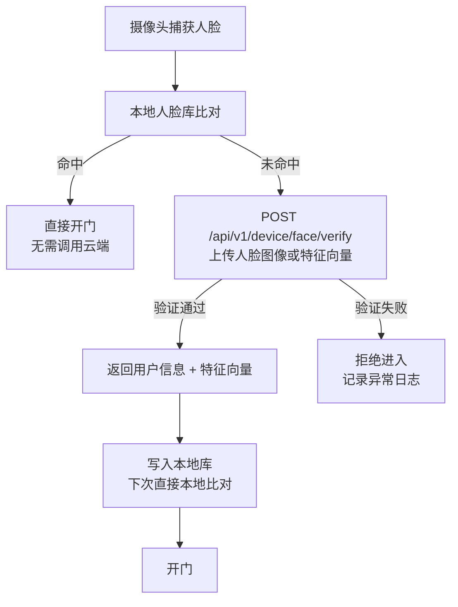

# 云端 API 服务

**负责人**：后端程序员  
**运行环境**：云服务器（Linux，Docker 部署）  
**核心职责**：统一业务逻辑处理、数据持久化、人脸远程验证、MQTT Broker 托管

---

## 职责边界

云端 API 服务是整个系统的**核心枢纽**，所有业务数据的权威来源均在此处。

**云端 API 负责：**
- 三套用户体系（消费者/教练/管理人员）的注册、登录、鉴权（JWT RS256）
- 产品、订单、优惠券的完整生命周期管理
- 人脸特征向量的存储与远程验证（工控机本地库无记录时的回退）
- 向工控机下发控制指令（通过 MQTT）
- 多门店数据隔离与聚合
- 管理后台的所有数据接口
- 数据分析聚合计算

**云端 API 不负责：**
- 实时硬件 I/O（由工控机负责）
- 页面渲染（由前端子系统负责）

---

## 核心模块

```
cloud-api/
├── auth/            # 鉴权：三套用户体系独立登录、JWT RS256 签发
├── consumer/        # 消费者管理：注册、信息、会员状态
├── staff/           # 管理人员：账号、角色、门店权限
├── coach/           # 教练管理（规划中）
├── face/            # 人脸服务：特征向量存储、远程验证接口
├── store/           # 门店管理：多店配置、设备绑定
├── product/         # 产品/套餐：定价、有效期规则
├── order/           # 订单：购买、核销、退款
├── coupon/          # 优惠券：发放、核验
├── hardware/        # 硬件控制：远程开门、灯控指令下发
├── analytics/       # 数据分析：报表聚合、飞书多维表格推送
└── mqtt-broker/     # MQTT Broker 托管（腾讯云托管 MQTT）
```

---

## API 设计规范

### 鉴权方式

三套用户体系使用**独立的登录入口和数据表**，JWT 只携带 `sub`（用户ID）和 `iss`（体系标识），权限数据在服务端通过 Redis 查询。详见 [接口通信安全](/functional-systems/basics/api-security)。

| 调用方 | 鉴权方式 | 查询的表 | 说明 |
|---|---|---|---|
| 用户端小程序 | `wx.login` → `openId` → JWT（`iss: consumer`） | `consumer` | 消费者身份 |
| 店长端小程序 | `wx.login` → `openId` → JWT（`iss: staff`）+ HMAC | `staff` | 管理人员身份 |
| 客服后台 | 账号密码 + TOTP 2FA → JWT（`iss: staff`）+ HMAC | `staff` | 管理人员身份 |
| 教练端（规划中） | `wx.login` → `openId` → JWT（`iss: coach`） | `coach` | 教练身份 |
| 工控机（HTTP） | mTLS 客户端证书（私有 CA 签发） | — | 设备身份 |
| 工控机（MQTT） | IoT Explorer 设备密钥认证 | — | 设备身份 |

### REST 接口规范

```
基础路径: /api/v1/

消费者端接口（用户端小程序）:
  POST   /api/v1/auth/consumer/wx-login    # 消费者微信登录
  POST   /api/v1/auth/consumer/bind-phone  # 绑定手机号
  GET    /api/v1/consumer/profile          # 消费者信息
  POST   /api/v1/consumer/face/enroll      # 人脸录入（上传特征向量）
  GET    /api/v1/consumer/membership       # 会员状态查询
  GET    /api/v1/products                  # 产品列表
  POST   /api/v1/orders                    # 创建订单
  GET    /api/v1/orders/{id}               # 订单详情
  POST   /api/v1/coupons/verify            # 核销优惠券

管理端接口（店长端小程序 + 客服后台）:
  POST   /api/v1/auth/staff/wx-login       # 管理人员微信登录（店长端）
  POST   /api/v1/auth/staff/password-login # 管理人员密码登录（客服后台）
  GET    /api/v1/staff/stores              # 当前管理人员的门店列表
  GET    /api/v1/staff/consumers           # 消费者列表
  GET    /api/v1/staff/orders              # 订单列表
  POST   /api/v1/staff/hardware/door       # 远程开门
  POST   /api/v1/staff/hardware/light      # 远程灯光控制
  GET    /api/v1/staff/analytics/...       # 数据报表

设备端接口（工控机调用，mTLS 认证）:
  POST   /api/v1/ipc/face/verify           # 人脸远程验证
  POST   /api/v1/ipc/event                 # 上报事件（进出记录等）
  GET    /api/v1/ipc/config                # 拉取设备配置
```

### 多语言接口约定（新增）

- 用户端 API 请求支持 `Accept-Language`（`zh` / `en`），缺省默认 `zh`
- 用户端接口返回**已按语言解析后的字符串**
- 管理端接口返回**完整多语言对象**（如 `{ "zh": "月卡", "en": "Monthly Pass" }`），用于后台编辑
- 解析回落规则：`请求语言 -> zh -> 任意有值语言 -> 空字符串`

示例：

```http
GET /api/v1/products
Accept-Language: en
```

```json
{
  "id": "prod_001",
  "name": "Monthly Pass",
  "description": "Unlimited monthly access",
  "price": 299.00
}
```

---

## 人脸远程验证流程



---

## 数据库设计（核心表）

| 表名 | 说明 |
|---|---|
| `consumer` | 消费者基本信息、微信 openId、状态 |
| `coach` | 教练信息（规划中） |
| `staff` | 管理人员：姓名、角色、密码哈希、TOTP |
| `staff_store` | 管理人员与门店的关联（staffId + storeId） |
| `consumer_face` | 人脸特征向量（压缩存储）、绑定消费者 |
| `stores` | 门店信息 |
| `products` | 产品套餐（类型、价格、有效期、次数） |
| `orders` | 订单（用户、产品、门店、支付状态、有效期） |
| `checkins` | 进出记录（用户、门店、时间、进/出） |
| `coupons` | 优惠券定义 |
| `user_coupons` | 用户优惠券（发放、使用记录） |
| `device_logs` | 设备事件日志（门状态、告警等） |

### 多语言字段设计（新增）

系统中面向用户展示的可译字段，统一采用 `JSONB` 存储多语言内容（示例：`{"zh":"月卡","en":"Monthly Pass"}`）：

| 表名 | 可译字段 | 存储类型 |
|---|---|---|
| `products` | `name`, `description` | `JSONB` |
| `stores` | `name`, `address`, `description` | `JSONB` |
| `coupons` | `name`, `description` | `JSONB` |

说明：
- `users`、`orders`、`checkins`、`device_logs` 等业务流水数据不做多语言改造
- 第一期要求 `zh`、`en` 双语必填，后续扩展语言不改表结构

---

## 技术选型建议（Kotlin 云端 API）

| 组件 | 建议方案 | 备注 |
|---|---|---|
| 开发语言 | Kotlin（JDK 17 LTS） | 统一后端主栈，减少跨语言维护成本 |
| 后端框架 | Spring Boot 3.x | 采用模块化单体架构，边界清晰、实现稳定 |
| 持久层 | MyBatis-Plus（CRUD）+ MyBatis（复杂 SQL） | 兼顾开发效率与复杂查询可控性 |
| 数据库迁移 | Flyway | 保证环境间 Schema 变更可追踪、可回滚 |
| 数据库 | PostgreSQL | 生产级稳定性，适合事务型业务 |
| 缓存 | Redis | 会话、限流、人脸验证结果缓存 |
| 消息队列 | MQTT 事件通道（腾讯云托管 MQTT） | 设备侧长连接事件与指令下发 |
| MQTT Broker | 腾讯云托管 MQTT | 设备侧长连接接入 |
| 对象存储 | 腾讯云 COS | 存储人脸图片原图 |
| API 文档 | springdoc-openapi（Swagger UI） | 自动生成接口文档，便于前后端协作 |
| 部署方式 | Docker Compose | 当前生产部署方案，配置与运维路径明确 |
| 支付集成 | 微信支付 API v3 | 小程序内购买，要求签名验签与幂等处理 |

### Kotlin 工程结构建议

```text
cloud-api/
├── src/main/kotlin/com/eachcan/fitness
│   ├── auth            # 三套用户体系登录鉴权、JWT RS256、权限上下文
│   ├── consumer        # 消费者、会员状态
│   ├── staff           # 管理人员、角色、门店权限
│   ├── coach           # 教练（规划中）
│   ├── face            # 人脸特征与远程验证
│   ├── store           # 门店与设备绑定
│   ├── product         # 产品/套餐
│   ├── order           # 订单、支付、退款
│   ├── coupon          # 优惠券发放与核销
│   ├── hardware        # 远程开门、灯控指令
│   ├── analytics       # 报表聚合、飞书同步
│   ├── common          # 通用异常、响应体、工具类
│   └── infrastructure  # DB/Redis/MQTT 适配
└── src/main/resources
    ├── application.yml
    ├── mapper/
    └── db/migration    # Flyway SQL
```

---

## 待确认事项

- [ ] 人脸特征向量存储方式（数据库字段 vs 向量数据库）
- [ ] 多门店数据隔离策略（单库多租户 vs 多库）
- [ ] 飞书多维表格数据推送的触发时机与频率
- [ ] 微信支付接入深度（仅 JSAPI + 退款，或增加分账能力）
