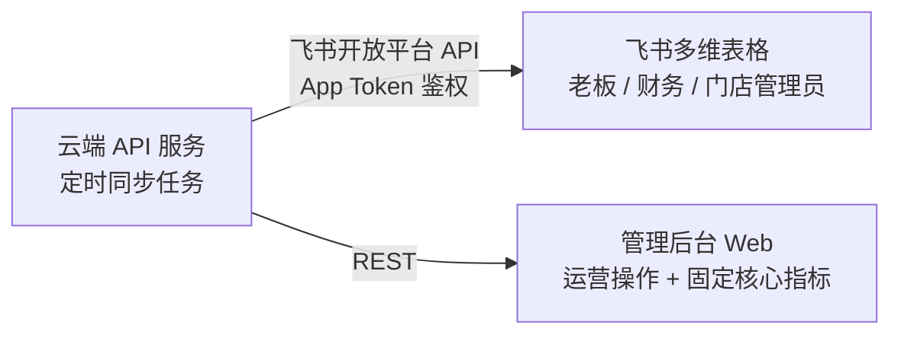
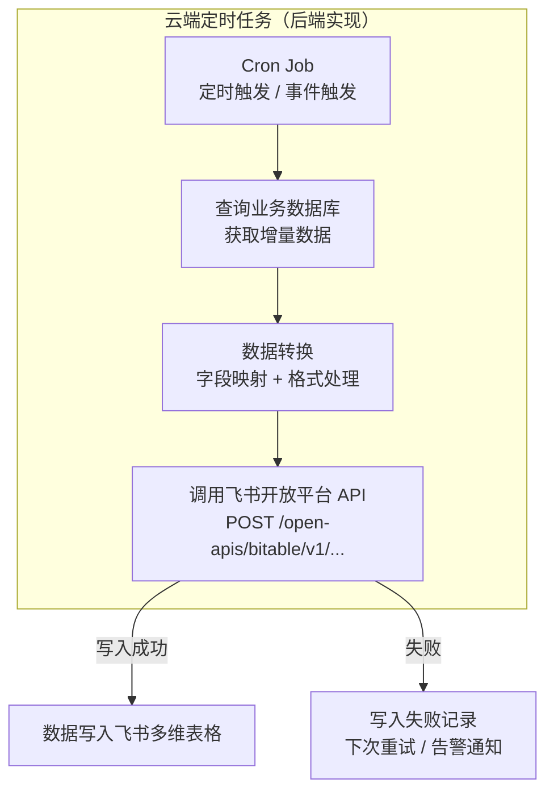

# 飞书多维表格

**负责人**：后端程序员（数据同步任务）  
**运行环境**：飞书平台（SaaS，无需自行部署）  
**使用对象**：老板、财务、门店管理员  
**核心职责**：作为灵活数据分析层，接收云端推送的经营数据，供业务人员自由构建分析视图

---

## 定位与分工

飞书多维表格不是自研系统，而是**引入的第三方 SaaS 平台**，承担管理后台无法高效覆盖的那部分需求——千变万化的数据分析。



**管理后台负责**：需要精确操作的功能（退款、开门、封号）以及少数固定核心指标（今日进店、营收概览）。

**飞书多维表格负责**：一切分析性需求——业务人员自行拖拽配置视图，无需开发介入。

---

## 核心优势

| 能力 | 说明 |
|---|---|
| 多视图 | 同一份数据可同时展示为表格、图表、看板、日历等视图 |
| 自由筛选/分组 | 按门店、时间段、产品类型任意组合，业务人员自行配置 |
| 公式字段 | 类似 Excel，可计算增长率、到期率、人均消费等 |
| 图表仪表盘 | 折线图、柱状图、饼图，拖拽配置，无需开发 |
| 自动化工作流 | 定时发送日报/周报到飞书群，无需人工触发 |
| 移动端 | 飞书 App 原生支持多维表格，手机和电脑体验一致 |
| 权限控制 | 可按飞书组织架构设置不同人员的查看/编辑权限 |

---

## 数据同步规划

云端 API 通过**飞书开放平台 API** 将数据定时写入以下表格。业务人员在这些基础表上自由建立视图，无需开发。

### 表格清单

| 表格名称 | 核心字段 | 同步频率 | 说明 |
|---|---|---|---|
| 每日经营汇总 | 日期、门店、营收、进店人次、新增用户、有效会员数 | 每天凌晨 | 多店对比、趋势分析的基础 |
| 订单明细 | 订单号、用户、产品、原价、实付、优惠券、支付时间、门店 | 每小时增量 | 财务对账、产品销售分析 |
| 会员状态快照 | 用户、套餐类型、购买时间、到期时间、剩余次数、门店 | 每天凌晨 | 会员结构分析、到期预警 |
| 进出记录 | 用户、门店、进入时间、离开时间（估算）、进入方式 | 每小时增量 | 热力图、活跃度分析 |
| 设备告警记录 | 门店、设备、告警类型、发生时间、是否已处理 | 实时触发 | 运维监控、响应时效统计 |

### 同步实现方式



---

## 飞书开放平台接入要求

### 必要配置

1. 在[飞书开放平台](https://open.feishu.cn)创建**自建应用**
2. 开通权限：`bitable:app:readonly`、`bitable:app`（多维表格读写）
3. 获取 `App ID` 和 `App Secret`，存入云端 API 的环境变量
4. 在多维表格中将应用添加为协作者（可编辑）

### 鉴权流程

```
POST https://open.feishu.cn/open-apis/auth/v3/tenant_access_token/internal
Body: { app_id, app_secret }

返回: tenant_access_token（有效期 2 小时）
→ 后端缓存 token，临近过期前自动刷新
→ 后续 API 请求 Header: Authorization: Bearer {token}
```

---

## 业务人员使用指南

业务人员无需了解技术细节，只需在飞书中操作：

1. **查看数据**：打开对应多维表格，切换至所需视图（图表/表格/看板）
2. **创建自定义视图**：点击「+新建视图」，选择视图类型，拖拽字段配置
3. **设置筛选**：在视图中添加筛选条件（如仅看某门店、某时间段）
4. **创建图表**：插入「图表」块，绑定表格数据，选择图表类型
5. **设置自动化**：飞书多维表格 → 自动化 → 新建规则（如每天 9 点发送前一天数据汇总到群）

---

## 典型分析视图示例

业务人员可自行搭建，以下为建议的初始视图配置：

| 视图名称 | 类型 | 数据来源表 | 典型用途 |
|---|---|---|---|
| 多店营收对比 | 柱状图 | 每日经营汇总 | 老板快速看各店表现 |
| 营收趋势（月） | 折线图 | 每日经营汇总 | 观察增长趋势 |
| 本月订单明细 | 表格（筛选本月） | 订单明细 | 财务对账 |
| 即将到期会员 | 表格（到期时间 ≤ 7天） | 会员状态快照 | 提前营销续费 |
| 进店高峰热力图 | 需飞书图表或导出分析 | 进出记录 | 了解高峰时段 |
| 告警处理跟进 | 看板（按处理状态分组） | 设备告警记录 | 运维团队跟进 |

---

## 与管理后台数据分析的区别

| 维度 | 管理后台数据分析 | 飞书多维表格 |
|---|---|---|
| 开发成本 | 每个新图表需要开发 | 零开发，业务自助配置 |
| 灵活性 | 固定维度 | 任意组合 |
| 实时性 | 实时（直连数据库） | 准实时（同步延迟 ≤ 1小时） |
| 使用场景 | 日常运营操作 + 核心指标 | 深度分析、财务报表、临时查询 |
| 访问方式 | 浏览器 Web | 飞书 App（手机 + 桌面端） |
| 适合人群 | 运营人员、技术人员 | 老板、财务、门店管理员 |

---

## 待确认事项

- [ ] 飞书组织架构配置（确认哪些人员账号加入）
- [ ] 各表格的具体字段设计（与财务确认对账所需字段）
- [ ] 告警记录是否需要实时同步（目前方案为触发时推送）
- [ ] 飞书自动化工作流的报告形式（纯文字 vs 表格截图 vs 卡片消息）
- [ ] 多维表格是否按门店分表，还是统一一张表通过筛选区分
