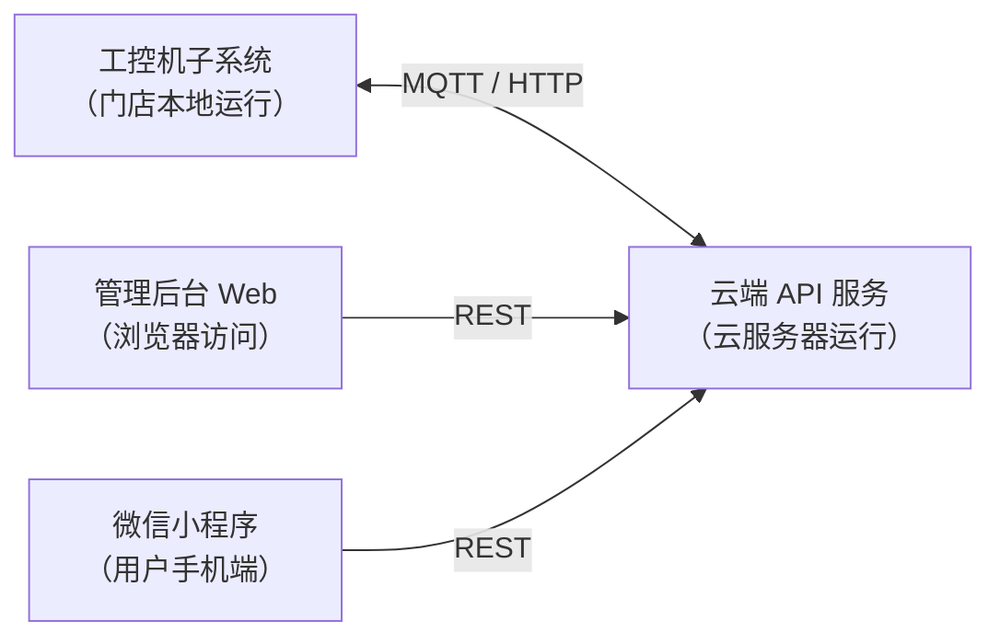

# 子系统概览

子系统是以**部署单元**为边界划分的独立程序集合，每个子系统独立运行、独立部署，通过网络协议相互协作。

## 子系统全景

## 各子系统一览

| 子系统 | 运行环境 | 负责人 | 通信协议 |
|---|---|---|---|
| [工控机子系统](./industrial-pc) | 门店本地 Linux/Windows | 硬件端负责人 | MQTT、HTTP、GPIO |
| [云端 API 服务](./cloud-api) | 云服务器 | 后端程序员 | REST、MQTT Broker |
| [管理后台 Web](./admin-web) | 浏览器（PC 端） | 前端程序员 | REST |
| [微信小程序](./mini-program) | 用户手机 | 前端程序员 | REST、WebSocket |

## 子系统间通信规则

- **工控机 ↔ 云端 API**：工控机订阅 MQTT topic 接收指令，同时通过 HTTP 上报状态和事件
- **管理后台 ↔ 云端 API**：标准 REST API，JWT 鉴权，仅内部管理员可访问
- **小程序 ↔ 云端 API**：标准 REST API，微信 openId 鉴权
- **工控机本地**：通过 GPIO/RS485/继电器与硬件设备通信，无需经过云端

## 离线降级策略

工控机子系统具备本地缓存能力，在网络断开时：

- 本地人脸库继续提供刷脸验证（已同步的用户）
- 门禁基本开关功能正常
- 订单校验暂停（需联网），已购买会员可正常进入
- 恢复联网后自动同步状态日志至云端
