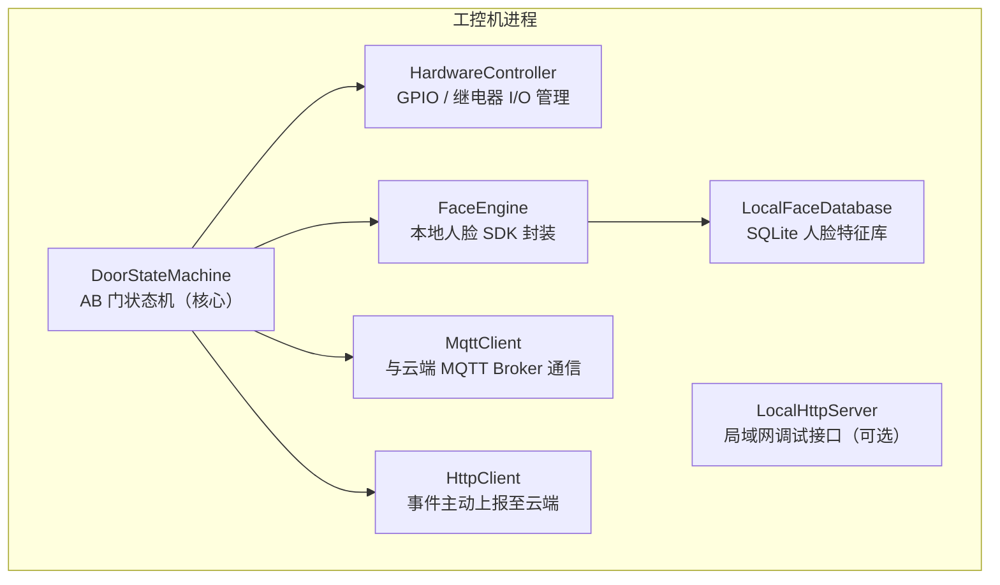

# 工控机子系统

**负责人**：硬件端负责人  
**运行环境**：门店本地工控机（Linux / Windows 工控系统）  
**核心职责**：连接物理硬件，执行实时控制逻辑，提供本地人脸验证能力

---

## 职责边界

工控机子系统是硬件世界与软件世界的桥梁，它直接与继电器、门磁、摄像头等物理设备交互，同时与云端 API 保持通信以同步数据和接收指令。

**工控机负责的事情：**
- 驱动 AB 门的电磁锁开关
- 读取门磁传感器状态（门开/门关）
- 驱动人脸识别摄像头，执行本地人脸比对
- 控制灯光继电器
- 控制淋浴阀（待定）
- 监控 UPS 电源状态
- 与云端 API 保持 MQTT 长连接

**工控机不负责的事情：**
- 订单/支付逻辑（由云端 API 负责）
- 前端展示（由小程序/管理后台负责）
- 人脸信息的首次录入（由小程序负责，录入后同步到本地）

---

## 硬件接口清单

| 接口类型 | 用途 | 说明 |
|---|---|---|
| GPIO 输出 | 控制电磁锁（A 门 / B 门） | 高电平解锁，低电平锁定 |
| GPIO 输入 | 读取门磁传感器（A 门 / B 门） | 检测门开关状态 |
| GPIO 输入 | 检测隔离间人体传感器 | 判断隔离间内是否有人 |
| GPIO 输出 | 灯光继电器控制 | 多路继电器分区控制 |
| USB / CSI | 人脸识别摄像头 | 接入人脸 SDK |
| RS485 / GPIO | 淋浴控制（待定） | 硬件方案确定后补充 |
| RS485 / 串口 | UPS 通信 | 读取电量、告警状态 |
| 以太网 | 与云端 API / MQTT Broker 通信 | 有线优先，4G 备用 |

---

## 本地服务架构

---

## AB 门状态机

> 详细刷脸逻辑参见 [刷脸系统文档](/functional-systems/face-recognition)

状态机维护以下变量：

| 变量 | 类型 | 说明 |
|---|---|---|
| `doorA_locked` | bool | A 门是否锁定 |
| `doorB_locked` | bool | B 门是否锁定 |
| `doorA_closed` | bool | A 门是否已关闭（门磁） |
| `doorB_closed` | bool | B 门是否已关闭（门磁） |
| `chamber_occupied` | bool | 隔离间内是否有人（人体传感器） |
| `face_verified` | bool | 当前隔离间内人员是否已刷脸成功 |

---

## 本地人脸数据库同步策略

1. **初次同步**：工控机启动时从云端拉取所有有效会员的人脸特征向量
2. **增量同步**：订阅 MQTT topic `store/{storeId}/face/sync`，云端推送新增/删除事件
3. **刷脸时回退**：本地库无此人脸 → 将图像发送至云端 API 验证 → 验证通过后将特征向量写入本地库
4. **过期清理**：定期清理已过期会员的本地人脸数据（以云端状态为准）

---

## MQTT Topic 规范

| Topic | 方向 | 说明 |
|---|---|---|
| `store/{storeId}/door/command` | 云端 → 工控机 | 远程开门/锁门指令（管理后台操作） |
| `store/{storeId}/door/status` | 工控机 → 云端 | 门状态变化上报 |
| `store/{storeId}/face/sync` | 云端 → 工控机 | 人脸数据同步推送 |
| `store/{storeId}/light/command` | 云端 → 工控机 | 远程灯光控制 |
| `store/{storeId}/device/heartbeat` | 工控机 → 云端 | 心跳包（每 30 秒） |
| `store/{storeId}/device/alert` | 工控机 → 云端 | 异常告警（UPS 低电量等） |

---

## 技术选型建议

| 组件 | 建议方案 | 备注 |
|---|---|---|
| 开发语言 | Python 3.x | 生态丰富，AI 辅助友好 |
| 人脸 SDK | 商业 SDK 或 InsightFace | 根据精度/成本权衡 |
| 本地数据库 | SQLite | 轻量，无需安装 |
| MQTT 客户端 | paho-mqtt | Python 标准库 |
| GPIO 操作 | RPi.GPIO / gpiod / pyserial | 根据工控机硬件选型 |
| 进程管理 | systemd / supervisord | 保证开机自启和崩溃恢复 |

---

## 待确认事项

- [ ] 工控机具体型号和操作系统
- [ ] 人脸识别 SDK 选型（本地推理精度与算力要求）
- [ ] 隔离间人体检测方案（红外传感器 / 摄像头视频分析）
- [ ] 淋浴控制硬件方案
- [ ] 4G 备用网络模块选型
