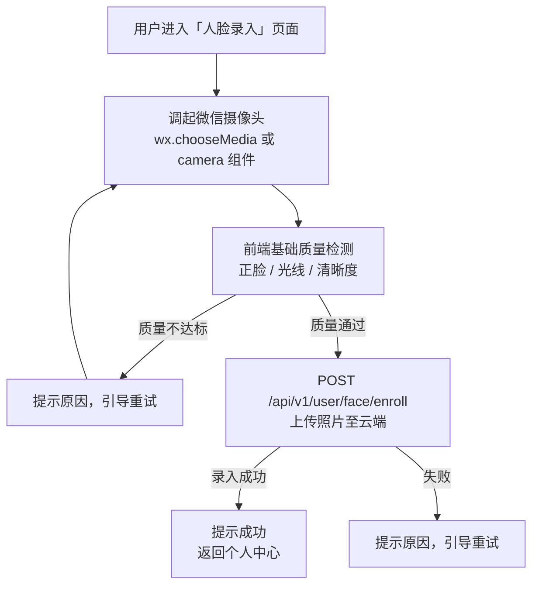
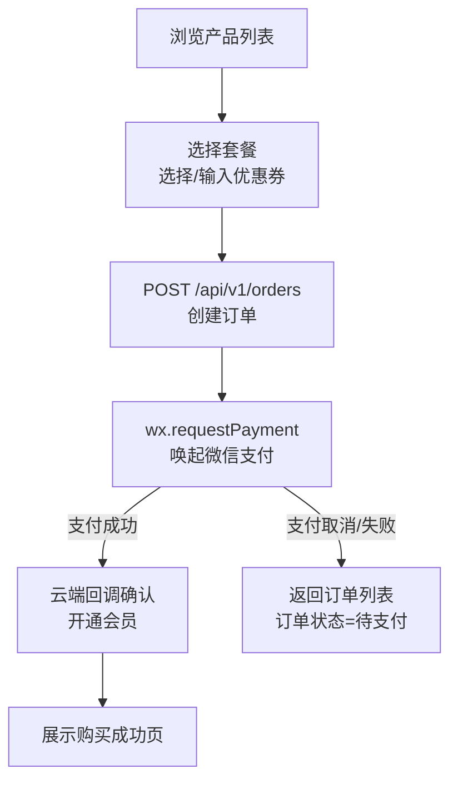
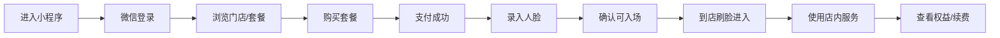

# 微信小程序需求文档

**负责人**：前端程序员  
**运行环境**：微信小程序（iOS / Android）  
**文档类型**：一期基础业务需求梳理  
**适用对象**：产品、前端、后端、测试、运营

---

## 1. 背景与目标

无人值守连锁健身房需要一个统一的用户入口。小程序一期聚焦登录注册、购买、录脸、门店浏览、个人中心、淋浴、动作库和营销活动。

### 1.1 业务目标

- 支持新用户完成登录并进入业务流程
- 支持完成用户注册与账号初始化
- 支持用户浏览门店与套餐并完成支付
- 支持用户完成人脸录入，满足刷脸入场前置条件
- 支持用户查询当前会员权益、订单和个人状态
- 支持用户在店内发起淋浴等基础服务
- 支持查看动作库与推广活动内容

### 1.2 用户价值

- 一个入口完成登录、购买、录脸、查权益和使用服务
- 到店前完成身份准备，减少现场失败
- 明确知道是否可入场、权益是否生效

---

## 2. 需求范围

### 首页 / 门店
- 附近门店列表与地图
- 当前门店入场状态（是否开放）
- 快捷入口：淋浴控制、购买会员、人脸管理
- 我的会员卡摘要
- 活动 Banner 与热门产品

> 详细 PRD：[首页 / 门店 / 营销 / 动作库](./home-marketing)
### 2.1 本期包含

- 微信授权登录与账号初始化
- 用户注册与资料初始化
- 门店浏览
- 套餐购买与微信支付
- 订单查询与会员权益查询
- 人脸录入与重录
- 入场资格提示
- 淋浴服务
- 动作库浏览
- 推广活动浏览
- 首页活动入口、客服与帮助入口
- 中英文多语言

### 人脸录入
- 调起摄像头进行人脸采集
- 前端基础质量检测（正脸、光线、清晰度、遮挡、多人）
- 提交至云端 API 完成录入
- 录入状态展示（已录入/未录入）
- 支持重新录入（覆盖旧数据）
- 首次使用引导页

> 详细 PRD：[人脸录入与重录](./face)

### 产品与购买
- 产品套餐列表（月卡、次卡、体验卡等）
- 套餐详情（价格、有效期、使用规则）
- 优惠券选择弹窗（可用/不可用分 Tab）
- 确认订单页（产品信息 + 优惠券 + 金额明细）
- 微信支付下单流程
- 支付结果页（成功引导人脸录入）
- 待支付订单处理（继续支付 / 超时自动取消）

> 详细 PRD：[产品购买流程](./purchase)

### 淋浴控制
- 显示当前用户可用的淋浴时长/次数
- 淋浴间状态展示（空闲/使用中）
- 启动按钮（发送指令到云端 → 工控机执行）
- 倒计时显示（淋浴剩余时间）
- 提前结束按钮

> 详细 PRD：[淋浴服务](./shower)

### 个人中心
- 个人信息（昵称、头像、手机号）
- 我的会员（当前有效套餐、到期时间、剩余次数、进度条）
- 我的订单（订单列表，按状态 Tab 筛选）
- 优惠券（我的优惠券列表）
- 人脸管理（查看/重新录入）
- 兑换券码（手动输入 / 扫码）
- 淋浴控制入口
- 联系客服
- 关于我们 / 隐私政策

> 详细 PRD：[个人中心](./profile)

### 推广/营销
- 活动 Banner 展示（首页轮播）
- 限时优惠标签
- 分享小程序（微信默认能力）

> 详细 PRD：[推广活动](./home-marketing#推广活动)

### 动作库
- 健身动作分类浏览（部位/器械）
- 动作详情（图文/视频）
- 收藏功能

> 详细 PRD：[动作库](./home-marketing#动作库)

---

## 核心流程：人脸录入

---

## 核心流程：购买产品

---

## 技术选型建议

| 组件 | 建议方案 | 备注 |
### 2.2 本次不包含

- 分销、积分商城、邀请裂变
- 直播课程、私教预约、复杂课程排期
- 多账号协作、家庭账号、企业团购能力
- 小程序内直接控制门锁或硬件设备
- 管理后台配置能力

### 2.3 外部依赖

| 系统 | 依赖级别 | 说明 |
|---|---|---|
| 云端 API | 强依赖 | 用户、订单、权益、人脸、门店、淋浴等业务接口 |
| 微信开放能力 | 强依赖 | `wx.login`、支付、相机、基础授权能力 |
| 工控机 / 门禁系统 | 间接依赖 | 小程序不直连，通过云端接口感知资格与服务结果 |
| 管理后台 | 间接依赖 | 门店、商品、活动、内容配置来源 |

---

## 3. 用户角色

| 角色 | 定义 | 主要目标 |
|---|---|---|
| 潜在用户 | 首次进入小程序，尚未购买 | 了解门店与价格，完成首次转化 |
| 新注册用户 | 已登录但未购买或未录脸 | 完成购买并准备入场 |
| 待入场用户 | 已购买但未录脸或权益未生效 | 完成人脸录入并确认资格 |
| 活跃会员 | 有有效权益 | 快速查看权益、顺利到店、使用淋浴 |
| 历史用户 | 曾购买但权益已失效 | 查看历史订单并完成续费 |
| 异常用户 | 登录、支付、录脸、权益状态存在异常 | 找到原因并得到明确处理路径 |

---

## 4. 多语言支持

面向外籍用户，小程序需要同时处理**静态文案多语言**与**后台动态内容多语言**。

### 目标语言

| 语言 | 代码 | 备注 |
|---|---|---|
| 简体中文 | `zh` | 默认语言 |
| 英文 | `en` | 第一阶段必支持 |

### 技术实现

| 能力 | 方案 |
|---|---|
| 静态文案 | `vue-i18n`（uni-app Vue 3） |
| 语言资源 | `src/locales/zh.json`、`src/locales/en.json` |
| 用户语言偏好 | 本地存储 `locale` |
| 动态内容 | 请求头携带 `Accept-Language`，由云端返回对应语言 |
| 错误提示 | 优先显示云端返回的多语言错误文案，兜底本地通用错误文案 |

### 语言选择与回落

1. 读取用户手动设置语言（若有）
2. 否则读取系统语言
3. 系统语言不在支持列表时回落到 `zh`

### 影响页面范围

- 首页/门店：门店名称、地址、状态文案
- 产品与购买：产品名称、产品描述、购买流程提示
- 推广/营销：Banner 标题和活动文案
- 动作库：动作名称和说明
- 人脸录入/淋浴控制/个人中心：按钮、提示语、错误信息

---

## 5. 页面定位

| 页面 | 定位 | 说明 |
|---|---|---|
| 首页 | 承接流量与转化 | 活动 Banner、推荐门店、套餐入口、状态提醒 |
| 门店 | 帮助用户完成门店决策 | 门店列表、门店详情、地址导航、营业状态 |
| 购买 | 完成商品转化 | 套餐列表、套餐详情、订单确认、支付 |
| 服务 | 提供使用工具 | 人脸录入、淋浴、帮助与客服 |
| 我的 | 查看身份和权益 | 会员状态、订单、人脸状态、个人资料 |

---

## 6. 业务总流程

### 6.1 主流程

### 6.2 业务总览图

### 6.3 业务阶段说明

| 阶段 | 目标 | 对应页面 |
|---|---|---|
| 获客 | 理解门店与套餐 | 首页、门店页、套餐列表页 |
| 转化 | 完成支付 | 套餐详情页、订单确认页、支付结果页 |
| 入场准备 | 完成录脸并确认资格 | 人脸录入页、我的会员页 |
| 使用 | 查看权益并使用服务 | 我的会员页、淋浴页、订单页 |
| 留存 | 续费与复购 | 首页、我的页、订单页 |

---

## 7. 页面结构

| 页面 | 是否一期 | 说明 |
|---|:---:|---|
| 首页 | 是 | 运营位、状态提醒、套餐入口、活动入口 |
| 门店列表/详情 | 是 | 门店地图、门店信息、营业状态、购买入口 |
| 登录授权页 | 是 | 登录、协议确认 |
| 套餐列表/详情 | 是 | 套餐信息、购买入口 |
| 订单确认页 | 是 | 优惠券、金额确认、发起支付 |
| 支付结果页 | 是 | 支付结果与后续跳转 |
| 人脸录入页 | 是 | 录脸说明、采集、结果 |
| 我的会员页 | 是 | 权益状态、入场资格、录脸入口 |
| 我的订单页 | 是 | 订单列表与详情 |
| 个人中心页 | 是 | 个人信息、订单入口、人脸状态、帮助入口 |
| 淋浴控制页 | 是 | 可用权益、启停、状态 |
| 动作库页 | 是 | 动作教程列表与详情 |
| 活动页 | 是 | 营销活动列表与详情 |
| 客服帮助页 | 是 | FAQ、客服入口 |

---

## 8. 功能需求

### 8.1 登录与账号初始化

需求点：
- 进入小程序时先校验本地 token；失效则重新登录。
- 调用 `wx.login` 和 `POST /api/v1/auth/wx-login` 获取 JWT。
- 首次登录由服务端自动创建用户。
- 登录后拉取用户资料、人脸状态、会员权益摘要。
- 协议和隐私政策需可查看；手机号补充不阻塞登录。

异常：
- `wx.login` 失败：展示重试入口。
- 鉴权失败：清空失效 token 并重新登录。
- 用户拒绝必要授权：说明影响范围。

### 8.2 门店浏览

需求点：
- 展示门店名称、地址、距离、营业状态、基础设施。
- 门店详情展示地图位置、营业时间、交通信息、门店说明。
- 门店详情可直达套餐购买页。
- 未授权定位时允许浏览，但不做距离排序。
- 套餐受门店限制时需明确提示。

异常：
- 门店列表加载失败可重试。
- 暂停营业门店不隐藏，但需提示不可到店。

### 8.3 套餐浏览与购买

需求点：
- 套餐列表展示价格、有效期、次数、适用门店。
- 套餐详情展示有效期、退款规则、使用限制。
- 订单确认页支持选券，金额实时刷新。
- 提交时调用 `POST /api/v1/orders` 创建订单，支付使用 `wx.requestPayment`。
- 订单金额、优惠金额、支付结果均以服务端为准。
- 支付结果页支持查看订单或查看权益。

异常：
- 优惠券失效：即时提示并刷新金额。
- 用户取消支付：订单保持待支付。
- 支付结果未返回：轮询订单状态。
- 待支付订单超时：不可继续支付。

### 8.4 人脸录入与重录

需求点：
- 录脸页展示用途、隐私说明、拍摄要求。
- 采集正脸照片后，前端做基础质量校验。
- 校验通过后调用 `POST /api/v1/user/face/enroll` 上传云端处理。
- 已录脸用户支持重录，成功后覆盖旧数据。
- 支付成功后、会员页、个人中心需持续引导未录脸用户。
- 小程序只负责采集上传，不做端上识别。

异常：
- 相机权限被拒：提示开启方式。
- 质量不达标：提示具体原因。
- 上传失败或超时：支持重试。

### 8.5 会员权益与入场准备

需求点：
- 会员页展示套餐名称、有效期、剩余次数、适用门店。
- 状态至少区分：无权益、待生效、有权益、已过期。
- 入场状态至少区分：可入场、未录脸不可入场、账号异常不可入场。
- 无权益时给续费入口；未录脸时给录脸入口。
- 会员状态以服务端实时返回为准。

异常：
- 权益接口失败：支持重试。
- 权益已生效但未录脸：明确提示不可入场。
- 套餐不适用当前门店：提示更换门店或购买适配套餐。

### 8.6 订单查询

需求点：
- 展示订单列表和订单详情。
- 状态至少包含 `PENDING`、`ACTIVE`、`EXPIRED`、`CANCELLED`、`REFUNDING`、`REFUNDED`。
- 详情展示金额、商品、状态、支付时间、生效时间、退款状态。
- 待支付订单支持继续支付。
- 支付结果页与订单详情页状态保持一致。

异常：
- 订单为空：展示空态和购买入口。
- 查询失败：支持重试。
- 状态延迟：以前端最新接口返回为准。

### 8.7 淋浴服务

需求点：
- 展示淋浴权益、剩余时长或次数。
- 启动时调用 `POST /api/v1/shower/start`。
- 无权益时不可启动。
- 启动成功后展示倒计时和当前状态。
- 权益和状态以服务端返回为准。

异常：
- 设备离线：明确提示不可用。
- 指令成功但设备未响应：提示异常并引导联系客服。
- 网络中断：支持重新拉取状态。

### 8.8 首页运营与客服入口

需求点：
- 首页展示运营位、推荐门店、套餐入口、状态提醒。
- 提醒位优先展示未录脸、无权益、待支付、即将到期等状态。
- 客服入口至少在首页或个人中心保留一个固定位置。
- 帮助页展示常见问题和客服联系方式。

异常：
- Banner 失败不影响主入口。
- 客服方式不可用时需提供备用说明。

### 8.9 动作库

需求点：
- 展示动作库列表，支持按部位或类型浏览。
- 动作详情展示名称、示意图或视频、动作说明、注意事项。
- 支持中英文文案展示。

异常：
- 内容加载失败：支持重试。
- 素材缺失：展示默认占位和说明。

### 8.10 推广活动

需求点：
- 展示活动列表、Banner 和活动详情。
- 活动内容支持跳转门店、套餐或购买页。
- 活动文案和图片由后台配置。
- 支持中英文文案展示。

异常：
- 活动加载失败不影响主业务入口。
- 活动下线或失效时需提示当前不可参与。

---

## 9. 规则与约束

### 9.1 状态规则

用户状态：

| 状态 | 说明 | 页面处理 |
|---|---|---|
| 未登录 | 尚未建立用户身份 | 引导登录 |
| 已登录未录脸 | 已有账号但未录入人脸 | 强提醒录脸 |
| 已登录已录脸 | 已完成入场前置准备 | 展示可使用状态 |
| 有效权益 | 当前存在可用套餐 | 展示会员权益 |
| 无有效权益 | 当前无可用套餐 | 引导购买或续费 |
| 账号异常 | 被限制或封禁 | 禁止关键操作并提示联系客服 |

订单状态：

| 状态 | 说明 | 页面处理 |
|---|---|---|
| `PENDING` | 待支付 | 支持继续支付 |
| `PAID` | 已支付待最终生效 | 展示处理中 |
| `ACTIVE` | 已生效 | 展示在会员权益中 |
| `EXPIRED` | 已过期 | 展示为历史订单 |
| `CANCELLED` | 已取消 | 不允许继续支付 |
| `REFUNDING` | 退款中 | 提示处理中 |
| `REFUNDED` | 已退款 | 权益失效 |

### 9.2 权限规则

- 未登录用户不可进入下单、查看订单、录脸、淋浴等页面。
- 未录脸用户可以购买，但不能完成刷脸入场。
- 无权益用户不可使用淋浴等依赖权益的服务。
- 多语言展示优先使用云端返回内容，缺失时回落本地文案。

### 9.3 展示规则

- 所有价格、优惠、权益、状态均以服务端返回为准。
- 所有关键结果页需提供下一步入口，例如返回首页、查看订单、立即录脸、联系客服。
- 术语统一使用“人脸录入”“会员权益”“门店”“套餐”“订单”。

### 9.4 合规要求

- 人脸录入前必须展示隐私说明。
- 用户需可查看隐私政策和用户协议。
- 生物特征数据的删除路径需在帮助或客服流程中可被告知。

---

## 10. 异常与边界场景

| 模块 | 关键异常 |
|---|---|
| 登录 | 微信登录失败、token 失效、鉴权失败、拒绝授权 |
| 支付 | 取消支付、支付失败、结果未回传、订单超时、优惠券失效 |
| 录脸 | 未授权相机、画面不合格、上传超时、录入失败 |
| 权益 | 已支付未生效、已过期、门店不适用、账号异常 |
| 淋浴 | 设备离线、设备无响应、状态不同步 |

通用要求：
- 异常文案需明确。
- 每类异常需给出下一步动作。
- 不可只提示“操作失败”。

---

## 11. 数据与统计需求

埋点：
- 首次打开、登录成功
- 浏览门店、浏览套餐
- 创建订单、发起支付、支付成功/失败/取消
- 人脸录入开始/成功/失败
- 查看权益、查看订单
- 发起淋浴、淋浴成功/失败

核心指标：
- 访问到登录转化率
- 登录到购买转化率
- 支付成功率
- 购买后录脸完成率
- 有效会员日活
- 淋浴使用率

告警建议：
- 支付成功率异常下降
- 人脸录入失败率异常升高
- 淋浴启动失败率异常升高
- 登录接口异常率升高

---

## 12. 验收标准

验收要点：
- 新用户可完成登录、购买、支付、录脸闭环。
- 已购用户可查看权益和订单状态。
- 已录脸且有权益用户可明确知道可到店使用。
- 有淋浴权益用户可发起淋浴。
- 中英文文案与动态内容可正确展示或回退。
- 关键页面具备加载态、空态、失败态和下一步动作。

---

## 13. 现有流程图

### 13.1 登录和人脸录入流程图

### 13.2 套餐浏览与购买流程图

### 13.3 支付流程图

### 13.4 特殊身份核验流程图

### 13.5 查看订单与权益流程图

---

## 14. 待确认问题

- [✅] 购买成功后是否必须强引导完成录脸
- [ ] 退款规则是否需要在小程序端对用户展示完整细则
- [ ] 是否在一期支持消息提醒能力；若支持，首批场景包含支付成功、权益即将到期/已到期、购买后未录脸提醒；通知方式待确认（站内提示、微信订阅消息等）
- [ ] 是否同时开发支付宝小程序（`uni-app` 是否按一套代码多端交付）
- [ ] 动作库内容来源（自制图文 vs 外部视频平台嵌入）
- [ ] 淋浴控制的 UI 交互细节（计时器样式、中途停止按钮）
- [ ] 推广/分享功能是否进入第一期范围
- [ ] 小程序是否需要定位权限（用于门店附近推荐与距离排序）
- [ ] 动作库一期是否需要搜索、收藏、按部位筛选

---

## 15. 结论

一期目标只有一件事：打通登录、购买、录脸、查权益、店内服务这条基础闭环。
