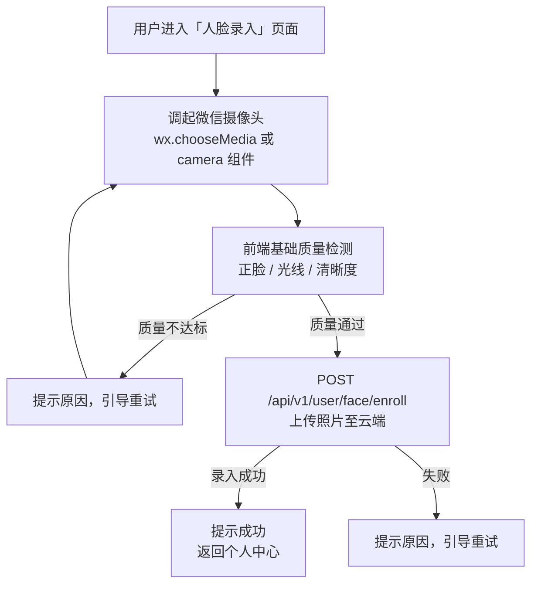
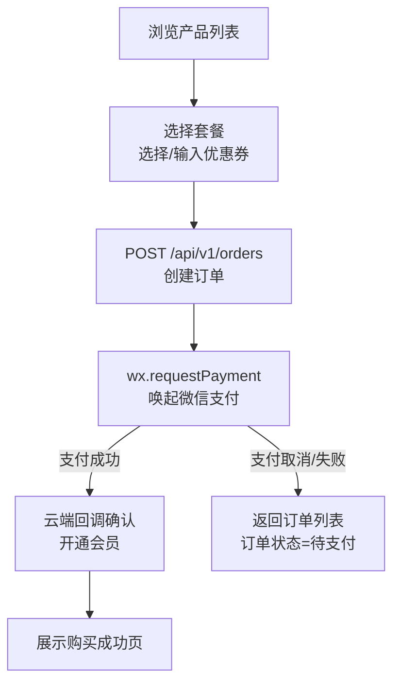

# 微信小程序

**负责人**：前端程序员  
**运行环境**：用户微信（iOS / Android）  
**核心职责**：用户侧全部交互入口，包括注册、购买、人脸录入、淋浴控制等

---

## 职责边界

微信小程序是**用户直接使用的界面**，是用户进入健身房的起点（人脸录入）和日常使用工具（购买会员、查看订单、控制淋浴）。

**小程序负责：**
- 微信授权登录与用户注册
- 购买产品套餐（接入微信支付）
- 人脸信息录入（调用摄像头，提取特征，上传云端）
- 查看个人信息与订单
- 查看门店地图与信息
- 启动淋浴（向云端发起指令）
- 查看动作库（健身动作教程）
- 浏览推广活动（营销推销）

**小程序不负责：**
- 直接操控硬件（通过云端 API 中转）
- 管理后台功能

---

## 页面清单

### 首页 / 门店
- 附近门店列表与地图
- 当前门店入场状态（是否开放）
- 快捷入口：我的会员、我的订单

### 用户注册与登录
- 微信一键授权
- 手机号绑定（可选）
- 首次使用引导（人脸录入提示）

### 人脸录入
- 调起摄像头进行人脸采集
- 提交至云端 API 完成录入
- 录入状态展示（已录入/未录入）
- 支持重新录入（覆盖旧数据）

### 产品与购买
- 产品套餐列表（月卡、次卡、体验卡等）
- 套餐详情（价格、有效期、使用规则）
- 微信支付下单流程
- 优惠券选择与核销

### 推广/营销
- 活动 Banner 展示
- 限时优惠
- 分享邀请（可选）

### 淋浴控制
- 显示当前用户可用的淋浴时长/次数
- 启动按钮（发送指令到云端 → 工控机执行）
- 倒计时显示（淋浴剩余时间）

### 动作库
- 健身动作分类浏览（部位/器械）
- 动作详情（图文/视频）
- 收藏与历史记录（可选）

### 个人中心
- 个人信息（昵称、头像、手机号）
- 我的会员（当前有效套餐、到期时间、剩余次数）
- 我的订单（订单列表与详情）
- 人脸管理（查看/重新录入）
- 联系客服

---

## 核心流程：人脸录入

---

## 核心流程：购买产品

---

## 技术选型建议

| 组件 | 建议方案 | 备注 |
|---|---|---|
| 框架 | uni-app（Vue 3）或原生小程序 | uni-app 利于未来多端扩展 |
| UI 组件库 | uView UI 3.x（配合 uni-app） | 小程序适配好 |
| 状态管理 | Pinia（uni-app 支持） | |
| 支付 | 微信支付小程序 API | 标准接入 |
| 人脸采集 | 微信 camera 组件 + 上传 | 不使用第三方 SDK（简化审核） |
| HTTP | uni.request 封装 | 统一拦截器处理 JWT |

---

## 多语言方案（新增）

面向外籍用户，小程序需要同时处理**静态文案多语言**与**后台动态内容多语言**。

### 目标语言

| 语言 | 代码 | 备注 |
|---|---|---|
| 简体中文 | `zh` | 默认语言 |
| 英文 | `en` | 第一阶段必支持 |

### 技术实现

| 能力 | 方案 |
|---|---|
| 静态文案 | `vue-i18n`（uni-app Vue 3） |
| 语言资源 | `src/locales/zh.json`、`src/locales/en.json` |
| 用户语言偏好 | 本地存储 `locale` |
| 动态内容 | 请求头携带 `Accept-Language`，由云端返回对应语言 |
| 错误提示 | 优先显示云端返回的多语言错误文案，兜底本地通用错误文案 |

### 语言选择与回落

1. 读取用户手动设置语言（若有）
2. 否则读取系统语言
3. 系统语言不在支持列表时回落到 `zh`

### 影响页面范围

- 首页/门店：门店名称、地址、状态文案
- 产品与购买：产品名称、产品描述、购买流程提示
- 推广/营销：Banner 标题和活动文案
- 动作库：动作名称和说明
- 人脸录入/淋浴控制/个人中心：按钮、提示语、错误信息

---

## 待确认事项

- [ ] 是否同时开发支付宝小程序（uni-app 可一套代码多端）
- [ ] 动作库内容来源（自制图文 vs 外部视频平台嵌入）
- [ ] 淋浴控制的 UI 交互细节（计时器样式、中途停止按钮）
- [ ] 推广/分享功能是否进入第一期范围
- [ ] 小程序是否需要定位权限（门店附近推荐功能）
