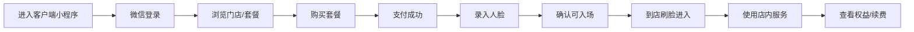

# 客户端小程序需求文档

上级文档：[微信小程序体系](../../mini-program)

**负责人**：前端程序员  
**运行环境**：微信小程序（iOS / Android）  
**文档类型**：一期基础业务需求梳理  
**适用对象**：产品、前端、后端、测试、运营

---

## 1. 背景与目标

客户端小程序是面向会员与潜在用户的统一入口，负责承接“登录 → 浏览门店 → 购买会员 → 录入人脸 → 到店使用服务 → 查询权益与续费”的完整用户链路。

### 1.1 业务目标

- 支持新用户快速完成微信登录和账号初始化
- 支持用户浏览门店、套餐和营销内容并完成支付
- 支持用户完成人脸录入，满足刷脸入场前置条件
- 支持用户查询会员权益、订单状态和个人资料
- 支持用户使用淋浴、券码兑换、动作库等辅助服务

### 1.2 用户价值

- 一个入口完成从注册到入场准备的全部关键动作
- 到店前完成购买、录脸和资格确认，减少现场失败
- 随时查看当前权益、历史订单和可用服务

## 2. 需求范围

### 2.1 本期包含

- 微信授权登录与账号初始化
- 首页、门店浏览、推广活动、动作库
- 套餐浏览、下单、微信支付
- 会员权益、订单查询
- 人脸录入与重录
- 淋浴服务
- 外部券码核销
- 个人中心
- 中英文多语言

### 2.2 本期不包含

- 分销、积分商城、邀请裂变
- 直播课程、私教预约、复杂排期
- 多账号协作、家庭账号、企业团购
- 小程序直连门锁或其他硬件设备
- 完整后台配置能力

### 2.3 外部依赖

| 系统 | 依赖级别 | 说明 |
|---|---|---|
| 云端 API | 强依赖 | 用户、订单、权益、人脸、门店、淋浴等接口 |
| 微信开放能力 | 强依赖 | `wx.login`、支付、相机、基础授权能力 |
| 工控机 / 门禁系统 | 间接依赖 | 小程序不直连设备，通过云端感知资格与服务结果 |
| 管理后台 | 间接依赖 | 门店、商品、活动、内容配置来源 |

## 3. 模块总览

| 模块 | 目标 | 详细文档 |
|---|---|---|
| 登录与账号初始化 | 获取用户身份并初始化资料 | [登录与账号初始化](./login) |
| 首页 / 门店 / 营销 / 动作库 | 承接获客、浏览与转化入口 | [首页 / 门店 / 营销 / 动作库](./home-marketing) |
| 产品购买流程 | 完成购卡与支付闭环 | [产品购买流程](./purchase) |
| 会员权益与订单 | 查询当前可用权益与历史订单 | [会员权益与订单](./membership) |
| 人脸录入与重录 | 完成刷脸入场前置准备 | [人脸录入与重录](./face) |
| 淋浴服务 | 使用门店内辅助服务 | [淋浴服务](./shower) |
| 个人中心 | 统一管理资料、状态与工具入口 | [个人中心](./profile) |
| 外部券码核销 | 兑换第三方平台券码 | [外部券码核销](./voucher) |

## 4. 用户角色

| 角色 | 定义 | 主要目标 |
|---|---|---|
| 潜在用户 | 首次进入小程序，尚未购买 | 浏览门店与套餐，完成首次转化 |
| 新注册用户 | 已登录但未购买或未录脸 | 完成购卡并做好入场准备 |
| 活跃会员 | 有有效权益 | 快速查看权益、顺利到店、使用服务 |
| 历史用户 | 曾购买但权益已失效 | 查看历史订单并完成续费 |
| 异常用户 | 登录、支付、录脸、权益状态异常 | 找到原因并得到处理路径 |

## 5. 业务总流程

## 6. 页面定位

| 页面 | 定位 | 说明 |
|---|---|---|
| 首页 | 承接流量与转化 | 活动 Banner、推荐门店、套餐入口、状态提醒 |
| 门店 | 帮助用户完成门店决策 | 门店列表、门店详情、地址导航、营业状态 |
| 购买 | 完成商品转化 | 套餐列表、套餐详情、订单确认、支付 |
| 服务 | 提供使用工具 | 人脸录入、淋浴、券码兑换、帮助与客服 |
| 我的 | 查看身份和权益 | 会员状态、订单、人脸状态、个人资料 |

## 7. 核心约束

- 订单金额、会员权益、入场资格以服务端实时返回为准
- 前端只负责采集并上传人脸，不做端上识别
- 小程序不直接下发门禁控制指令
- 所有用户关键链路需覆盖中英文文案与异常提示
