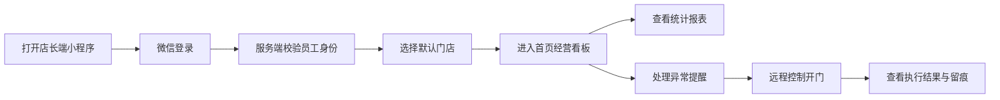

# 店长端小程序需求文档

上级文档：[微信小程序体系](../../mini-program)

**负责人**：前端程序员  
**运行环境**：微信小程序（iOS / Android）  
**文档类型**：一期基础业务需求梳理  
**适用对象**：产品、前端、后端、测试、运营、店长

---

## 1. 背景与目标

店长端小程序用于满足门店一线人员的移动运营需求。店长和值班店员在不打开 PC 管理后台的情况下，也能完成基础登录、经营数据查看、异常到店协助和远程开门操作。

### 1.1 业务目标

- 支持店长和已授权店员通过微信完成身份登录
- 支持按门店查看近实时经营数据和历史统计报表
- 支持在会员到店异常场景下远程控制开门并保留完整操作记录

### 1.2 目标价值

- 让门店人员可在手机端完成日常巡店和值班动作
- 缩短到店异常处理时间，降低会员现场等待
- 让店长及时掌握营收、到店、续费、异常开门等核心经营指标

## 2. 需求范围

### 2.1 本期包含

- 微信登录与员工身份校验
- 单门店/多授权门店切换
- 首页经营看板
- 统计报表分析
- 远程控制开门
- 开门记录与基础操作留痕

### 2.2 本期不包含

- 商品、价格、活动等复杂后台配置
- 排班、审批、工单、考勤等内部 OA 能力
- 财务对账、发票、结算分账等总部能力
- 大区/总部级精细化 BI 分析替代

## 3. 用户角色

| 角色 | 定义 | 主要目标 |
|---|---|---|
| 店长 | 门店第一责任人 | 查看经营全量指标、处理异常、执行开门 |
| 值班店员 | 店长授权的现场工作人员 | 查看当班数据、处理会员到店异常 |
| 区域督导 | 拥有多个门店查看权限的管理角色 | 切换门店查看数据，必要时协助处理异常 |

## 4. 页面与路由

| 路由 | 页面 | 说明 |
|---|---|---|
| `/pages/auth/login` | 登录页 | 微信登录、协议确认、异常提示 |
| `/pages/auth/store-select` | 门店选择页 | 多门店权限账号登录后选择默认门店 |
| `/pages/dashboard/index` | 首页看板 | 今日核心经营数据、异常提醒、快捷入口 |
| `/pages/report/index` | 报表分析 | 指标总览、趋势图、筛选维度 |
| `/pages/door-control/index` | 控制开门 | 选择门禁设备、填写开门原因、发起指令 |
| `/pages/door-control/history` | 开门记录 | 查看远程开门历史和执行结果 |

## 5. 业务总流程

## 6. 功能模块

| 模块 | 目标 | 详细文档 |
|---|---|---|
| 登录与权限初始化 | 建立员工身份、角色、门店范围 | [登录与权限初始化](./login) |
| 统计报表分析 | 查看近实时经营数据与历史趋势 | [统计报表分析](./analytics) |
| 控制开门 | 远程协助会员或员工开门 | [控制开门](./door-control) |

## 7. 关键规则

- 店长端也使用微信登录，但访问权限由服务端按员工身份控制
- 所有指标默认按当前选中门店展示，跨门店能力仅限已授权范围
- 门禁指令必须经过云端 API 转发，不允许小程序直连硬件
- 远程开门必须记录操作人、门店、设备、原因、结果和时间
- 报表展示以服务端统计口径为准，近实时数据允许短暂延迟
