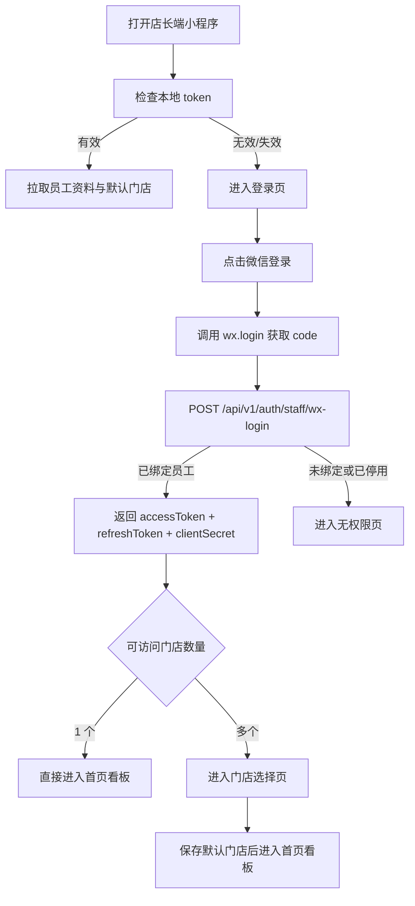

# 店长端小程序 — 登录与权限初始化

上级文档：[店长端小程序](./index)

---

## 背景与目标

店长端登录用于确认当前微信账号是否对应已授权员工，并在登录后初始化角色、门店权限、默认门店和快捷能力，避免未授权人员进入门店运营界面。

## 需求范围

- 微信登录
- 员工身份校验
- 门店权限拉取
- 默认门店选择
- 登录失效后的重新鉴权

## 用户角色

店长端小程序用户来自 `staff` 表（管理人员体系），通过微信登录校验是否为已绑定的管理人员。不同角色登录后可见能力不同：

| staff 角色 | 说明 | 登录后可见能力 |
|---|---|---|
| `manager` | 店长 | 查看经营数据、查看全部开门记录、发起远程开门 |
| `support` | 客服 | 查看设备状态、处理消费者问题 |
| `ops` | 运营 | 切换授权门店查看数据，按权限执行开门 |
| `owner` | 老板 | 切换名下所有门店查看数据，发起开门 |

## 页面路由

| 路由 | 页面 | 说明 |
|---|---|---|
| `/pages/auth/login` | 登录页 | 微信登录按钮、协议说明、异常提示 |
| `/pages/auth/store-select` | 门店选择页 | 多门店账号首次登录后选择默认门店 |
| `/pages/auth/forbidden` | 无权限页 | 未绑定员工身份或权限被停用时展示 |

## 登录流程

## 功能需求

### 1. 微信登录
目标：

通过微信账号完成员工身份登录，不提供账号密码登录方式。

前置条件：

- 员工已在后台完成微信账号绑定或预绑定流程

触发方式：

- 用户打开小程序或 token 失效后主动点击“微信登录”

主流程：
1. 小程序调用 `wx.login` 获取微信 `code`
2. 调用 `POST /api/v1/auth/staff/wx-login`
3. 服务端在 `staff` 表中校验微信身份是否绑定有效管理人员
4. 返回 `accessToken`（JWT，仅含 `sub` + `iss: staff`）、`refreshToken`、`clientSecret`（HMAC 签名用）
5. 前端通过 `GET /api/v1/staff/me` 拉取权限上下文（角色、门店列表、权限点）
6. 前端缓存登录态和 `clientSecret`，进入首页或门店选择页

业务规则：
- 仅支持微信登录
- JWT 只携带身份标识（`sub` + `iss`），角色和门店权限由服务端 Redis 提供，前端通过接口拉取
- 权限变更（分配新门店、调整角色）即时生效，无需重新登录
- 店长端**所有请求**附加 HMAC 签名（使用登录时下发的 `clientSecret`）
- 登录成功后首页接口和报表接口必须带上当前门店标识

异常/边界：
- `wx.login` 失败时提示“登录失败，请重试”
- 员工状态为停用、离职、未绑定时禁止进入系统
- 服务端返回门店列表为空时，视为无权限账号

验收标准：
- 已绑定员工可在 1 次点击内完成登录
- 未绑定员工无法进入首页和报表页
- 登录成功后可正确看到角色和门店信息

### 2. 门店选择与权限初始化
目标：

让多门店权限账号在登录后明确当前操作门店，避免报表和开门操作误用到错误门店。

前置条件：

- 服务端返回 2 个及以上授权门店

触发方式：

- 首次登录
- 用户手动切换当前门店

主流程：
1. 登录成功后进入门店选择页
2. 展示门店名称、地址、营业状态、门禁在线状态摘要
3. 用户选择默认门店
4. 前端保存当前门店并进入首页
5. 后续接口默认附带当前门店 ID

业务规则：
- 当前门店切换后，首页看板、报表、开门页必须同步刷新
- 无该门店权限时，不允许通过参数伪造切换
- 默认门店可本地缓存，但以服务端返回权限为最终准入依据

异常/边界：
- 门店列表拉取失败时支持重试
- 默认门店已被停用或撤权时，要求重新选择

验收标准：
- 多门店账号首次登录必须先选择门店
- 切换门店后首页和报表数据在 3 秒内刷新

### 3. 登录态维护
目标：

保证店长端在安全前提下具备稳定的连续使用体验。

业务规则：
- token 失效后自动跳回登录页
- 高风险能力（如远程开门）在服务端判定需要时可要求二次确认
- 用户主动退出登录后，需清空本地 token、门店缓存和报表筛选条件

异常/边界：
- 网络异常时保留当前页面，但禁止继续调用敏感操作
- 权限被后台回收后，下一次接口响应需提示并强制重新登录

验收标准：
- 退出登录后重新进入必须重新鉴权
- token 过期后不能继续访问受限页面
