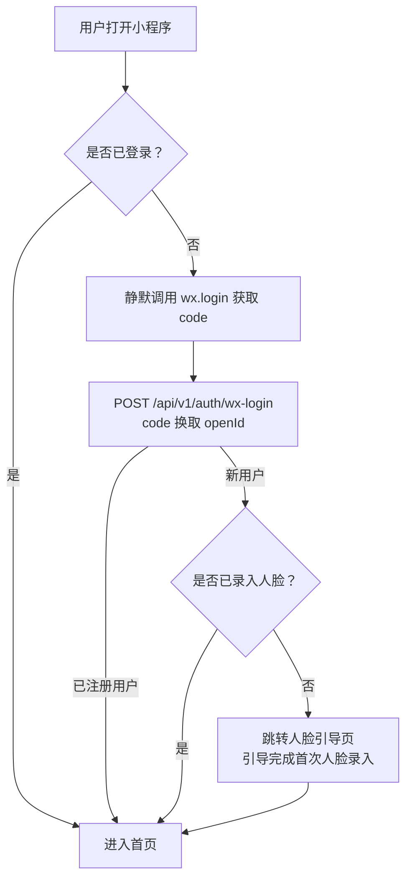
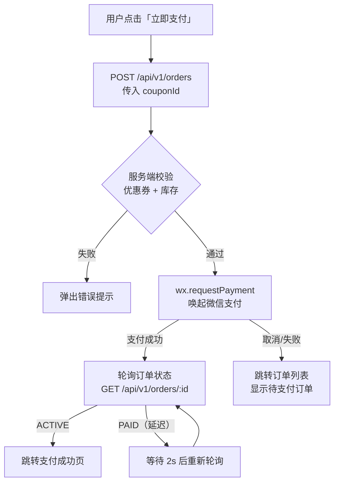

# 微信小程序 — 核心页面详细 PRD

上级文档：[微信小程序](../mini-program)

---

## 页面路由规划

| 路由 | 页面 | TabBar | 说明 |
|---|---|---|---|
| `/pages/index/index` | 首页 | ✅ 首页 | 门店信息、快捷入口 |
| `/pages/store/map` | 门店地图 | — | 附近门店列表 + 地图 |
| `/pages/product/list` | 产品列表 | — | 当前门店可售产品 |
| `/pages/product/detail` | 产品详情 | — | 产品详细信息 + 购买 |
| `/pages/order/confirm` | 确认订单 | — | 选优惠券 + 确认支付 |
| `/pages/order/result` | 支付结果 | — | 支付成功/失败页 |
| `/pages/order/list` | 我的订单 | — | 订单列表 |
| `/pages/order/detail` | 订单详情 | — | 单个订单信息 |
| `/pages/face/enroll` | 人脸录入 | — | 摄像头采集 + 上传 |
| `/pages/face/guide` | 人脸引导 | — | 首次使用引导页 |
| `/pages/shower/index` | 淋浴控制 | — | 启动淋浴 + 倒计时 |
| `/pages/voucher/redeem` | 兑换券码 | — | 外部券码输入/扫码 |
| `/pages/profile/index` | 个人中心 | ✅ 我的 | 个人信息、会员、订单入口 |
| `/pages/profile/membership` | 我的会员 | — | 当前会员卡详情 |
| `/pages/profile/face-manage` | 人脸管理 | — | 查看/重录人脸 |
| `/pages/profile/about` | 关于我们 | — | 联系客服、隐私政策 |
| `/pages/auth/login` | 登录页 | — | 微信授权登录 |

### TabBar 配置

| Tab | 图标 | 页面 |
|---|---|---|
| 首页 | 🏠 | `/pages/index/index` |
| 我的 | 👤 | `/pages/profile/index` |

> [建议值] 小程序底部仅保留 2 个 Tab：首页 + 我的。产品购买、淋浴等功能通过首页快捷入口或页面内导航到达，避免 Tab 过多。

---

## 用户注册与登录

### 登录流程



### 登录页线框

```
┌─────────────────────────┐
│                         │
│       🏋️ 健身房 LOGO     │
│                         │
│   ╔═════════════════╗   │
│   ║  微信一键登录    ║   │
│   ╚═════════════════╝   │
│                         │
│  登录即表示同意《用户协议》│
│  和《隐私政策》          │
│                         │
└─────────────────────────┘
```

### 字段与接口

```
POST /api/v1/auth/wx-login
Request:  { code: string }
Response: {
  token: string,           // JWT
  isNewUser: boolean,      // 是否新用户
  user: {
    id, nickname, avatarUrl,
    faceEnrolled: boolean
  }
}
```

---

## 人脸录入

### 引导页

首次使用时展示，引导用户完成人脸录入。

```
┌─────────────────────────┐
│                         │
│   📸                    │
│                         │
│   完成人脸录入            │
│   即可刷脸进入健身房      │
│                         │
│   · 正对摄像头           │
│   · 确保光线充足         │
│   · 避免佩戴帽子墨镜     │
│                         │
│   ╔═════════════════╗   │
│   ║   开始录入       ║   │
│   ╚═════════════════╝   │
│                         │
│   暂时跳过              │
│                         │
└─────────────────────────┘
```

### 人脸采集页

```
┌─────────────────────────┐
│  ← 人脸录入             │
│                         │
│  ┌───────────────────┐  │
│  │                   │  │
│  │    📷 摄像头预览   │  │
│  │                   │  │
│  │   ┌─────────┐    │  │
│  │   │ 人脸框  │    │  │
│  │   └─────────┘    │  │
│  │                   │  │
│  └───────────────────┘  │
│                         │
│  💡 请正对摄像头，确保   │
│  面部完整出现在框内      │
│                         │
│  自动检测中...           │
│                         │
│  ╔═════════════════╗   │
│  ║   拍照           ║   │
│  ╚═════════════════╝   │
│                         │
└─────────────────────────┘
```

### 前端质量检测规则

| 检测项 | 条件 | 不通过提示 |
|---|---|---|
| 正脸 | 面部角度偏转 < 15° | 「请正对摄像头」 |
| 光线 | 画面亮度在合理范围内 | 「光线太暗/太亮，请调整」 |
| 清晰度 | 图像模糊度 < 阈值 | 「请保持不动，画面模糊」 |
| 遮挡 | 眼睛/鼻子/嘴巴无遮挡 | 「请摘下口罩/墨镜/帽子」 |
| 多人 | 画面中仅 1 张人脸 | 「请确保只有您一人在画面中」 |

> **[建议值]** 前端仅做基础质量检测，最终人脸质量判断由云端 API 完成。前端通过后自动拍照并上传。

### 人脸录入成功页

```
┌─────────────────────────┐
│                         │
│        ✅               │
│                         │
│   人脸录入成功！         │
│                         │
│   现在您可以刷脸进入      │
│   任意已开通的健身房门店  │
│                         │
│   ╔═════════════════╗   │
│   ║   去逛逛         ║   │
│   ╚═════════════════╝   │
│                         │
└─────────────────────────┘
```

### 重录人脸

在「个人中心 → 人脸管理」中可重新录入：

1. 点击「重新录入」
2. 弹出确认：「重新录入将覆盖您当前的人脸数据，旧的将失效。确认？」
3. 确认后进入采集页
4. 上传成功后旧特征标记为失效，新特征同步到工控机

### 接口

```
POST /api/v1/user/face/enroll
  Auth: 用户 JWT
  Body: { image: string }  // Base64 编码的人脸照片
  Response: {
    success: boolean,
    message: string  // 成功 / 失败原因
  }

POST /api/v1/user/face/re-enroll
  Auth: 用户 JWT
  Body: { image: string }
  Response: 同上
```

---

## 产品购买流程

### 产品列表页

```
┌─────────────────────────┐
│  ← 🏠 朝阳门店          │
│                         │
│  ── 限时优惠 ────────── │
│  ┌───────────────────┐  │
│  │ 🎉 新人专享         │  │
│  │ 体验卡 原价 ¥19.9  │  │
│  │ 现价 ¥9.90         │  │
│  │ [立即购买]          │  │
│  └───────────────────┘  │
│                         │
│  ── 全部产品 ────────── │
│                         │
│  ┌───────────────────┐  │
│  │ 月卡               │  │
│  │ ¥99/月   ¥129 划线│  │
│  │ 有效期 30 天 不限次 │  │
│  │         [购买]     │  │
│  └───────────────────┘  │
│                         │
│  ┌───────────────────┐  │
│  │ 季卡               │  │
│  │ ¥249/季            │  │
│  │ 有效期 90 天 不限次 │  │
│  │         [购买]     │  │
│  └───────────────────┘  │
│                         │
│  ┌───────────────────┐  │
│  │ 次卡 10 次         │  │
│  │ ¥79               │  │
│  │ 有效期 90 天 10 次 │  │
│  │         [购买]     │  │
│  └───────────────────┘  │
│                         │
└─────────────────────────┘
```

### 产品卡片字段

| 字段 | 说明 |
|---|---|
| 产品名称 | `name` |
| 售价 | `price`，格式 `¥XX.XX` |
| 划线价 | `originalPrice`，删除线样式，有优惠时展示 |
| 有效期 | `durationDays` + 天，次卡额外展示次数 |
| 标签 | `限时优惠` / `热门` / `推荐`（可选，由管理后台配置） |

### 产品列表展示规则

1. 优先展示通用产品（`storeId = null`），再展示门店专属产品
2. 按 `sortOrder` 升序排列
3. 体验卡仅对从未购买过任何产品的用户展示（云端判断）
4. 已下架产品不展示

### 确认订单页

```
┌─────────────────────────┐
│  ← 确认订单             │
│                         │
│  ┌─ 产品信息 ─────────┐ │
│  │ 月卡               │ │
│  │ 有效期 30 天 不限次 │ │
│  └────────────────────┘ │
│                         │
│  ┌─ 优惠券 ───────────┐ │
│  │ 🎫 新用户专享 50 元券│ │
│  │    满减券  -¥10.00 │ │
│  │         [选择优惠券>]│ │
│  └────────────────────┘ │
│                         │
│  ────────────────────── │
│  原价：          ¥99.00 │
│  优惠：         -¥10.00 │
│  ────────────────────── │
│  应付：          ¥89.00 │
│                         │
│  ╔═══════════════════╗ │
│  ║  立即支付 ¥89.00  ║ │
│  ╚═══════════════════╝ │
│                         │
│  支付即表示同意《服务协议》│
│                         │
└─────────────────────────┘
```

### 优惠券选择弹窗

```
┌─────────────────────────┐
│  选择优惠券        [确定]│
├─────────────────────────┤
│  [可用(2)]  [不可用(1)] │
│─────────────────────────│
│  ┌───────────────────┐  │
│  │ ○ 新用户专享 50 元 │  │
│  │ 满100减20          │  │
│  │ 有效期至 04-30     │  │
│  └───────────────────┘  │
│                         │
│  ┌───────────────────┐  │
│  │ ○ 限时 9 折券      │  │
│  │ 无门槛             │  │
│  │ 有效期至 04-07     │  │
│  └───────────────────┘  │
│                         │
│  ── 不可用 ──────────  │
│  ┌───────────────────┐  │
│  │ ☒ 满 200 减 50    │  │
│  │ 未达门槛（还差111）│  │
│  └───────────────────┘  │
│                         │
│  [不使用优惠券]          │
│                         │
└─────────────────────────┘
```

### 支付流程



### 支付结果页

```
┌─────────────────────────┐
│                         │
│        ✅               │
│                         │
│   支付成功！             │
│                         │
│   产品：月卡            │
│   有效期至：2026-04-30   │
│   已优惠：¥10.00        │
│                         │
│   ╔═════════════════╗   │
│  ║  完成人脸录入      ║  │
│  ╚═════════════════╝   │
│  （仅 faceEnrolled=false│
│   时显示此按钮）         │
│                         │
│   [返回首页]             │
│                         │
└─────────────────────────┘
```

### 待支付订单处理

- 订单列表中 `PENDING` 状态的订单显示「继续支付」按钮
- 超过 30 分钟未支付自动取消（[建议值]）
- 点击「继续支付」重新唤起微信支付

---

## 淋浴控制

### 淋浴入口

- **首页**：在门店内（基于定位或最近一次进入记录判断）时显示「启动淋浴」入口
- **个人中心**：始终显示淋浴入口

### 淋浴主页面

```
┌─────────────────────────┐
│  ← 淋浴控制             │
│                         │
│  当前门店：朝阳门店      │
│  淋浴间状态：🟢 空闲    │
│                         │
│      ┌───────────┐      │
│      │           │      │
│      │  🚿       │      │
│      │           │      │
│      └───────────┘      │
│                         │
│  剩余可用：5 分钟       │
│  （本月还剩 3 次）       │
│                         │
│  ╔═════════════════╗   │
│  ║   启动淋浴       ║   │
│  ╚═════════════════╝   │
│                         │
│  ⚠️ 启动后将倒计时 5 分钟│
│     到时间自动关闭       │
│                         │
└─────────────────────────┘
```

### 倒计时页面

```
┌─────────────────────────┐
│  ← 淋浴中               │
│                         │
│  ┌───────────────────┐  │
│  │                   │  │
│  │      🚿           │  │
│  │                   │  │
│  │    03:42          │  │
│  │                   │  │
│  │  ████████████░░░░ │  │
│  │                   │  │
│  └───────────────────┘  │
│                         │
│  ╔═════════════════╗   │
│  ║   提前结束        ║   │
│  ╚═════════════════╝   │
│                         │
│  朝阳门店 · 淋浴间 1    │
│                         │
└─────────────────────────┘
```

### 交互规则

| 场景 | 行为 |
|---|---|
| 点击「启动淋浴」 | 调用 API → 成功后跳转倒计时页 |
| 启动失败（无权益/淋浴间占用） | 展示具体失败原因 |
| 倒计时中 | 每 1 秒更新倒计时数字和进度条 |
| 倒计时结束 | 显示「淋浴已结束」，3 秒后返回主页面 |
| 点击「提前结束」 | 二次确认 → 调用 API 关闭 → 返回 |
| 页面退出/后台 | 倒计时继续在服务端执行（不依赖前端） |

### 淋浴权益展示 [建议值]

> **[建议值]** 第一期暂定：**每次刷脸进入健身房自动赠送 1 次淋浴机会**，每次 5 分钟。不在健身房内时不显示启动入口。

| 展示文案 | 条件 |
|---|---|
| 「启动淋浴」+ 按钮可用 | 有可用淋浴次数 |
| 「今日已用完」+ 按钮置灰 | 今日淋浴次数已用完 |
| 「请先进入健身房」+ 引导 | 未进入过健身房（无淋浴权益） |

---

## 个人中心

### 个人中心主页面

```
┌─────────────────────────┐
│                         │
│  ┌───────────────────┐  │
│  │ 👤 昵称            │  │
│  │ 📱 138****5678    │  │
│  │ 🎫 月卡 · 到期 04/30│  │
│  │         [编辑资料 >]│  │
│  └───────────────────┘  │
│                         │
│  ── 我的会员 ────────── │
│  ┌───────────────────┐  │
│  │ 🟢 月卡            │  │
│  │ 到期：2026-04-30   │  │
│  │ 状态：使用中        │  │
│  └───────────────────┘  │
│  ┌───────────────────┐  │
│  │ 🔵 次卡 10 次      │  │
│  │ 剩余：7 次          │  │
│  │ 到期：2026-06-11   │  │
│  └───────────────────┘  │
│  [查看全部会员 >]        │
│                         │
│  ┌───────────────────┐  │
│  │ 📋 我的订单    >   │  │
│  ├───────────────────┤  │
│  │ 🎫 优惠券     3 > │  │
│  ├───────────────────┤  │
│  │ 📸 人脸管理    >   │  │
│  ├───────────────────┤  │
│  │ 🎁 兑换券码    >   │  │
│  ├───────────────────┤  │
│  │ 🚿 淋浴控制    >   │  │
│  ├───────────────────┤  │
│  │ 📞 联系客服    >   │  │
│  └───────────────────┘  │
│                         │
└─────────────────────────┘
```

### 我的会员页

```
┌─────────────────────────┐
│  ← 我的会员             │
│                         │
│  ┌─ 当前会员卡 ───────┐ │
│  │ 🟢 月卡 · 使用中    │ │
│  │                     │ │
│  │ 到期时间             │ │
│  │ 2026 年 4 月 30 日  │ │
│  │                     │ │
│  │ ████████████░░░░    │ │
│  │ 剩余 30 天          │ │
│  │                     │ │
│  │ 购买时间：03-31      │ │
│  │ 购买门店：朝阳门店    │ │
│  └─────────────────────┘ │
│                         │
│  ┌─ 次卡 10 次 ───────┐ │
│  │ 🔵 有效             │ │
│  │ 剩余：7/10 次        │ │
│  │ 到期：2026-06-11     │ │
│  └─────────────────────┘ │
│                         │
│  ┌─ 体验卡 ───────────┐ │
│  │ ⬛ 已过期            │ │
│  │ 已使用 1/1 次        │ │
│  │ 过期：2026-03-11     │ │
│  └─────────────────────┘ │
│                         │
│  ╔═════════════════╗   │
│  ║   续费 / 购卡    ║   │
│  ╚═════════════════╝   │
│                         │
└─────────────────────────┘
```

### 我的订单列表

```
┌─────────────────────────┐
│  ← 我的订单             │
│  [全部] [使用中] [已过期]│
│                         │
│  ┌───────────────────┐  │
│  │ 月卡      🟢使用中 │  │
│  │ ¥89.00            │  │
│  │ 2026-03-31        │  │
│  │ 有效期至 04-30    │  │
│  └───────────────────┘  │
│                         │
│  ┌───────────────────┐  │
│  │ 次卡10次   🟢使用中│  │
│  │ ¥79.00            │  │
│  │ 2026-03-15        │  │
│  │ 剩余 7 次         │  │
│  └───────────────────┘  │
│                         │
│  ┌───────────────────┐  │
│  │ 体验卡     ⬛已过期│  │
│  │ ¥9.90             │  │
│  │ 2026-03-10        │  │
│  │ 已使用 1/1 次     │  │
│  └───────────────────┘  │
│                         │
└─────────────────────────┘
```

### 人脸管理页

```
┌─────────────────────────┐
│  ← 人脸管理             │
│                         │
│  ┌───────────────────┐  │
│  │ 人脸状态：✅ 已录入 │  │
│  │ 录入时间：03-31     │  │
│  └───────────────────┘  │
│                         │
│  💡 人脸数据将用于       │
│  健身房刷脸进出验证      │
│                         │
│  ╔═════════════════╗   │
│  ║   重新录入        ║   │
│  ╚═════════════════╝   │
│                         │
│  如需删除人脸数据，      │
│  请联系客服             │
│                         │
│  📞 联系客服            │
│                         │
└─────────────────────────┘
```

---

## 兑换券码

### 兑换页面

```
┌─────────────────────────┐
│  ← 兑换券码             │
│                         │
│  在抖音/美团等平台购买   │
│  的券码，在此兑换使用    │
│                         │
│  ┌───────────────────┐  │
│  │ 请输入券码         │  │
│  │                   │  │
│  └───────────────────┘  │
│                         │
│  ── 或 ──               │
│                         │
│  📷 扫描二维码兑换       │
│                         │
│  ╔═════════════════╗   │
│  ║   立即兑换        ║   │
│  ╚═════════════════╝   │
│                         │
└─────────────────────────┘
```

### 兑换结果页

```
┌─────────────────────────┐
│                         │
│        ✅               │
│                         │
│   兑换成功！             │
│                         │
│   产品：月卡            │
│   有效期：2026-04-30     │
│   （原会员有效期已顺延） │
│                         │
│   [返回首页]             │
│                         │
└─────────────────────────┘

失败时：
┌─────────────────────────┐
│                         │
│        ❌               │
│                         │
│   兑换失败               │
│                         │
│   原因：券码已过期       │
│                         │
│   [重新输入]             │
│                         │
└─────────────────────────┘
```

### 交互规则

1. 输入框支持粘贴
2. 扫码按钮调用 `wx.scanCode`，二维码内容为券码字符串
3. 兑换成功后展示获得的产品和有效期
4. 失败时展示具体原因：券码无效 / 已使用 / 已过期 / 活动已结束
5. 同一批次同一用户限兑换 1 张

---

## 接口汇总

```
# 登录
POST /api/v1/auth/wx-login

# 用户信息
GET  /api/v1/user/profile
PUT  /api/v1/user/profile

# 人脸录入
POST /api/v1/user/face/enroll
POST /api/v1/user/face/re-enroll

# 会员状态
GET  /api/v1/user/membership?storeId=xxx

# 产品列表
GET  /api/v1/products?storeId=xxx

# 订单
POST /api/v1/orders                         # 创建订单
GET  /api/v1/orders                        # 我的订单列表
GET  /api/v1/orders/:id                    # 订单详情

# 优惠券
GET  /api/v1/user/coupons                  # 我的优惠券
GET  /api/v1/user/coupons/available?productId=xxx  # 可用优惠券

# 淋浴
POST /api/v1/shower/start
POST /api/v1/shower/stop
GET  /api/v1/shower/status?storeId=xxx

# 券码兑换
POST /api/v1/vouchers/redeem

# 门店列表
GET  /api/v1/stores
GET  /api/v1/stores/:id
```
