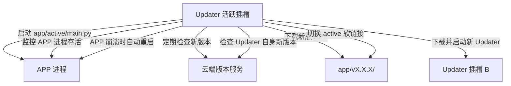
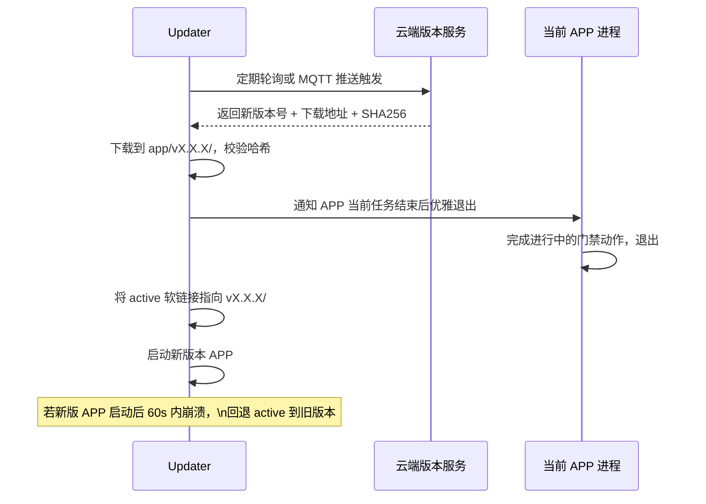
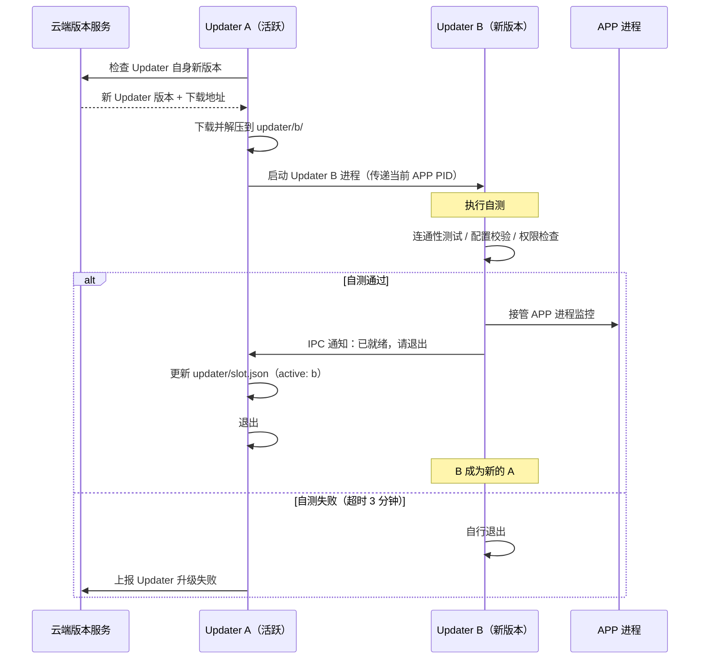

# A/B 包 OTA 升级方案

**适用子系统**：工控机（RK3576，Python）  
**核心目标**：在无人值守环境下完成软件升级，保证升级过程可回滚、不中断业务

---

## 整体架构说明

工控机上运行两个独立的程序包，职责严格分离：

| 包 | 职责 | 稳定性要求 |
|----|------|-----------|
| **升级程序（updater）** | 监控应用程序进程，启动正确版本的应用程序，下载新版本，管理自身升级 | 极高，逻辑极简，几乎不需要改动 |
| **应用程序（app）** | 门禁、人脸、MQTT、硬件控制等所有业务逻辑 | 正常迭代 |

**A/B 包机制只用于升级程序自身**。应用程序的新版本由升级程序统一管理，采用版本目录切换的方式升级，逻辑更简单（见下文）。

---

## 目录结构

```
/opt/fitness/
├── launcher.py              # systemd 启动入口（只做一件事：启动 updater）
├── updater/
│   ├── slot.json            # 当前活跃的 updater 插槽
│   ├── a/                   # Updater 插槽 A（当前活跃）
│   │   ├── updater.py
│   │   └── version.json
│   └── b/                   # Updater 插槽 B（新版本，测试中）
│       ├── updater.py
│       └── version.json
└── app/
    ├── active -> v1.2.3/    # 软链接，指向当前运行的版本目录
    ├── v1.2.3/              # 当前版本
    │   ├── main.py
    │   └── version.json
    └── v1.2.4/              # 新版本（下载完成，等待切换）
        ├── main.py
        └── version.json
```

---

## 升级程序（Updater）职责



Updater 的代码逻辑保持极简，**不包含任何业务逻辑**，只负责：进程管理、版本检查、下载验证、切换。

---

## 应用程序（APP）升级流程

由 Updater 驱动，流程简单：



**回退策略**：新版 APP 启动后，Updater 计时 60 秒。如果 APP 在 60 秒内崩溃，Updater 将 `active` 软链接回退到上一个版本，保留崩溃日志并上报云端。

---

## 升级程序自身 A/B 升级流程

Updater 自身的升级逻辑与 APP 不同——新旧两个 Updater 需要**并行运行并通信**，因为 Updater 持有进程管理权，不能直接被替换。



**Updater B 的自测项**（不含业务逻辑，仅测试自身能力）：
- 可读写 `updater/slot.json`
- 可写入 app active 软链接
- 可 fork 子进程（验证进程管理能力）
- 可连接云端版本服务接口

---

## IPC 通信

Updater A/B 之间通过 Unix Domain Socket 通信：

```
/opt/fitness/updater/updater.sock
```

消息格式（JSON）：

```json
{ "action": "handover", "app_pid": 12345, "from_version": "2.1.0", "to_version": "2.2.0" }
{ "action": "shutdown_ack" }
```

---

## 版本文件格式

```json
{
  "version": "1.2.3",
  "build_time": "2026-03-01T10:00:00Z",
  "git_commit": "abc1234",
  "package_type": "app"
}
```

`package_type` 取值：`app` 或 `updater`，云端版本服务对两种包分别管理。

---

## Systemd 配置

```ini
# /etc/systemd/system/fitness.service
[Unit]
Description=Fitness System
After=network.target

[Service]
Type=simple
ExecStart=/usr/bin/python3 /opt/fitness/launcher.py
Restart=always
RestartSec=5
WorkingDirectory=/opt/fitness

[Install]
WantedBy=multi-user.target
```

`launcher.py` 极简：读取 `updater/slot.json`，exec 对应插槽的 `updater.py`。Launcher 代码量控制在 30 行以内，永远不需要升级。

---

## 待确认事项

- [ ] 升级包分发服务：使用腾讯云 COS + 签名 URL，还是独立版本服务器
- [ ] 强制升级策略：云端下发强制版本时，是否需要等待当前进行中的门禁操作（APP 侧逻辑）
- [ ] Updater B 接管 APP 进程监控时，是通过 PID 接管还是重新拉起 APP
