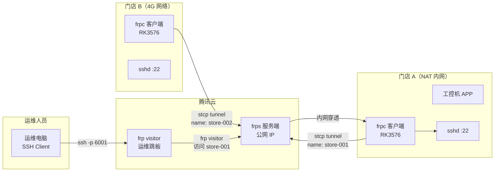
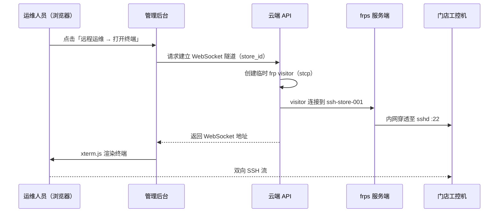
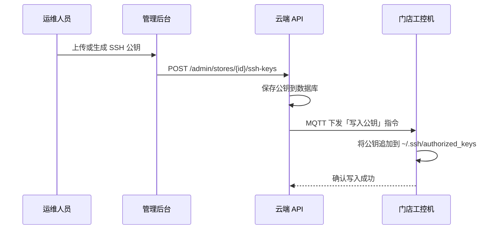
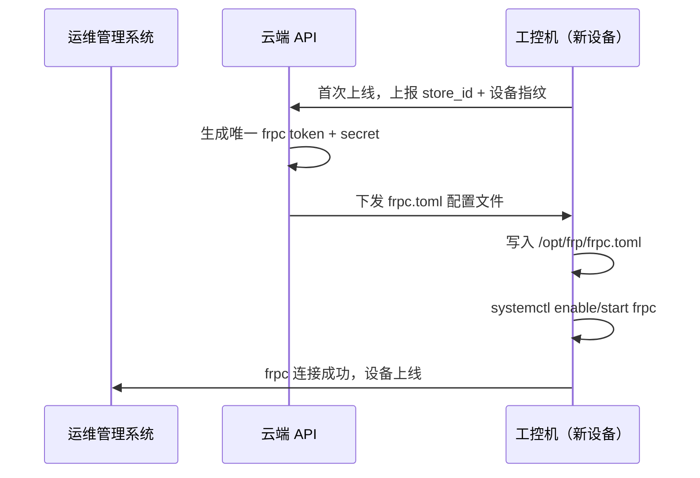

# 远程 SSH 运维通道方案

**适用子系统**：工控机（RK3576）、DevOps  
**核心目标**：在千店规模、复杂网络环境下，运维人员可随时 SSH 到任一门店工控机，且无需到店操作

---

## 方案选型对比

| 方案 | 稳定性 | 千店规模 | 网络穿透 | 运维成本 | 推荐度 |
|------|-------|---------|---------|---------|-------|
| **FRP**（推荐） | ★★★★☆ | ★★★★☆ | 强 | 低 | ✅ 主选 |
| Teleport | ★★★★★ | ★★★★★ | 强 | 中 | 备选 |
| Tailscale/WireGuard | ★★★★★ | ★★★☆☆ | 需 relay | 中 | 备选 |
| ngrok | ★★★☆☆ | ★★☆☆☆ | 强 | 高（付费） | ❌ |

### 选择 FRP 的理由

1. **开源免费**，无按连接数收费
2. **轻量**，frpc 客户端资源占用极低（< 10MB 内存）
3. **穿透能力强**，支持 NAT 穿透，不依赖门店网络质量
4. **协议丰富**，支持 TCP/UDP/HTTP，可扩展其他隧道用途
5. **社区活跃**，千店规模的 frps 服务器压力完全可承受

### FRP 的主要挑战及应对

| 挑战 | 应对方案 |
|------|---------|
| 千个设备端口管理 | 使用 stcp 模式（名称路由），无需为每台设备分配独立端口 |
| 服务端单点故障 | frps 服务端高可用部署 |
| 网络中断重连 | frpc 内置断线重连，加 systemd 兜底 |
| 安全性 | TLS 加密 + 每设备唯一 Token |

---

## 架构设计



---

## 服务端配置（frps）

部署在腾讯云，建议独立一台轻量服务器（2C2G 即可支撑千台连接）：

```toml
# /etc/frp/frps.toml

bindAddr = "0.0.0.0"
bindPort = 7000

# 鉴权：使用 Token 模式
auth.method = "token"
auth.token = "全局强随机Token（每设备单独Token见下方）"

# 面板（可选，便于查看在线设备数）
webServer.addr = "127.0.0.1"
webServer.port = 7500
webServer.user = "admin"
webServer.password = "强密码"

# 日志
log.to = "/var/log/frps.log"
log.level = "info"
log.maxDays = 7

# 连接数限制（防滥用）
maxPortsPerClient = 5
```

**systemd 服务：**

```ini
[Unit]
Description=FRP Server
After=network.target

[Service]
Type=simple
ExecStart=/usr/local/bin/frps -c /etc/frp/frps.toml
Restart=always
RestartSec=5

[Install]
WantedBy=multi-user.target
```

---

## 客户端配置（frpc，每台工控机）

每台工控机有**唯一的 store_id 和独立的 Token**，由设备初始化脚本写入：

```toml
# /opt/frp/frpc.toml
# 此文件在设备初始化时由云端下发，包含唯一 token

serverAddr = "your-frps-server.com"
serverPort = 7000

auth.method = "token"
auth.token = "设备唯一Token_store_001"

log.to = "/var/log/frpc.log"
log.level = "warn"

# stcp 模式：不占用服务端端口，通过名称访问
[[proxies]]
name = "ssh-store-001"          # 全局唯一名称
type = "stcp"
secretKey = "store_001_secret"  # visitor 端需要填写相同 secret
localIP = "127.0.0.1"
localPort = 22
```

**systemd 服务：**

```ini
[Unit]
Description=FRP Client
After=network.target

[Service]
Type=simple
ExecStart=/usr/local/bin/frpc -c /opt/frp/frpc.toml
Restart=always
RestartSec=10
RestartStopSec=5

[Install]
WantedBy=multi-user.target
```

---

## 运维侧访问：Web Terminal

运维人员通过**管理后台 Web 界面**直接打开 SSH 终端，无需在本地安装 frpc 或手动配置 visitor。

### 架构



**技术选型**：
- 前端：[xterm.js](https://xtermjs.org/)（WebSocket 接收字符流，渲染到 Canvas）
- 后端：云端 API 增加 `/ws/terminal/{storeId}` 接口，通过 WebSocket 桥接 SSH 流
- SSH 库：后端使用 Apache MINA SSHD（Kotlin/Java）建立 SSH 客户端连接

---

## SSH 密钥管理

工控机只允许**密钥认证**，禁用密码登录。密钥通过管理后台统一管理，不需要运维人员手动登机操作。

### 密钥分发流程



### 公钥下发 MQTT 指令

```json
{
  "action": "ssh_key_update",
  "operation": "add",
  "key": "ssh-rsa AAAAB3NzaC1... ops@eachcan",
  "key_id": "key-abc123",
  "comment": "运维-张三-2026-03"
}
```

`operation` 支持 `add` / `remove`，`key_id` 用于标识和删除特定公钥。

### 工控机侧实现要点

- `authorized_keys` 文件由 APP 通过 MQTT 指令管理，每条密钥附带 `key_id` 注释便于删除
- 禁用 SSH 密码认证：`/etc/ssh/sshd_config` 中 `PasswordAuthentication no`
- `fitness` 用户的 `authorized_keys` 权限设为 `600`

---

## 千店管理策略

面对千个门店，不可能手动管理每台配置，需要自动化：

### 设备配置下发



### 管理后台「远程运维」功能

- 门店列表中每个门店有「远程运维」入口
- 进入后显示：连接状态（在线/离线）、最近登录记录、公钥管理
- 点击「打开终端」→ 在管理后台内直接开启 Web Terminal（xterm.js）
- 公钥管理：上传/删除运维人员的 SSH 公钥，操作记录留存审计

---

## 稳定性保障措施

| 措施 | 说明 |
|------|------|
| frpc systemd Restart=always | 客户端崩溃 10 秒后自动重启 |
| frpc 内置心跳 | 默认 30 秒心跳，连接断开自动重连 |
| 网络看门狗联动 | 网络故障恢复后，systemd 自动触发 frpc 重连 |
| frps 高可用 | 主备两台 frps + keepalived VIP，单点故障自动切换 |
| 连接监控 | frps 面板 + 云端 API 定期查询在线设备数，低于阈值告警 |
| TLS 加密 | frps/frpc 配置 `transport.tls.enable = true` |

---

## 安全规范

1. **最小权限**：SSH 用户 `fitness` 只有运维所需权限，禁止 root 直连
2. **密钥认证**：禁用密码登录，仅允许 SSH 公钥认证
3. **端口保护**：frps 的 7000 端口通过腾讯云安全组限制来源 IP（仅运维 IP 段）
4. **Token 轮换**：每台设备 Token 独立，单台泄露不影响全局；可通过云端 API 远程更换 Token
5. **审计日志**：所有 SSH 登录记录保留 30 天

---

## 待确认事项

- [ ] frps 服务器规格：需做压测验证千台并发时的内存/CPU/带宽消耗
- [ ] 设备初始化流程：frpc.toml 是烧录时写入还是首次上线时下发
- [ ] frps 高可用方案：keepalived 主备，还是腾讯云 CLB + 多实例
- [ ] Web Terminal 后端 SSH 库选型（Kotlin 侧 Apache MINA SSHD 或其他方案）
