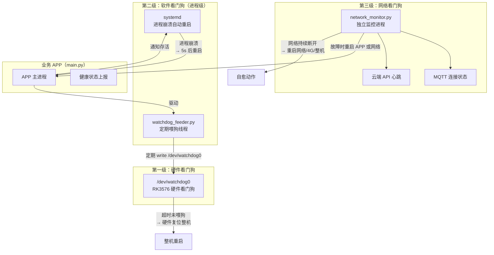
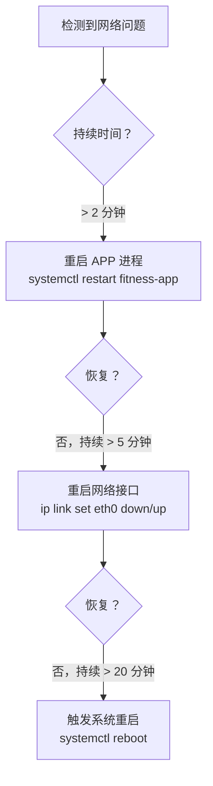

# 三级看门狗方案

**适用子系统**：工控机（RK3576，Python）  
**核心目标**：在无人值守环境中，通过三个层次的自动恢复机制，保证工控机 7×24 小时稳定运行

---

## 三级架构总览



---

## 第一级：硬件看门狗

**机制**：RK3576 内置硬件看门狗定时器，如果在超时时间内没有收到"喂狗"操作，则触发**硬件复位**，强制重启整机。

**覆盖场景**：内核死锁、Python 解释器卡死、所有软件进程无响应。

### 喂狗实现

Python 通过写入 `/dev/watchdog0` 设备节点实现喂狗：

```python
# watchdog_feeder.py（在 APP 主进程内以独立线程运行）
import threading
import time
import logging

WATCHDOG_DEV = "/dev/watchdog0"
FEED_INTERVAL = 10        # 每 10 秒喂一次（硬件超时 30 秒，留足余量）
HARDWARE_TIMEOUT = 30     # RK3576 硬件看门狗超时上限 30 秒

class HardwareWatchdog:
    def __init__(self):
        self._fd = None
        self._thread = None
        self._stop_event = threading.Event()

    def start(self):
        self._fd = open(WATCHDOG_DEV, "wb", buffering=0)
        self._thread = threading.Thread(target=self._feed_loop, daemon=True)
        self._thread.start()
        logging.info("硬件看门狗已启动")

    def _feed_loop(self):
        while not self._stop_event.wait(FEED_INTERVAL):
            self._fd.write(b"\x00")
            self._fd.flush()

    def stop(self):
        # 写入 'V' 表示正常退出，关闭看门狗（避免测试时意外重启）
        self._stop_event.set()
        self._fd.write(b"V")
        self._fd.close()
```

> `/dev/watchdog0` 默认仅 root 可写。解决方案：在 `/etc/udev/rules.d/99-watchdog.rules` 中添加 `KERNEL=="watchdog0", GROUP="watchdog", MODE="0660"`，并将 `fitness` 用户加入 `watchdog` 组。

---

## 第二级：软件看门狗（进程级）

**机制**：由 systemd 管理 APP 进程，进程崩溃后自动重启。同时支持 systemd WatchdogSec，要求 APP 定期发送存活信号，超时则 systemd 主动 kill 并重启。

**覆盖场景**：Python 进程崩溃、未捕获异常退出、进程假死（事件循环卡住）。

### systemd 配置（含 Watchdog）

```ini
# /etc/systemd/system/fitness-app.service
[Unit]
Description=Fitness IPC App
After=network.target

[Service]
Type=notify
ExecStart=/usr/bin/python3 /opt/fitness/slots/launcher.py
Restart=always
RestartSec=5
WatchdogSec=30            # 30 秒内 APP 必须发送 WATCHDOG=1，否则 kill+restart
NotifyAccess=main
StandardOutput=journal
StandardError=journal
User=fitness
Group=fitness

[Install]
WantedBy=multi-user.target
```

### APP 侧 sd_notify 集成

```python
# 在 APP 主循环中定期调用
import sdnotify  # pip install sdnotify

notifier = sdnotify.SystemdNotifier()

def startup_complete():
    notifier.notify("READY=1")  # 通知 systemd 启动完成

def watchdog_keepalive():
    notifier.notify("WATCHDOG=1")  # 每 10 秒调用一次，远小于 WatchdogSec=30
```

---

## 第三级：网络看门狗

**机制**：独立的 `network_monitor.py` 进程，持续监控 MQTT 连接状态和云端 API 可达性，按阶梯策略执行自愈。

**覆盖场景**：网络断线、MQTT Broker 不可达、路由器切换到 4G 备用网络、路由器死机。

> 4G 模块集成在路由器中，工控机无需直接控制 4G 模块。但需要通过路由器管理接口查询**当前使用的是有线网络还是 4G 网络**，以便在告警和日志中记录网络状态，也可以在有线断线时提前调整上报频率（4G 流量有限）。

### 监控指标

| 指标 | 检查方式 | 检查间隔 |
|------|---------|---------|
| MQTT 连接 | 检查 paho-mqtt 连接状态 + 心跳 | 30 秒 |
| 云端 API | HTTP GET `/health`，超时 5s | 60 秒 |
| 本地网络 | ping 网关 | 30 秒 |
| 网络链路类型 | HTTP 查询路由器管理接口（见下文） | 60 秒 |

### 从路由器获取网络链路类型

不同品牌路由器的接口不同，实现时需要根据实际选型适配。常见方案：

| 路由器类型 | 查询方式 |
|-----------|---------|
| OpenWrt | HTTP GET `http://192.168.1.1/cgi-bin/luci/rpc/sys`（JSONRPC） |
| 商用 4G 路由器 | HTTP GET 路由器状态页，解析 WAN 口状态 |
| 支持 SNMP | SNMP walk `ifOperStatus` |

工控机端将查询到的链路类型（`wired` / `4g` / `unknown`）写入本地状态文件，供上报和日志使用：

```python
NETWORK_STATE_FILE = "/opt/fitness/runtime/network_type.txt"
# 内容示例："wired" 或 "4g"
```

### 阶梯自愈策略



> 4G 模块由路由器管理，工控机不干预路由器的 4G 切换过程。重启网络接口指的是重置工控机本身的以太网接口，触发路由器重新分配 IP。

### 实现要点

```python
# network_monitor.py（以 systemd 独立服务运行）

THRESHOLDS = {
    "restart_app":  2 * 60,    # 2 分钟未恢复 → 重启 APP
    "restart_net":  5 * 60,    # 5 分钟未恢复 → 重启工控机网络接口
    "reboot":       20 * 60,   # 20 分钟未恢复 → 重启系统
}
```

---

## 三级联动关系

| 故障类型 | 触发级别 | 恢复动作 |
|---------|---------|---------|
| 内核死锁 / 系统假死 | 第一级（硬件） | 整机硬件复位 |
| Python 进程崩溃 | 第二级（systemd） | 5s 后自动重启 APP |
| Python 事件循环卡死（不喂狗） | 第二级（WatchdogSec） | 30s 后 systemd kill+restart |
| MQTT 断线（APP 正常运行） | 第三级（网络） | 阶梯式网络自愈 |
| 云端 API 不可达 | 第三级（网络） | 阶梯式网络自愈，APP 降级本地运行 |

---

## 本地降级运行

网络看门狗检测到云端不可达时，APP 不应直接停止工作，而应切换到**离线降级模式**：

- 人脸验证：仅使用本地 SQLite 人脸库，不请求云端
- 门禁控制：依据本地缓存的会员有效期判断
- 事件日志：写入本地队列，网络恢复后批量上报
- 告警上报：通过 MQTT 重连或 4G 上报

---

## 待确认事项

- [ ] 路由器具体型号，确认是否有可用的 HTTP 管理接口供工控机查询网络链路类型
- [ ] 网络看门狗与 APP 进程的状态共享方式（Unix Socket / 状态文件），需与 APP 侧协商接口
